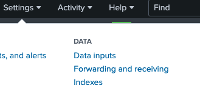

= Advanced Topics
Alexandre Cezar <acezar@paloaltonetworks.com>, April 26, 2022:
:toc:
:toc-title:
:toclevels: 4
:icons: font

Some examples of advanced capabilities and integrations

== Using External Threat Feeds to detect malicious IPs

In this example, we leverage _IPsum_ (a threat intelligence feed based on more than 30 publicly available lists of suspicious and/or malicious IP addresses).
The list is updated once, daily.

This example guides you through creating:

** A script that creates and updates an external network with the latest malicious IP addresses from IPsum.

** A network ruleset that blocks processing units from initiating or accepting connections with the malicious IP addresses

[NOTE]
Because network rulesets that reject traffic take precedence over those that accept it, the one we create in this procedure won’t conflict with any other network rulesets you may have in place.

=== Prerequisites
* apoctl +
Authenticated to apoctl with the Namespace Administrator role in the target namespace

=== Creating the automation script

* Step 1-> Set a MICROSEG_NS environment variable containing the target namespace. +
`export MICROSEG_NS=<your namespace>`

[NOTE]
We recommend creating the external network and network ruleset at your top-level namespace.

* Step 2 -> Use the following https://www[script] to add an automation that creates a new external network called malicious-ips and keeps it synchronized with IPsum.

* Step 3 -> Copy the alphanumeric string returned by the Microsegmentation Console to your clipboard.

This is the ID of the automation.

* Step 4 -> Use the following command to retrieve the automation, replacing <automation-id> with the value you copied in the previous step.
 `apoctl api get automations <automation-id> -o yaml -n $MICROSEG_NS` +

It should return a YAML object representing the automation. Check the *errors* key. It should not contain any value. +

Navigate to _Network Lists_, then select _External networks_. You should see an external network named _malicious-ips_. +

Expand to review the details. You should see a number of malicious IPs listed.

=== Blocking connections with a network ruleset

* Step 1-> Set an environment variable named *PUSELECTOR* containing the tag or tag expression defining the processing units that should be blocked from connecting to the malicious IPs.
The following example sets the value to *$identity=processingunit*, which will select all processing units in your current namespace as well as any children. Feel free to modify this value as desired. +
`export PUSELECTOR="\$identity=processingunit"`

* Step 2 -> Use the https://www[following] command to create the network ruleset.

* Step 3 -> Copy the alphanumeric string returned by the Microsegmentation Console to your clipboard. This is the ID of the network ruleset. +

* Step 4 -> Use the following command to retrieve the network ruleset, replacing *<ruleset-id>* with the value you copied in the previous step.
 `apoctl api get networkrulesetpolicy <ruleset-id> -o yaml -n $MICROSEG_NS`

* Step 5 -> It should return a YAML object representing the network ruleset.

=== Verifying the network ruleset
The easiest way to verify the network ruleset is from a Linux host. +
If you’ve created the network ruleset and external network at the top namespace, as we recommended, you can verify it from any Microsegmentation namespace.

* Step 1 -> Obtain your public IP address, such as by visiting _whatsmyip.org_ in your browser.

* Step 2 -> Navigate to Network Lists, then select External networks. Click the Edit button to open the malicious-ips external network for editing. +

[NOTE]
If it is grayed out, navigate higher in the namespace hierarchy, to the namespace it was created in. If you followed our recommendation, you created it in the top-level namespace.

* Step 3 -> Click Next.

* Step 4 -> Paste your public IP address into the Networks field, click Next, and then click Update.

* Step 5 -> Navigate to the namespace of your enforcer, and select App Dependency Map. You should see your host listed there.

* Step 6 -> From your local host, attempt to gain access to the enforcer host, such as via SSH.

* Step 7 -> You should see the malicious-ips external network with a red flow to your host.

* Step 8 -> Click the red flow and select Policies. Your block-malicous-ips ruleset should be listed as having blocked the traffic.

Because it is a reject ruleset, it takes precedence over any allow policies in place.

* Step 9 -> Navigate to the namespace of the malicious-ips external network, select Network Lists, then select External networks. +

* Step 10 -> Click the Edit button to open the malicious-ips external network for editing.

* Step 11 -> Click Next, remove your IP address from the Networks field, click Next, then click Update.

From your local host, confirm that you can once again access the remote host via SSH.

Congratulations! You have successfully blocked your processing units from communicating with IP addresses known to be malicious or suspicious.

== Automating event extraction and forwarding to Splunk

Enforcers can forward syslog events to external systems, but sometimes customers want to integrate events into their systems using REST APIs or apoctl

This example provides guidance on how to use both methods.

=== Using REST APIs

You can programmatically extract logs from the platform using a set of APIs.
For now, let's focus on the main event types:

*Flow logs, Event Logs, Enforcer Logs and Audit Logs*

==== REST API - Flow Logs
You can use the _*/reportsqueries*_ API to retrieve flow logs.

A curl example is provided as reference:

`curl --request POST 'https://<microsegmentation gw api>/reportsqueries?recursive=true&order=-timestamp&startRelative=1h' \ +
--header 'content-type: application/json' \ +
--header 'accept: application/json' \ +
--header 'x-namespace: <your namespace>' \ +
--header 'cookie: <token>' \ +
--data-raw '{"report":"Flows"}'`

In the example above, we're retrieving all the flows logs generated on the parent namespace where we are executing the command (x-namespace) and all its children (recursive), that occurred in the last hour (timestamp&startRelative=1h)

A response sample is provided below:

`{
"DNSLookupReports": [], +
"connectionExceptionReports": [], +
"counterReports": [], +
"enforcerReports": [], +
"eventLogs": [], +
"flowReports": [
{
"ID": "610d577e3ad679000176c714", +
"action": "Accept", +
"destinationID": "61057ab930e052000145df57", +
"destinationIP": "10.32.6.7", +
"destinationPort": 8443, +
"destinationType": "ProcessingUnit", +
"enforcerID": "61056caf30e052000145dedd", +
"namespace": "/853809537107753221/my-cloud-account/K8s-prod/istio-system", +
"observedAction": "NotApplicable", +
"policyID": "60e8cd4f2fd55100012a3089", +
"policyNamespace": "/853809537107753221/my-cloud-account/K8s-prod/istio-system", +
"protocol": 6, +
"serviceType": "L3", +
"sourceID": "60e8c9cb8eeaab00013c2c8a", +
"sourceIP": "10.150.0.30", +
"sourceType": "ExternalNetwork", +
"timestamp": "2021-08-06T15:38:21.559Z", +
"value": 100 +
},`

==== REST API - Event Logs
You can use the _*/reportsqueries*_ API to retrieve event logs.

A curl example is provided as reference:

`curl --request POST 'https://<microsegmentation gw api>/reportsqueries?recursive=true&order=-timestamp&startRelative=1h' \ +
--header 'content-type: application/json' \ +
--header 'accept: application/json' \ +
--header 'x-namespace: /853809537107753221/my-cloud-account/K8s-prod' \ +
--header 'cookie: <token>' \ +
--data-raw '{"report":"EventLogs"}'`

In the example above, we're retrieving all the event logs generated on the parent namespace where we are executing the command (x-namespace) and all its children (recursive), that occurred in the last hour (timestamp&startRelative=1h)

A response sample is provided below:

`{
"DNSLookupReports": [], +
"connectionExceptionReports": [], +
"counterReports": [], +
"enforcerReports": [], +
"eventLogs": [ +
{
"ID": "61058aac872ea800013252bb", +
"category": "crud", +
"content": "Enforcerd 'gke-prod-istio-cluster-pool-4c2f68b3-iepp' started in namespace '/853809537107753221/my-cloud-account/K8s-prod' in 17.895245222s", +
"level": "Info", +
"namespace": "/853809537107753221/my-cloud-account/K8s-prod", +
"opaque": "{\"crud\":\"start\",\"duration\":\"17.895245222s\",\"enforcerID\":\"61058a9acdfb4300015c7858\"}", +
"targetID": "61058a9acdfb4300015c7858", +
"targetIdentity": "enforcer", +
"timestamp": "2021-07-31T17:38:52.573Z", +
"title": "Enforcerd started" +
},`

==== REST API - Enforcer Logs
You can use the _*/reportsqueries*_ API to retrieve agent logs.

A curl example is provided as reference:

`curl --location --request POST 'https://<microsegmentation gw api>/reportsqueries?recursive=true&order=-timestamp&startRelative=1h' \ +
--header 'content-type: application/json' \ +
--header 'accept: application/json' \ +
--header 'x-namespace: /853809537107753221/my-cloud-account/K8s-prod' \ +
--header 'cookie: x-aporeto-token=<token>' \ +
--data-raw '{"report":"Enforcers"}'`

In the example above, we're retrieving all the Enforcer logs generated on the parent namespace where we are executing the command (x-namespace) and all its children (recursive), that occurred in the last hour (timestamp&startRelative=1h)

A response sample is provided below:

`{
"DNSLookupReports": [], +
"connectionExceptionReports": [], +
"counterReports": [], +
"enforcerReports": [ +
{
"CPULoad": 1.3987226397216885, +
"ID": "610d5fdc3ad6790001797c89", +
"enforcerID": "61058a9acdfb4300015c7858", +
"licenseType": "Host", +
"memory": 66527232, +
"name": "gke-prod-istio-cluster-pool-4c2f68b3-iepp", +
"namespace": "/853809537107753221/my-cloud-account/K8s-prod", +
"processes": 1, +
"timestamp": "2021-08-06T16:14:18.913Z"
},

==== REST API - Audit Logs
You can use the /activities API to retrieve system logs.

A curl example is provided as reference:

`curl --request GET 'https://<microsegmentation gw api>/activities?limit=100&order=-date&recursive=true' \ +
--header 'Accept: application/json' \ +
--header 'x-Namespace: <namespace>' \ +
--header 'Cookie: <token>'`

In the example above, we're retrieving all the platform logs, limited to the last 100, sorted by date generated on the parent namespace where we are executing the command (x-namespace) and all its children (recursive).

A response sample is provided below:

`{
"ID": "610bfde8197d920001c87b59", +
"claims": [ +
"@auth:prismaid=859809532107743232", +
"@auth:realm=pcidentitytoken", +
"@auth:subject=acezar@paloaltonetworks.com", +
"@auth:username=acezar@paloaltonetworks.com", +
"@auth:userroleid=a9c1873a-c92e-4592-93fd-0adc6d1fa507", +
"@auth:userrolename=System Admin", +
"@auth:userroletypeid=1", +
"@auth:userroletypename=System Admin" +
], +
"data": null, +
"date": "2021-08-05T15:04:08.636Z", +
"diff": "-{\n-  \"ID\": \"610bfcc16ef711000124ca75\",\n-  \"annotations\": {},\n-  \"associatedTags\": [],\n-  \"createTime\": \"2021-08-05T14:59:13.228Z\",\n-  \"description\": \"\",\n-  \"disabled\": false,\n-  \"fallback\": false,\n-  \"metadata\": [],\n-  \"name\": \"Enforcer Profile\",\n-  \"namespace\": \"/859809532107743232/demo-cloud-account/GKE_Demo\",\n-  \"normalizedTags\": [\n-    \"$id=610bfcc16ef711000124ca75\",\n-    \"$identity=enforcerprofilemappingpolicy\",\n-    \"$name=Enforcer Profile\",\n-    \"$namespace=/859809532107743232/demo-cloud-account/GKE_Demo\",\n-    \"$type=EnforcerProfile\"\n-  ],\n-  \"object\": [\n-    [\n-      \"enforcerprofile=Anything\"\n-    ]\n-  ],\n-  \"propagate\": true,\n-  \"protected\": false,\n-  \"subject\": [\n-    [\n-      \"@org:cloudaccount=demo-cloud-account\",\n-      \"@org:group=Anything\",\n-      \"@org:tenant=859809532107743232\"\n-    ]\n-  ],\n-  \"updateTime\": \"2021-08-05T14:59:13.228Z\"\n-}", +
"error": null, +
"message": "Deleted policy with ID 610bfcc16ef711000124ca75", +
"namespace": "/859809532107743232/demo-cloud-account/GKE_Demo", +
"operation": "delete", +
"originalData": null, +
"source": " 18.229.98.79", +
"targetIdentity": "policy" +
},`

=== apoctl
Apoctl is an all-purpose binary that can be used to automate the task of exporting logs from the platform.

You can install apoctl in a dedicated server or in a server used to centralize logging (such as a collector node).

A good approach is to add apoctl to your PATH, here we added it to /usr/local/bin)

Once apoctl is installed, generate an app-credential for this instance and create the required environment variables, _APOCTL_NAMESPACE=<namespace>_ and _APOCTL_CREDS=<app credential file>_

*Step-by-Step configuration*

* Step 1 -> Download apoctl

Download apoctl using the following command:

`curl -o /usr/local/bin/apoctl \
https://<Prisma Cloud apoctl download URL> && \ +
chmod 755 /usr/local/bin/apoctl`

* Step 2 -> Generate the app-credential and configure the environment variables

On your tenant or cloud account level namespace (depending from where you do want to start collection logs), go to the Credentials tab and create a new App-Credential. We will use this credential to authorize the apoctl client to export the logs from the platform.

Name it _Splunk_, add a description and click Next

Add the following permissions to the credential:

_Namespace Viewer, Infrastructure Viewer, Application Viewer_

Save it, download the json file and upload it to the host where you will be collecting the logs using SCP or any secure file upload method available to you.

Create two environment variables in your server

_APOCTL_NAMESPACE_ and _APOCTL_CREDS_, where the first one points out to your parent namespace and the second one to the path where you just uploaded the credential.

===== Environmental variable example

`APOCTL_NAMESPACE=/859809532107743232/demo-cloud-account +
APOCTL_CREDS=/home/user/.apoctl/splunk.json +

user@splunk:~$ echo $APOCTL_NAMESPACE
/859809532107743232/demo-cloud-account

user@splunk:~$ echo $APOCTL_CREDS
/home/user/.apoctl/splunk.json

[NOTE]
Remember to persist the variables by adding them to the /etc/environment file (to make them available to all accounts in the system) or to a specific user profile by modifying its specific "~/.profile" file.

Now, create the specific scripts that will programmatically collect the logs for us:

===== flow-collector.sh
`/usr/local/bin/apoctl --creds /home/user/.apoctl/splunk.json reportsquery flows --from-rel 1h -r -o json -c ID,action,policyNamespace,sourceIP,destinationIP,protocol,destinationPort,timestamp > ./flowlogs.json +
/usr/bin/cat flowlogs.json > /var/log/aporeto/flowlogs.json`

The script above, uses apoctl and the reportsquery flows option to download the flow logs generated in the last hour, stores it in a file called flowlogs.json in the local directory and append the new content to another file also called flowlogs.json that is located in the /var/log/aporeto directory (remember to create this folder)

===== event-collector.sh
`/usr/local/bin/apoctl --creds /home/user/.apoctl/splunk.json reportsquery eventlogs --from-rel 1h -r -o json > eventlogs.json +
/usr/bin/cat eventlogs.json > /var/log/aporeto/eventlogs.json`

The script above, uses apoctl and the reportsquery eventlogs option to download the event logs generated in the last hour, stores it in a file called eventlogs.json in the local directory and append the new content to another file also called eventlogs.json that is located in the /var/log/aporeto directory.

===== crontab
`# m h  dom mon dow command +
0/10 * * * * /home/acezar/flow-collector.sh +
0 * * * * /home/acezar/event-collector.sh`

You can schedule the scripts to run at predefined time (per example, flow logs every 10 minutes and event logs every hour).

=== Setting up Splunk to monitor the log files

On Splunk, we just need to add a new Data Input type for the platform to be able to collect and parse the different data we are generating:

===== Configuring the Data Input

* Step 1 -> Go to Settings/Data inputs +

* Step 2 -> Select the source to be Files & Directories and configure it to monitor the directory where you are storing the logs (in our case, /var/log/aporeto)

* Step 2 -> Under Input Settings, just define the source type as Manual and add a type source as "Prisma_Cloud_Microsegmentation"

image::images/splunk03.png[width=500,align="center"]

Save your new Data Input and go to the Search tab

===== Performing Searches

We can execute some simple searches to demonstrate how analysts can use these logs.

Let's look at the _flowlogs_ file:

By specifying the source as our log file, we can now see all the logs that happened in the last 24h (your time range for this search).

We can also filter by the flow action (let's use the Reject action):

Another interesting filter would be to analyze all events in a given namespace:

Now, let's take a look at the _eventlogs_ file:

