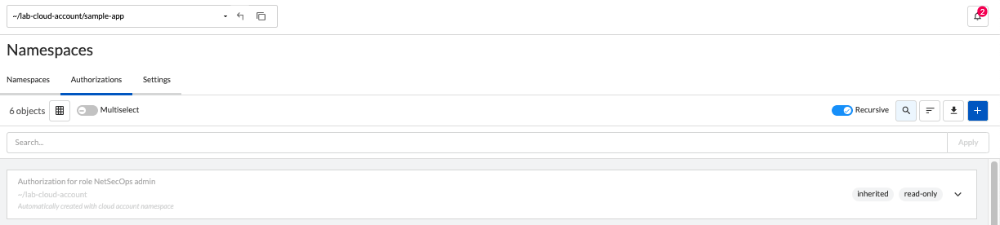
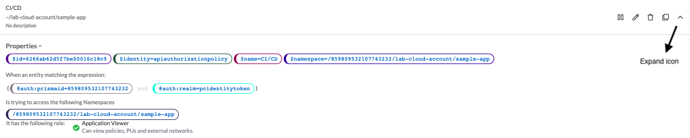
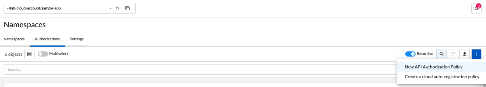
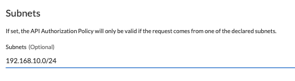
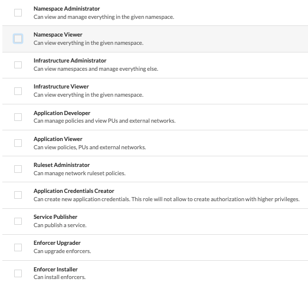

= API Authorizations
Alexandre Cezar <acezar@paloaltonetworks.com> 1.0, April 25, 2022:

== Listing Authorizations
You can list all the authorizations in a given namespace by selecting the namespace of interest and clicking on Namespaces/Authorizations:

== Looking at an Authorization details
By selecting a specific authorization and clicking on the "Expand" icon, you can look at its details, without having to explicitly edit it.

== Editing Authorizations
Select a specific API Authorization and click on the "Edit" icon.

== Creating a new Authorization
Navigate to the namespace of interest, select Namespaces/Authorizations, click on "+" button and select "New API Authorization Policy"

This opens the Authorization Wizard and after your provide a name to the Authorization and click next, it will request additional information, as follows:

* Subject -> The objects that indicates where the authorization should apply to. There's always a requirement for 2 conditions and a target namespace (if a parent is select, the authorization will propagate to its children)

image::images/authorizations-4.png[width=500,align="center"]

* Subnets -> Define the CIDRs where calls from this authorization are allowed to be made (optional)

* Roles -> Define the permissions that this authorization can use.

For more details about roles and permissions, please read this [page]

== Creating Authorizations using apoctl
To create an API Authorization using apoctl, use the command below as an example:

`apoctl api create apiauthorizationpolicy \ +
--api <Prisma Cloud API endpoint> \ +
--namespace <namespace> \ +
--data +
'{
"authorizedIdentities": +
[
"@auth:role=<role>"
], +
"subject": [
[
"@auth:realm=pcidentitytoken",
"@auth:prismaid=<tenant ID>"] +
], +
"name": "<API Authorization Name>", +
"description": "", +
"propagationHidden": false, +
"authorizedNamespaces": [ +
"<namespace path>"
] +
}'`