= App Dependency Map
Alexandre Cezar <acezar@paloaltonetworks.com> 1.0, May 3, 2022:
:toc:
:toc-title:
:icons: font

The App Dependency Map allows users to visualize flows and understand how their applications work from a networking perspective.

== Visualizing flows
Navigate to Visibility/App Dependency map
It will present all the flows being reported by the Enforcers on the immediate namespace and child namespaces (if you are in a parent ns).

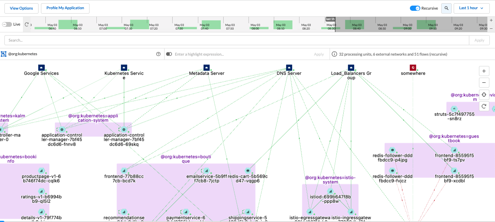

[TIP]
By changing namespaces, you can change the visualization and look at specific applications you are interested in

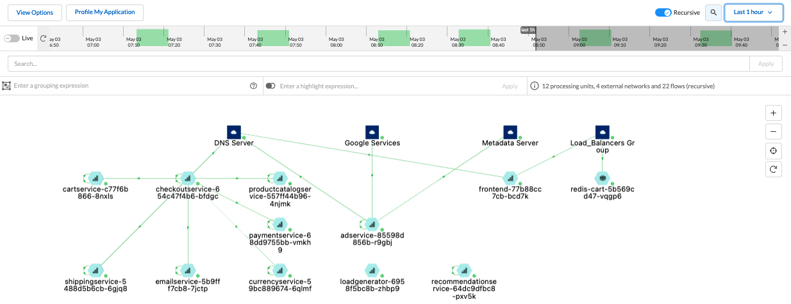

You can also click on a given flow, for further investigation. +
For more details about investigating flows, click https://xxx[here]

== Object types
The app dependency map displays flows between Processing Units or between a Processing Unit and an External Network.

[IMPORTANT]
Flows between a Processing Unit and an Undefined IP/FQDN are mapped to "somewhere"

Two types of objects can be seen in the App Dependency Map

=== Processing Unit
It displays resources that are protected by the Enforcer

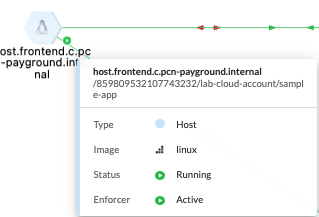

=== External Network
It displays resources that are don't have an Enforcer installed but still require rulesets to control their inbound/outbound traffic

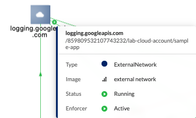

== Grouping Expressions
A grouping expression enables you to group processing units according to their tags. Prisma Cloud Identity-Based Microsegmentation provides you with a simple language to tell the system how you want them to be grouped.

Per example, if you want to group namespaces using a different color than pods, you can group them by typing ```$namespace as ns in blue then $image in red```

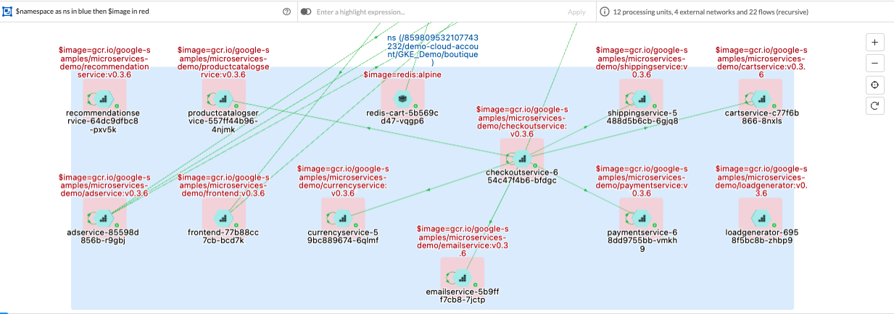

To understand this feature in more details, some concepts need to explained in more details: +

=== Groups and Tags
Groups are composed of a TAG. You can also include a NAME and/or a COLOR:

*GROUP* = TAG [as NAME] [in COLOR] +
Tag: The TAG can be a tag value such as role or can be a fixed value such as role=backend. If no value is specified, a group will be created for each possible value of that tag.

*Name*: The NAME is a simple string that allows you to give a custom name to the group. If not specified, the system will use the value of the TAG.

*Color*: The COLOR allows you to give a custom color to the group that will be created. If not specified, the system will use a random color based on the group name. You can specify the color using any of the following: +

**Examples: **
Color name: red, blue, green. +
Hexadecimal color code: #123456 or #333 +
RGBA values: rgba(123, 123, 123, 0.7)

=== Nested Grouping
Multiple GROUPs can be nested using the following syntax:

NESTEDGROUP = GROUP-1 then ... then GROUP-n
GROUP-1 will be the parent group and GROUP-n it's child.

You can also use a sequential syntax, as follows:

GROUP-1|NESTEDGROUP-1, ..., GROUP-n|NESTEDGROUP-n

== Using filters
You can filter specific resources you want to inspect by adding a filter in the search bar.

Per example, if you want to filter specific flows between two containers/pods, you can add a filter like ```images containers <image name> OR images containers <image name>```

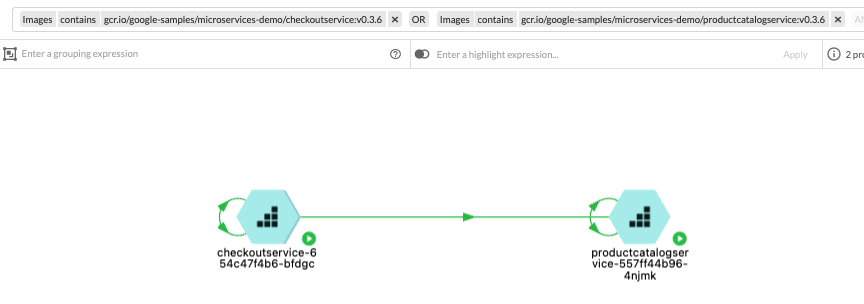

Or if you want to filter specific flows between hosts, you can add a filter like ```Name == <host fqdn> OR Name == <host fqdn>```

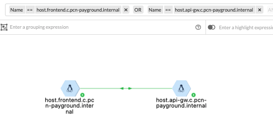

== Visualizing Processing Units Details
You can click on a Processing Unit to be able to see its details, such as:

=== Tags
You can check what are the tags collect by the Enforcer that generated the PU identity and tags that are available for use in rulesets

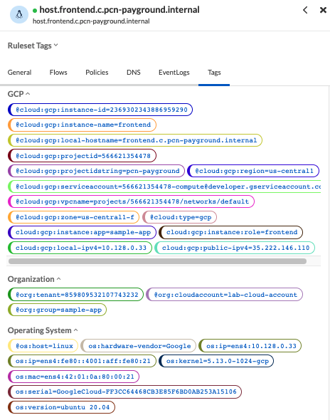

=== Policies
You can find what are the rulesets that are attached to a Processing Unit and the default action that controls the Processing Unit

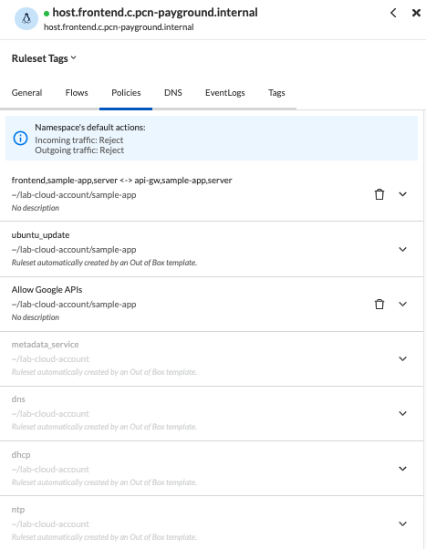

=== Flows
You can investigate what are the flows being reported by a Processing Unit

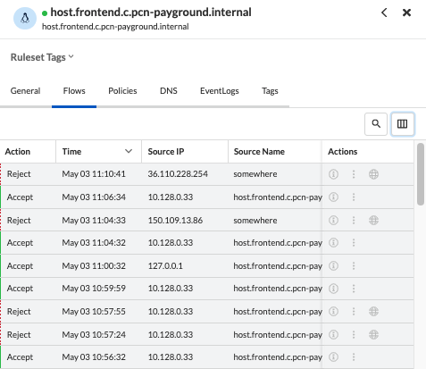

=== DNS Events
You can investigate what are the dns requests being made by a Processing Unit

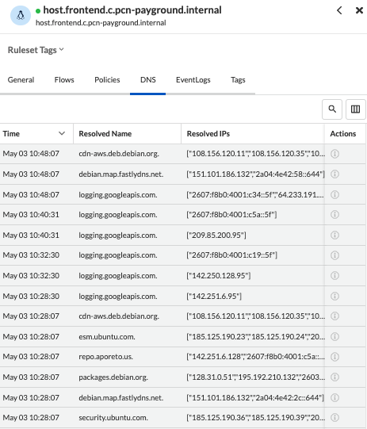

=== Event Logs
You can investigate Enforcer events associated with a Processing Unit

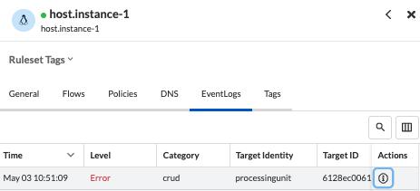