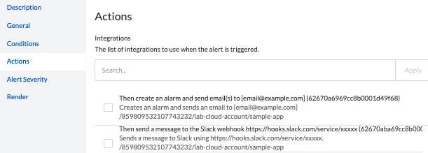
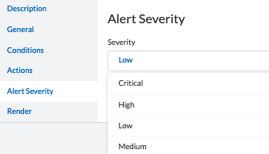
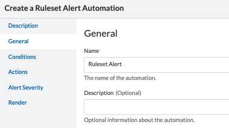

= Alerts and Automations
Alexandre Cezar <acezar@paloaltonetworks.com> 1.0, April 25, 2022:
:toc:
:toc-title:
:icons: font

Prisma Cloud Microsegmentation alerts are used on situations where you have specific controls you want to enforce and be alerted when a violation occurs:

== Alert Types
There are 4 specific alert types supported on Prisma Cloud Microsegmentation:

* Ruleset -> Alerts are generated when traffic matches a specific ruleset.

* Host Processing Units -> Alerts are generated when a Host PU is connected or disconnected.

* Enforcer -> Alerts are generated when an Enforcer is connected or disconnected

* Audit -> Alerts are generated when a specific action is executed in the system.

== Alert Components
There's always two components to an alert:

* Integration -> Defines the downstream system where alerts will be forwarded to. +
Today, email and Slack are supported integrations

* Automation -> Defines what Alert type is going to be created and its triggers.

== Creating an Integration
Navigate to _Manage/Alerts and Automations_ and click on the Integrations tab.

Click on the _"Add"_ button on the right and select the Integration you want to create.

image::images/automations-01.png[width=500,align="center"]

For the email integration, just type the emails you want to send alerts to

For the Slack integration, just type the incoming Webhook URL of the Slack channel you want to send alerts to

image::images/automations-03.png[width=500,align="center"]

[NOTE]
You cannot edit an Integration once it's created.

== Creating an Automation
Navigate to _Manage/Alerts and Automations_ and click on the Automations tab.

Click on the _"Add"_ button on the right and select the Automation type you want to create.

image::images/automations-04.png[width=500,align="center"]

=== Create a Host PU Automation
The Host PU Automation Wizard will request the following information:

* General -> Provide a name and description for the automation (optional).

image::images/automations-05.png[width=500,align="center"]

* Conditions -> Define what Host PU events should be alerted upon. +
The following conditions are available: +
** Host PU start event
** Host PU stop event
** Host PU start or stop event

image::images/automations-06.png[width=500,align="center"]

* Actions -> Define what Integration(s) will be notified once an event is detected.

* Severity -> Define the Alert severity.

=== Create a Ruleset Automation
The Ruleset Wizard will request the following information:

* General -> Provide a name and description for the automation (optional).

* Conditions -> In the case of Rulesets, the conditions are: +

** Limit -> Defines how many flow hits a ruleset must have in 5 minutes for the automation to be triggered

** Ruleset Policy IDs -> Select all the rulesets you want to monitor in the automation

[TIP]
default is the ruleset created by the namespace Implicit default action.

* Actions -> Define what Integration(s) will be notified once an event is detected.

* Severity -> Define the Alert severity.

=== Create an Enforcer Automation
The Enforcer Automation Wizard will request the following information:

* General -> Provide a name and description for the automation (optional).

image::images/automations-05.png[width=500,align="center"]

* Conditions -> Define what Enforcer events should be alerted upon. +
The following conditions are available: +
** Enforcer connection event
** Enforcer disconnects event
** Enforcer connection or disconnection event

* Actions -> Define what Integration(s) will be notified once an event is detected.

* Severity -> Define the Alert severity.

=== Create an Audit Automation
The Audit Automation Wizard will request the following information:

* General -> Provide a name and description for the automation (optional).

image::images/automations-05.png[width=500,align="center"]

* Conditions -> Define what system events should be alerted upon. +
The following event types are available: +
** Application Credential events
** Namespace events
** Ruleset events

And for each event type, the following actions can be monitored: +

** create
** delete
** update

* Actions -> Define what Integration(s) will be notified once an event is detected.

* Severity -> Define the Alert severity.

[IMPORTANT]
Integrations and Automations are namespace specific and as such, multiple integrations and automations can be leveraged independent of each other, although propagation is supported from parent to children.

