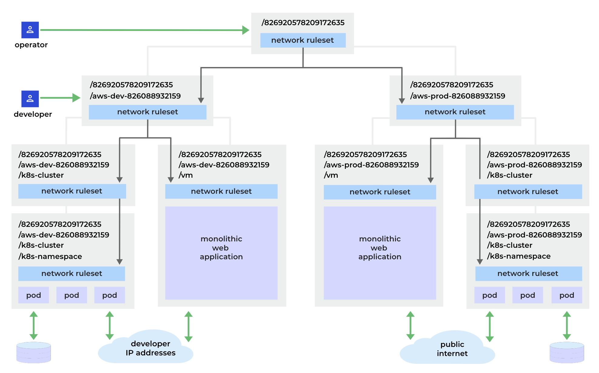
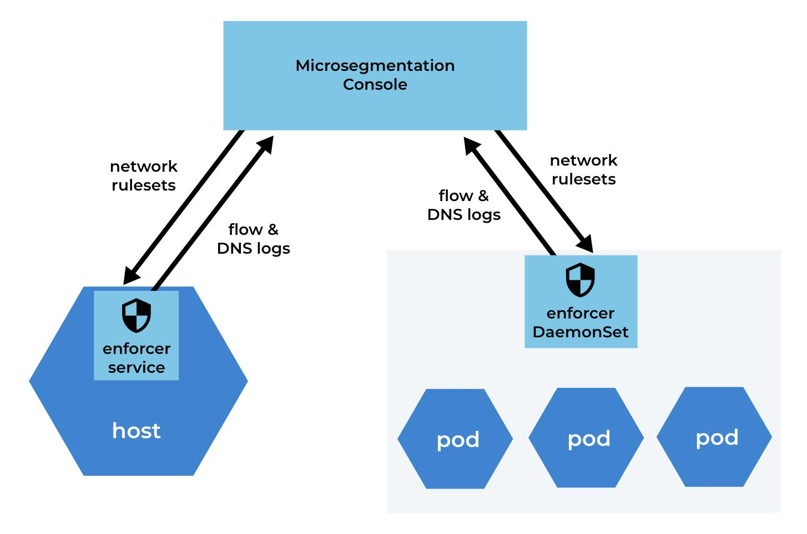
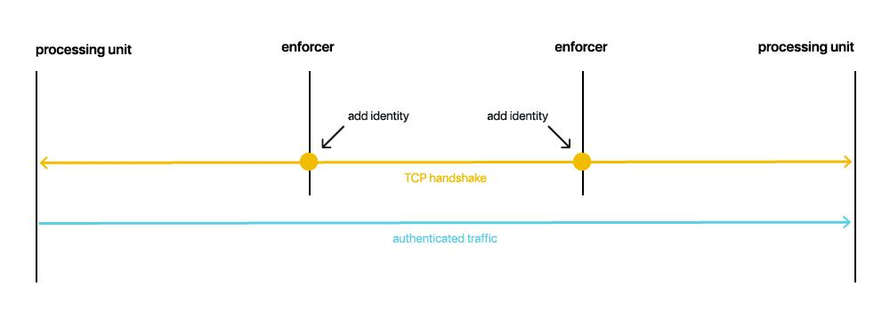
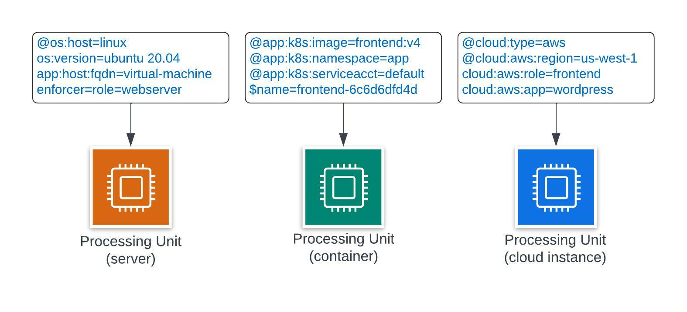
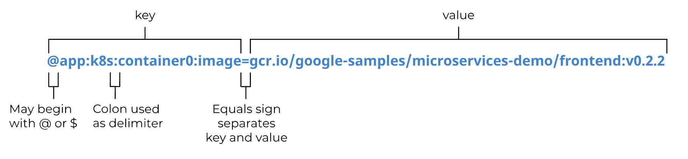
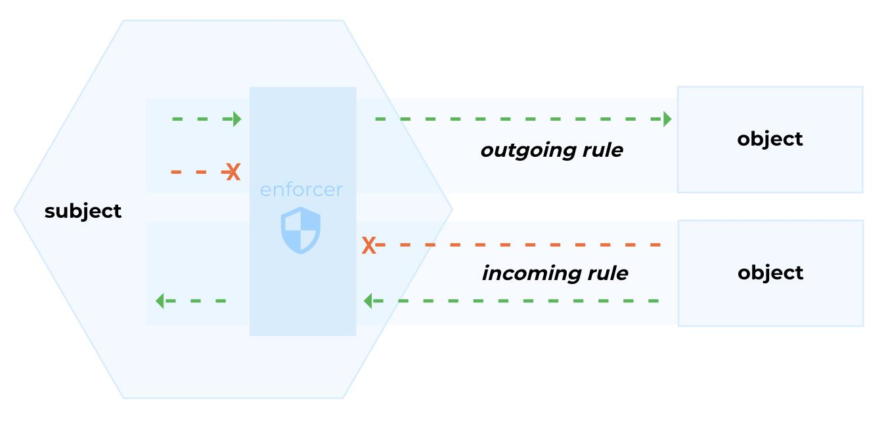
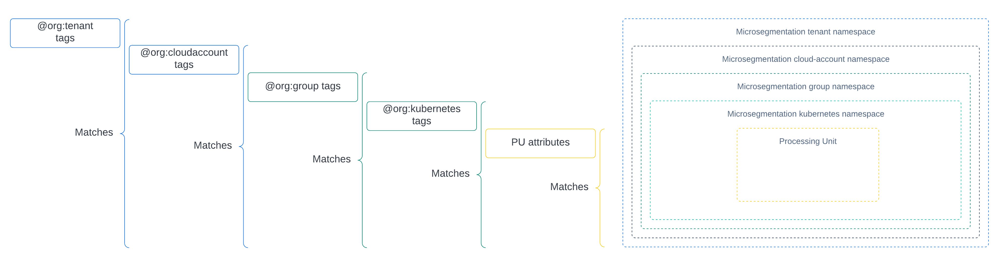
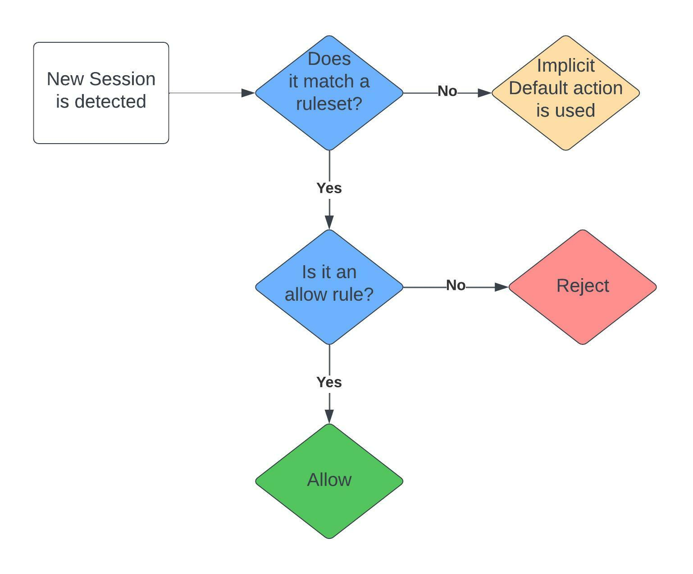

= Concepts
Alexandre Cezar <acezar@paloaltonetworks.com>, April 1, 2022:
:toc:
:toc-title:
:icons: font

Learn about the critical components in the Prisma Cloud Identity-Based Microsegmentation solution

== Microsegmentation Console
The Microsegmentation Console manages all Microsegmentation resources. You can access it from three interfaces.

* Web interface: a web application accessed through your browser that allows you to define all resources, as well as view a visual representation of all applications that are protected by Microsegmentation. +

All possible actions in the web interface may be alternatively performed by scripts, SDK or API instead.  +

* Command line: apoctl is the Microsegmentation command line interface (CLI). It supports completion as well as various other commands that will help you automate everything. +

* REST API: the Microsegmentation Console API allows programmatic manipulation of all parts of the system. +

Both the web interface and apoctl act as clients of the Microsegmentation Console API.

== Microsegmentation Namespaces
In Microsegmentation, a namespace define a logical groups of resources. +

They have hierarchical relationships, like folders in a file system designed to work in a 4 level hierarchy.

You should group your resources according to their users, which may be inside or outside of your organization. An optimal namespace scheme makes it easier to provide a good user experience and access control.

The top level namespace (tenant) is automatically set to your Prisma Tenant ID and you cannot delete it. +

The second level namespace (cloud account) should represent the Cloud Account (AWS, Azure, GCP, Oracle, Alibaba, etc) where your applications are deployed or your physical Datacenter, in case your resources are deployed on-prem. +
This namespace is automatically created when you onboard cloud accounts on the CSPM module and can be deleted. You can also create them manually. +

The next namespace level (group) depends on the workload type which can be either a namespace that hosts VMs and/or Hosts or a Kubernetes cluster. +
Group level namespaces are always manually created.

If the group level namespace hosts a Kubernetes cluster, there will be a set of 4th level namespaces which aligns with the Kubernetes cluster namespaces (kubernetes).

We recommend the following namespace scheme: +

* Tenant namespace: represents your organization. +

* Children namespaces: cloud accounts, private clouds, data centers, subscriptions or projects. +

* Grandchild namespaces: represent either Kubernetes/OpenShift clusters or VMs. Each cluster needs its own grandchild namespace. +

* Great-grandchild namespaces: the Kubernetes namespaces of your clusters. +

The following example shows an organization named /803920923337065472 with two children namespaces: aws-dev-826088932159 and aws-prod-826088932159. +

The aws-dev-826088932159 namespace contains the development environment and the aws-prod-826088932159 account contains the production environment. +
Both contain the same resources, but one set is under development and the other is in production.

[TIP]
====
Additional information on how to design and implement a namespace hierarchy is offered in the *https://xxx[Planning a Microsegmentation deployment]* guide.
====

=== Implicit Defaults
Every namespace has a setting called _"Implicit Defaults"_ which controls what is the default namespace action for flows that don't match a Network Ruleset. +

There are 3 possible values: +

* Inherit (the namespace will receive the default action from its parent) +
* Allow (if no ruleset matches a given flow, this action will take place) +
* Reject (if no ruleset matches a given flow, this action will take place)

[IMPORTANT]
====
If you're starting with Microsegmentation or just want to have in-depth network visibility, make sure your namespace action is set to Allow.
====

== Enforcer
The Enforcer is the Microsegmentation agent that monitors and controls traffic to and from processing units.

You deploy it as a service on a virtual machine and as a DaemonSet on a K8s cluster.

It connects to the Microsegmentation Console API to retrieve network rulesets and to send flow and DNS resolution logs.

The enforcer can control traffic between processing units at different layers of the network stack.

At layer 3, it automatically adds the processing unit’s cryptographically signed identity during the SYN/SYN->ACK portion of TCP session establishment (or by using UDP options in the case of UDP traffic).

At layer 4, it exchanges identities after a TCP connection is established, but before any data traffic is allowed to flow.
In this case, it utilizes TCP Fast Open to minimize the round-trip times needed to complete a robust authorization.

The addition of these cryptographically signed tags allows Microsegmentation to exchange and verify the identity of both processing units and validate if there is a network ruleset which will allow or deny traffic between the two endpoints. Once the authentication and authorization is complete, the enforcer allows both processing units to communicate directly.

For detailed information about Enforcers, please read the document *https://github.com/alexandre-cezar/cns-docs/blob/main/How%20Enforcers%20work%3F.adoc[How Enforcers work?]*

== Processing Unit
A processing unit represents a unit of computation that the Enforcer will protect by generating a unique identity and enforcing network ruleset. A processing unit can be: +

* Virtual machine +
* Bare metal server +
* Docker container +
* Kubernetes pod +

The Enforcer assigns identities to the processing units based on the unique combination of attributes a processing unit has and use each respective identity to monitor and protect the network interactions related to a given processing unit.

== External Networks
External networks represent workloads without Enforcers or where Enforcers cannot be installed. +

Because external networks don’t have Enforcers, you can’t control their attempts to initiate or accept connections. However, you can control whether processing units: +

* Initiate connections to external networks +
* Accept connections from external networks

== Identity and Tags
Each object in Microsegmentation has a set of key-value pairs that describe its attributes, called tags. +

Tags allow you to identify users and workloads to determine whether they should be allowed to access resources and communicate.

Enforcers populate the values of tags from various sources, such as the host (operational system information), cloud provider metadata (region, zone, service account, tags, etc), kubernetes (node, namespace, labels, etc) and tags created by the Microsegmentation Console during a processing unit registration. +

You can also add custom tags manually during the agent install (they're called Enforcer tags). +
Enforcer tags, as the name implies, are tags that belong to the agent, rather than the processing unit, but still can be leveraged to create network rulesets.

=== Tag Syntax
The following diagram shows an example of a Microsegmentation tag

Each Microsegmentation tag has at a minimum a key and a value, separated by an equals sign. The key portion of the tag may also include the following symbols. +
It may begin with either a @ or a $ character. +

The @symbol identifies the tag as consisting of metadata, populated by the Microsegmentation Console at the time that the object is created. +
Tags with the @ will always be followed the source of where this tag was ingested, such as @cloud:aws, @cloud:azure, @cloud:gcp, @app:k8s, @app:docker, @org (Prisma Cloud tags), etc.

The $ symbol identifies a tag based on attributes of the object, such as name, status, type, etc.

For more complex keys, consisting of several parts, a colon is used as a delimiter.

== App credentials and Tokens
Each Microsegmentation Console has its own private certificate authority (CA) capable of issuing X.509 certificates to authorized clients upon request. It uses public-private key cryptography to ensure that private keys never travel the wire. +

Authorized clients can use X.509 certificates issued by the Microsegmentation Console CA to access the Microsegmentation Console API. We These certificates are called "app credentials". +
They allow the clients to:

* Access to the authorized namespace and its children.

* Read-write permissions as per Microsegmentation role assigned to it.

* App credentials expire ten years from the date of issuance. They require a mutual TLS connection to the Microsegmentation Console.

[IMPORTANT]
====
TLS-intercepting middleboxes must be configured to exclude communications between the client and the Microsegmentation Console.
====

=== Microsegmentation Tokens
The Microsegmentation Console also issues and accepts Microsegmentation tokens (JSON web tokens) for authentication. +
You can set various restrictions such as limited permissions and short validity to reduce risk from man-in-the-middle attacks.

== Network rulesets
Network Rulesets are stateful policies that allow you to control traffic between: +

* Processing units +
* Processing units and External networks

=== Network Rulesets components
Each network ruleset must have at least one subject, rule, and object. +

* Subject: Must match the attributes of a processing unit

* Rule: Control incoming or outgoing traffic and their respective actions

* Object: Can be an external network or a processing unit +

The following diagram illustrates the syntax and enforcement of network rulesets.

For simplicity, the diagram above shows a ruleset with just one subject, two rules, and two objects. A ruleset can have multiple subjects, incoming rules, outgoing rules, and objects.

=== Tag Matching in Rulesets
Rulesets will always match the more specific tags. If you are matching the tags of a cloud account namespace, that means all processing units that has this tag (basically all PUs deployed on children namespaces will be matched against this ruleset). +

If you add the tags of a group namespace or Kubernetes namespace and also specific attributes of a processing unit (like the image name or FQDN) to the subject and actions, only the specific PUs will match this policy.

=== Rulesets Precedence Order
For each new session, the Enforcer checks its local network rulesets to find a matching ruleset. +
It may find multiple matches. If so, it resolves these as follows. +

Inheritance is an important concept to understand as rulesets created on parent level namespaces are inherited by all child namespaces. +
This capability allows administrators to define guardrails at the tenant or cloud-account namespaces that will be enforced across all applications.

[IMPORTANT]
====
If two identical rulesets with different actions match a given flow, the reject action is used as reject always takes precedence over allow
====

== apoctl
apoctl is the official command line tool (CLI) and the recommended way to interact with the Microsegmentation Console in a programmatic manner.

== api-server (K8s CRD operator)
If you are using the kubectl CLI or Helm charts to manage your K8s environment, Prisma Cloud offers a Kubernetes api-server that offers support for custom resource definitions. +
This allows administrators to manage microsegmentation objects that are part of the _network.prismacloud.io_ API group using kubectl commands.
