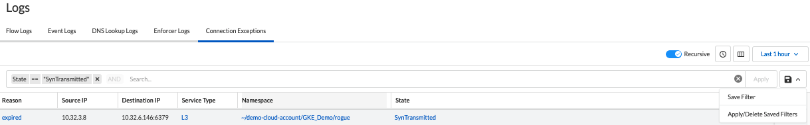

= Connection Exceptions
Alexandre Cezar <acezar@paloaltonetworks.com> 1.0, May 13, 2022:
:toc:
:toc-title:
:icons: font

Connection Exceptions are generated when Enforcers try to establish a session between two resources based on their own rulesets and the session is dropped due to another Enforcer on a different namespace to have a ruleset rejecting the flow or because an external device is interfering with the identity certificate or dropping the session.

To monitor/investigate Connection Exceptions, navigate to Logs/Connection Exceptions

The page will present several options as we can see below,

To note:

* Search Bar -> Allows users to create queries to search for specific events.

* Recursive -> Enable/Disable visualization of events from child namespaces

* Time Range button -> Enable/Disable the timeline view

* Column selector -> Selects the specific log fields you want to visualize

* Time View Box -> Selects the time range you want to inspect

* Save button -> Allows you to Save/Apply/Delete queries

== Connection Exception types
A connection exception may be generated on two scenarios:

- SynTransmitted - The source Enforcer sent a SYN packet with identity and the response was never received

- SynAckTransmitted - The destination Enforcer replied with a SYN-ACK packet with identity but the handshake could not be completed.

An _expired_ reason means that the session timedout and no packet was received by the reporting side.

== Connection Exception details
The data view allows you to investigate and analyze all content in a Connection Exception log

Different fields can be selected for visualization, depending on your preference.

The complete list of event log fields is provided below

|===
|Field name | What it means?

| "ID"
| "Unique Report ID"

| "enforcerID"
| "Unique Enforcer ID"

| "DestinationIP"
| "Destination IP where the identity was sent to"

| "destinationPort"
| "Destination Port where the identity was sent to"

| "enforcerNamespace"
| "Namespace where the Enforcer that generated the exception is deployed"

| "namespace"
| "Namespace where the exception happened"

| "processingUnitID"
| "Unique Processing Unit ID"

| "protocol"
| "Protocol where the session was established"

| "reason"
| "The reason why a connection wasn't established"

| "serviceType"
| "The data-path used to try to establish a connection"

| "sourceIP"
| "Source IP where the identity was sent from"

| "state"
| "The stage of the connection when the drop was identified"

| "timestamp"
| "Event timestamp",

| "value"
| "Number of occurrences"

|===

== Searching Logs
Creating specific search is as simple as clicking on an interesting field, and it will automatically be added to your query. You can continue selecting fields to match the exact traffic you are interested in. +

You can also manually select the fields and add the values directly in the search bar.

[TIP]
If you hold the _shift_ key before selecting a field, it will be added as a _negation_ to your query

== Using Saved Queries
Once you create a query that may be reused in the future, you can save it and reapply it later.

For that, simply click the _Save_ button, provide a name to your Search and the query will be added to your collection

You can visit this anytime in the future to reapply your saved queries or delete them.

image::images/connection-exception-5.png[width=500,align="center"]

[WARNING]
Saved queries are saved locally in your browser. They may appear differently in other devices
