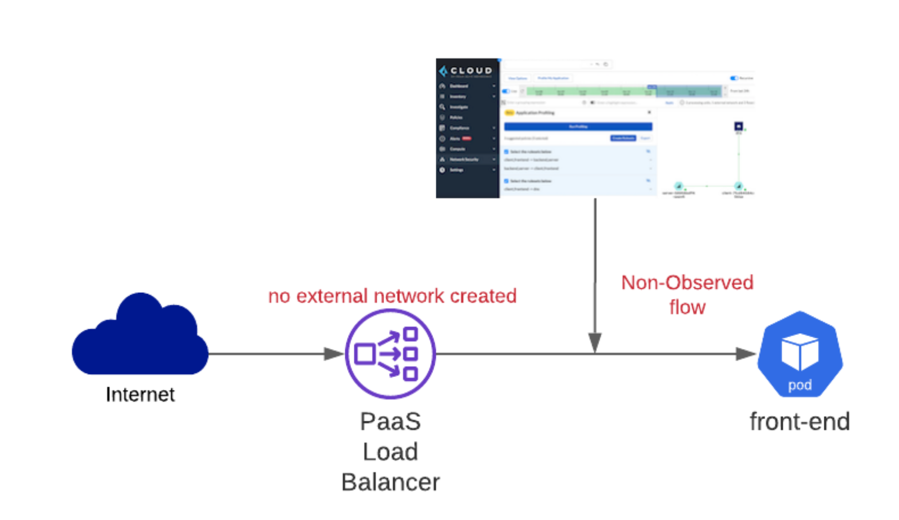
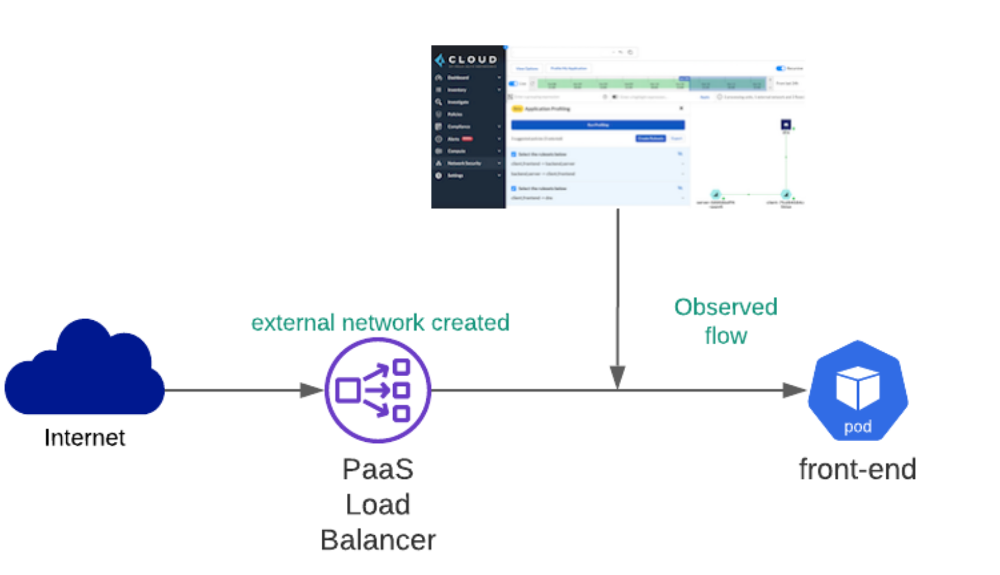
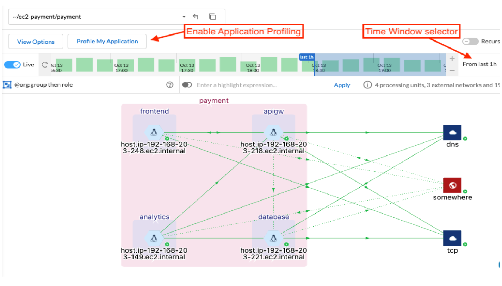
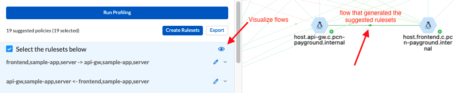
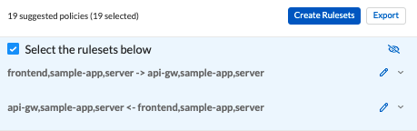

= Create an Application Profile
Alexandre Cezar <acezar@paloaltonetworks.com> 1.0, April 7, 2022:

https://xxx[Application profiling] analyses the accepted flows from the App-Dependency Map for the selected timeframe and provides a very granular set of tags that reflect the application resources. +

For every single flow analyzed, the algorithm identifies the source and destination are processing units if both are processing units, it removes all the unnecessary (or noisy) tags (those which are not starting with the tag prefixes or those which are too repetitive) and determines the smallest group of tags that represents both workloads for a given flow. +
It then optimizes both source and destinations to have a common set of tags and converts them into a list of rulesets.

If the source or destination is not a processing unit, you must first create an external network to represent this resource before you can run the Application Profile. +
The algorithm does not profile flows coming from or going to undeclared FQDNs or IP addresses to avoid security issues that may arise from mapping unnecessary or unapproved flows.

*Example* +

Application is exposed to the Internet behind a Load Balancer
The flow tupple is Source (PaaS Load Balancer) → Destination (front-end) processing unit +

If you have not created an external network for this Load Balancer, then App Profiling will observe the flow as <Source IP address> → (front-end) PU and ignore it as shown here:

If there’s a previously created external network that matches the Load Balancer IP address or FQDN, then App Profiling will observe the flow from <external network> → (front-end) PU and it will profile it as shown below:

[NOTE]
Application Profiling leverages only organizational and custom tags to suggest rulesets. +

**Enabling Application Profiling Using the Console**

If you’re not deploying a cloud native application or if your application lifecycle is not managed using a CI/CD process, use this workflow.

* Step 1 - Select the namespace where your application is deployed and go to the App Dependency Map.
** Make sure that all custom tags you want to leverage on your rulesets are added to the namespace tag prefixes before you profile the application.
** Run Application Profiling in a @org:group namespace if your application is VM-based or at the @org:kubernetes namespace level for a containerized application.
This will ensure that only traffic inside that namespace is analyzed and the least privilege rulesets are suggested.

[IMPORTANT]
Application Profiling is not available at the tenant or cloud account level namespaces.

* Step 2 - Define the period for which you want to observe the traffic and select Profile My Application.

* Step 3 - Review the suggested rulesets. +

You can expand the details of a ruleset and look at the rule details. The number of suggested rulesets may vary based on the time window. +

To visualize the specific flows that pertain to a ruleset, click the eye icon to the upper right of each ruleset.

Application Profiling will always suggest policies based on the flow direction and create rulesets per processing unit.

Example, if client PU only sends traffic to server PU, Application Profiling will suggest 2 rulesets.

In the image above, we can verify that Application Profiling suggested 2 rulesets for the related flow

* Client Ruleset
- Allow client to send outgoing traffic to the server

* Server Ruleset
- Allow server to accept incoming traffic from the client

[NOTE]
The reason why Application Profiling suggests 2 policies for the example above, is because policies need to be applied at both client and server Enforcers.

