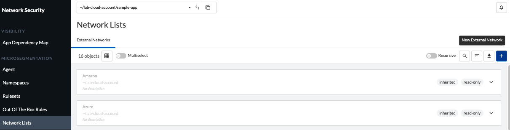
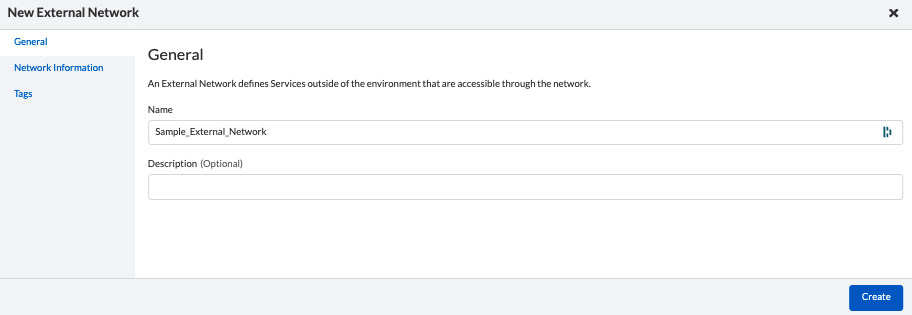
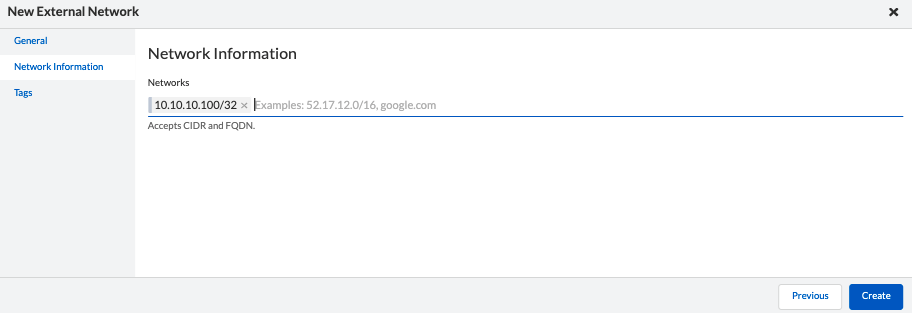
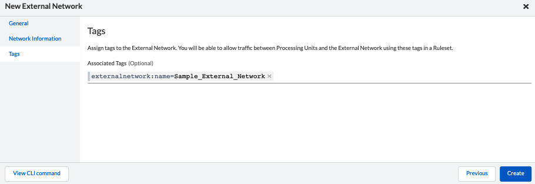
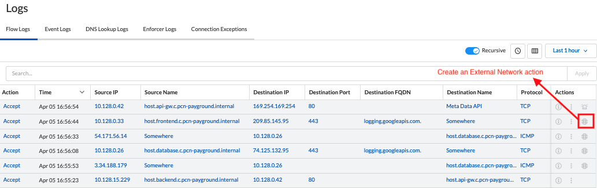
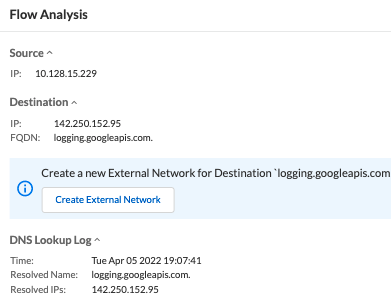

= Create External Networks
Alexandre Cezar <acezar@paloaltonetworks.com> 1.0, April 5, 2022:

To create an External Network, navigate to your Prisma Cloud Console and under CNS, select your namespace, click on *Network Lists* on the menu bar and click on the "+" button at the right.

A Guided Wizard will provide the required steps to create an External Network.

* Provide the External Network name: +

* Add the External Network IP (use CIDR) or FQDN (multiple entries can be added) +

* Review the associate tags: +

Another way to create an External Network is directly in the flow logs page.

For flows that have a source or destination classified as "somewhere" an additional button, called "Flow Analysis" becomes available under "Action"

Clicking on this button will expand a view that allows you to create an External Network. +

[IMPORTANT]
====
Enforcers will suggest the FQDN of the External Network if there's a DNS Lookup result associated with that IP
====