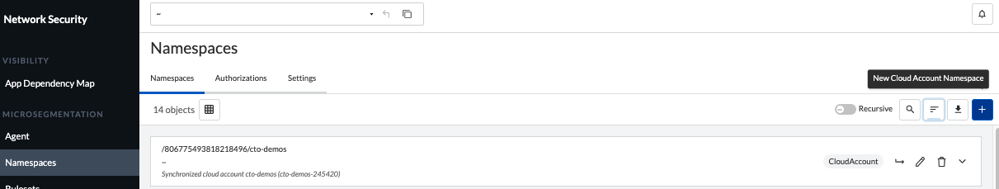
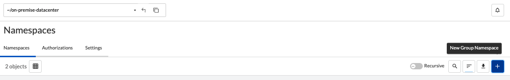

= Create Namespaces
Alexandre Cezar <acezar@paloaltonetworks.com> 1.0, April 7, 2022:
:toc:
:toc-title:
:icons: font

== Create Cloud Account Namespaces
Cloud account namespaces are used to specify: +

* AWS Cloud Accounts
* Azure Subscriptions
* GCP projects
* Datacenter

Step 1 - To create a cloud account level namespace, navigate to the Namespace page under Network Security > Microseg. +
Make sure that you are on the root (tenant level namespace)

Step 2 - Click on the "+" sign button to create a new cloud account level namespace.

Step 3 - Define the Namespace Name

Step 4 - Select the Implicit Default Action (_we recommend you define it as allow initially as child namespaces will inherit this action_)

Step 5 - Leave Organizational Tags and Additional Tag Prefixes as-is (_unless explicitly instructed otherwise by a Prisma Cloud specialist_)

[NOTE]
Cloud Account Namespaces are automatically created for cloud accounts that were onboarded on Prisma Cloud.

== Create Group Level Namespaces
Group  namespaces are used to specify: +

* VM or Server based applications
* K8s/Openshift clusters

Step 1 - To create a group level namespace, navigate to the Namespace page under Network Security > Microseg. +
Make sure that you are on the proper cloud-account namespace

Step 2 - Click on the "+" sign button to create a new group level namespace.

Step 3 - Define the Namespace Name

Step 4 - Select the Implicit Default Action (_we recommend you define it as Inherit as it will receive the Implicit action from the parent namespace_)

Step 5 - Leave Organizational Tags and Additional Tag Prefixes as-is (_unless explicitly instructed otherwise by a Prisma Cloud specialist_) 