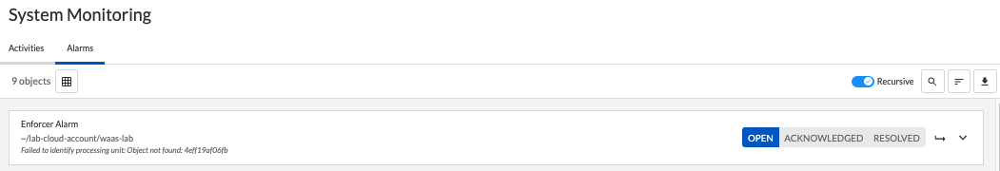
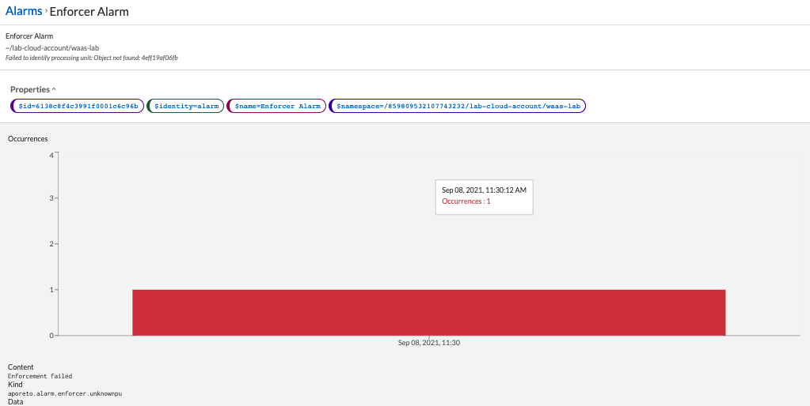
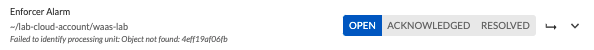
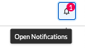
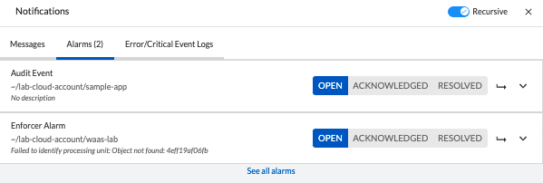

= Enforcer Alarms
Alexandre Cezar <acezar@paloaltonetworks.com>, May 20, 2022:
:toc:
:toc-title:
:icons: font

== What is an Enforcer Alarm?
Certain events or failures may raise a specific alert by an Enforcer, such as a failure to enforce a ruleset or to create a processing unit. Also, Enforcer will raise alarms if they detect an attempt to tamper with its configurations or state.

Once this happens, the alert will be displayed under System Activities/Alarms

By clicking on an alarm, you can look at its details

== Alarm States
An alarm can have 3 states

* Open -> The alarm was created, but no action was taken

* Acknowledge -> The alarm was identified by an user and its under investigation

* Resolve -> The alarm was resolved and no further action is necessary

== Alarm Notifications
When an alarm is on the _Open_ state, it will be available under the Notifications button, on the upper right of the Alarm page

By clicking on it, users can have access to all Alarms that are in the _Open_ state.

== Resolving Alarms
To resolve an Alarm, move its state to _Resolved_

== Alarm List
The list of possible alarms are listed below: