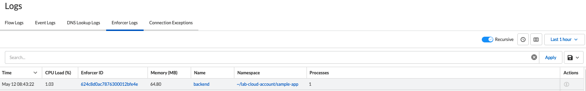
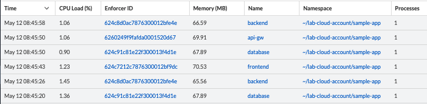
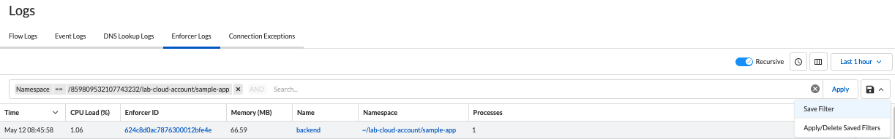
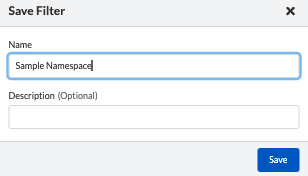
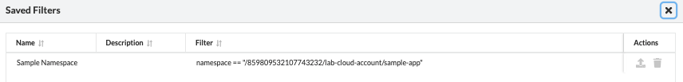

= Enforcer Logs
Alexandre Cezar <acezar@paloaltonetworks.com> 1.0, May 12, 2022:
:toc:
:toc-title:
:icons: font

Enforcer Logs are used to monitor Enforcer's resource consumption (CPU/Memory)

To monitor/investigate Enforcer Logs, navigate to Logs/Enforcer Logs

The page will present several options as we can see below,

To note:

* Search Bar -> Allows users to create queries to search for specific events.

* Recursive -> Enable/Disable visualization of events from child namespaces

* Time Range button -> Enable/Disable the timeline view

* Column selector -> Selects the specific log fields you want to visualize

* Time View Box -> Selects the time range you want to inspect

* Save button -> Allows you to Save/Apply/Delete queries

== Enforcer Logs details
The data view allows you to investigate and analyze all content in an Enforcer log

Different fields can be selected for visualization, depending on your preference.

The complete list of event log fields is provided below

|===
|Field name | What it means?

| "CPULoad"
| "Enforcer CPU usage (%)"

| "ID"
| "Unique Report ID"

| "enforcerID"
| "Unique Enforcer ID"

| "licenseType"
| "Enforcer Type"

| "memory"
| "Enforcer Memory usage (bytes)"

| "name"
| "Hostname of the reporting Enforcer"

| "namespace"
| "Namespace where the report was generated"

| "processes"
| "Number of active Enforcer processes in the host"

| "timestamp"
| "Event timestamp",

|===

== Searching Logs
Creating specific search is as simple as clicking on an interesting field, and it will automatically be added to your query. You can continue selecting fields to match the exact traffic you are interested in. +

You can also manually select the fields and add the values directly in the search bar.

[TIP]
If you hold the _shift_ key before selecting a field, it will be added as a _negation_ to your query

== Using Saved Queries
Once you create a query that may be reused in the future, you can save it and reapply it later.

For that, simply click the _Save_ button, provide a name to your Search and the query will be added to your collection

You can visit this anytime in the future to reapply your saved queries or delete them.

[WARNING]
Saved queries are saved locally in your browser. They may appear differently in other devices