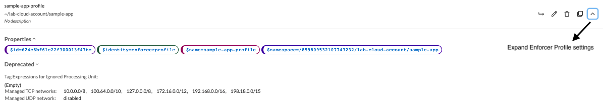
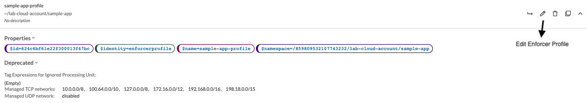
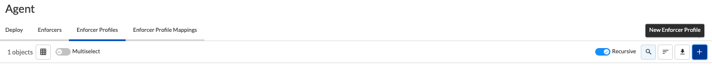
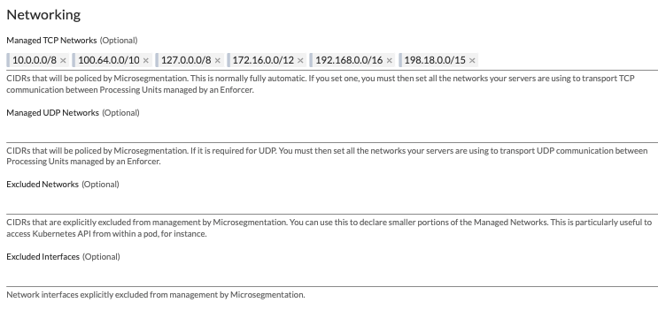

= Enforcer Profile
Alexandre Cezar <acezar@paloaltonetworks.com> 1.0, April 18, 2022:

For an introduction about Enforcers, please check this https://github.com/alexandre-cezar/cns-docs/blob/main/Concepts.adoc#enforcer[page]

== Configuring an Enforcer Profile
Enforcer Profiles are a set of configurations that controls different aspects of Enforcers. +

When you create a new namespace, it automatically creates a new Enforcer profile on that namespace. +

== Visualizing an Enforcer Profile
Navigate to your namespace and select Agent/Enforcer Profiles.

Expand the Enforcer Profile configuration by clicking on the Expand icon on the right.

== Editing an Enforcer Profile
Navigate to your namespace and select Agent/Enforcer Profiles.

Edit the Enforcer Profile configuration by clicking on the pencil icon on the right.

== Creating an Enforcer Profile
Navigate to your namespace and select Agent/Enforcer Profiles.

Click on the _"+"_ sign to go through the Enforcer Profile Wizard

== Enforcer Profile Settings
You can control different aspects of Enforcers on the Enforcer Profile.

* Ignored Processing Units +
If you need to exclude a specific PU(s) from ever being monitored/enforced by a group of Enforcers, you can use this setting to exclude them. Use specific tags ($name= or $image=) to define the excluded PUs.

* Networking +
This group of settings define how Enforcers define where an identity is expected to be sent/received, and it also defines networks and interfaces that needs to be excluded from microsegmentation +

- Managed TCP Networks +
It defines what CIDRs that will be policed by Enforcers for TCP related traffic and therefore where identity packets are expected. By default, the following networks are automatically created. +
_10.0.0.0/8_, _100.64.0.0/10_, _127.0.0.0/8_, _172.16.0.0/12_, _192.168.0.0/16_, _198.18.0.0/15_

- Managed UDP Networks +
It defines what CIDRs that will be policed by Enforcers for UDP related traffic and therefore where identity packets are expected. By default, Enforcers do not add identity to UDP packets. +

- Excluded Networks +
It defines what CIDRs will be completed ignored by Enforcers (no flow reporting, no identity, no rulesets will be applied). By default, no network is excluded from an Enforcer Profile. +

- Excluded Interfaces +
On situations where a host has multiple interfaces and users want to apply microsegmentation to only one or to a specific groups of interfaces, you can exclude the non-wanted interfaces by adding them here. By default, all interfaces are monitored. +

* Syslog +
This setting Enables/Disables the Syslog forwarding feature on Enforcers

The complete configuration guidance for syslog forwarding can be found https://github.com/alexandre-cezar/cns-docs/blob/main/Syslog.adoc[here]

* Tags +
You can assign tags to an Enforcer Profile for easy identification, in situations where you may have multiple profiles (optional).

[TIP]
If your environment requires a custom Enforcer profile that must be shared across all applications, define it at your cloud-account ns level, remove the default Enforcer profile from the children ns and use inheritance as a method to ensure that all applications share the same profile.