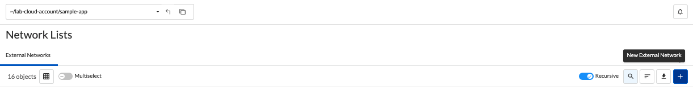
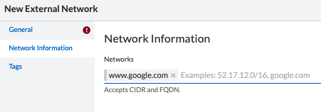
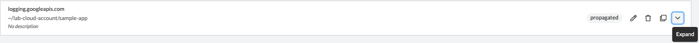
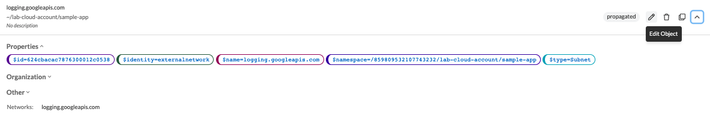

= External Networks
Alexandre Cezar <acezar@paloaltonetworks.com> 1.0, April 19, 2022:
:toc:
:toc-title:
:icons: font

For an introduction about External Networks, please check this https://github.com/alexandre-cezar/cns-docs/blob/main/Concepts.adoc#external-networks[page]

== Creating an External Network
To create an External Network, navigate to your namespace and go to Network Lists

Click on the _"+"_ sign to go through the Create External Network Wizard

* Step 1 - Define a name for your External Network

* Step 2 - Define the External Network value. You can use CIDR or FQDN.

[WARNING]
Wildcards on External Networks are supported but not recommended for use, as they can lead to corner cases where Enforcers may not be able to properly identify the related IP address. Use CIDR or fully qualified domain names and let wildcards be used only on exceptions.

== Visualizing an External Network
Select your Eternal Network and click on the _expand_ sign to edit your External Network

== Editing an External Network
Select your Eternal Network and click on the _pencil_ sign to edit your External Network

[TIP]
External Networks, like any other object, can be inherited by child namespaces. If you have a pre-defined set of external networks your applications are allowed to use, you can create them at a parent level. With that, all applications can only use approved external networks.

== Creating External Networks using apoctl

To create an External Network using apoctl, you will need to create an yaml file with your External Network configuration and import it to the namespace of interest, using the command below:

`apoctl api import -f <file name.yaml> -n /859809532107743232/lab-cloud-account/sample-app`

where _/859809532107743232/lab-cloud-account/sample-app_ needs to be replaced with your namespace information.
