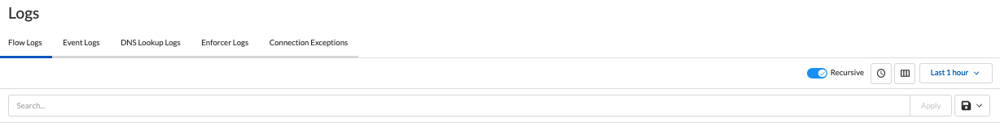
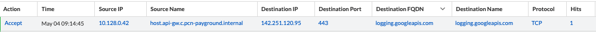
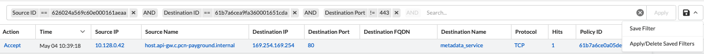
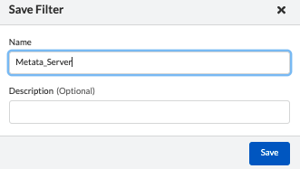
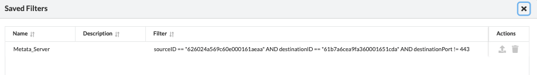
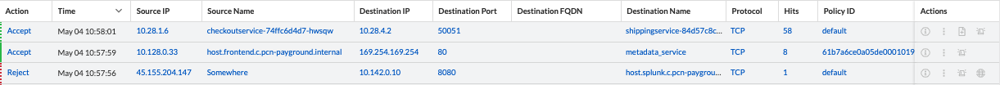
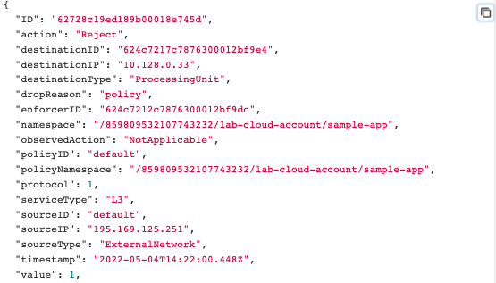
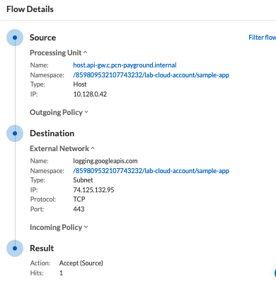
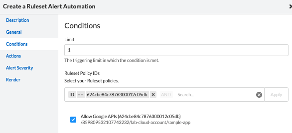
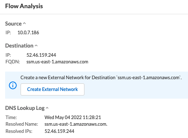

= Flow Logs
Alexandre Cezar <acezar@paloaltonetworks.com> 1.0, May 4, 2022:
:toc:
:toc-title:
:icons: font

To monitor/investigate Flow Logs, navigate to Logs/Flow Logs

The page will present several options as we can see below,

To note:

* Search Bar -> Allows users to create queries to search for specific events.

* Recursive -> Enable/Disable visualization of events from child namespaces

* Time Range button -> Enable/Disable the timeline view

* Column selector -> Selects the specific log fields you want to visualize

* Time View Box -> Selects the time range you want to inspect

* Save button -> Allows you to Save/Apply/Delete queries

== Flow Log details
The data view allows you to investigate and analyze all content in a flow log

Different fields can be selected for visualization, depending on your preference.

The complete list of flow log fields is provided below

|===
|Field name | What it means?

| "ID"
| "Unique Flow ID"

| "action"
| "Resulting Ruleset Action"

| "dropReason"
| "Reported reason for a flow to be rejected"

| "destinationFQDN"
| "Resolved FQDN reported by the Enforcer"

| "destinationID"
| "Internal destination object ID"

| "destinationIP"
| "Destination IP address"

| "destinationPort"
| "Destination Port"

| "destinationType"
| "Object Type related to the Destination address"

| "enforcerDNSReportID"
| "Enforcer DNS report attached to the flow",

| "enforcerID"
| "Unique agent ID",

| "namespace"
| "Prisma Cloud namespace where the flow occurred",

| "observedAction"
|

| "policyID"
| "Unique ID of the ruleset applied to the flow"

| "policyNamespace"
| "Namespace where the applied ruleset was created"

| "protocol"
| "Protocol type"

| "serviceType"
| "Datapath selected by the Enforcer, based on the ruleset type"

| "sourceID"
| "Internal source object ID",

| "sourceIP"
| "source IP address"

| "sourceType"
| "ProcessingUnit",

| "timestamp"
| "Time of Event registration"

| "value"
| "number of flow hits"

| "sourceName"
| "Internal Source Object name"

|  "destinationName"
| "Internal Destination Object Name"

|  "sourceNamespace"
| "Namespace where the source object is reported"

|  "destinationNamespace"
| "Namespace where the destination object is reported"

|===

== Searching Logs
Creating specific search is as simple as clicking on an interesting field, and it will automatically be added to your query. You can continue selecting fields to match the exact traffic you are interested in. +

You can also manually select the fields and add the values directly in the search bar.

[TIP]
If you hold the _shift_ key before selecting a field, it will be added as a _negation_ to your query

== Using Saved Queries
Once you create a query that may be reused in the future, you can save it and reapply it later.

For that, simply click the _Save_ button, provide a name to your Search and the query will be added to your collection

You can visit this anytime in the future to reapply your saved queries or delete them.

[WARNING]
Saved queries are saved locally in your browser. They may appear differently in other devices

== Flow Actions
Different actions can be taken directly from the flow logs view and they are available at the right sidecar of the flow logs bar.

=== Flow action details

* View Info -> Provides a complete view of all log fields

* Flow Details -> Provides a detailed view of the reason behind the resulting flow action, including ruleset details

* Create an Alert -> When selected, this action pre-configures an alert that will trigger when flows matching the selected ruleset are reported. See https://github.com/alexandre-cezar/cns-docs/blob/main/Automations.adoc[Alerts] for more details

* Flow Analysis -> When a flow matches a source of destination that is not a Processing Unit or External Network _somewhere_, this action allows you to create an External Network using the FQDN/IP reported by the Enforcer

* Create a Ruleset Policy -> When a flow matches the default implicit policy, this action will be visible, allowing you to create rulesets to explicitly allow or reject the traffic matching the flow. +
The ruleset is automatically configured by Prisma Cloud (but not automatically created).

[IMPORTANT]
Flows matching _somewhere_ do not offer the "Create a Ruleset Policy" action. +
Create an External Network first.

