= Install Enforcers
Alexandre Cezar <acezar@paloaltonetworks.com> 1.0, April 8, 2022:
:toc:
:toc-title:
:toclevels: 4
:icons: font

== System Requirements
System requirements are documented https://github.com/alexandre-cezar/cns-docs/blob/main/System%20Requirements.adoc[here]

== Installing Enforcers

=== Standard Hosts and VMs (on-prem)
Enforcers can be installed on bare metal servers and virtual machines running on on-prem or private clouds. +

The steps below cover the Enforcer installation in such environments. +

==== Linux

* Step 1 - Navigate to the group Namespace where you want to deploy the Enforcer and once there, click on the Agent/Deploy page. +

* Step 2 - Select Single Enforcer, Platform Type is Linux and under Registration, select Standard.

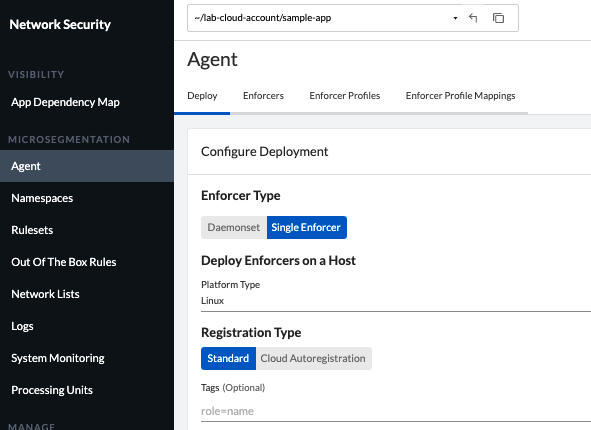

* Step 3 (optional) - If you want to add custom tags to your Enforcer in order to leverage them in rulesets, add them under tags.

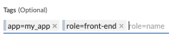

* Step 4 - Copy the resulting installation script and use it to install the Enforcer on your workload.

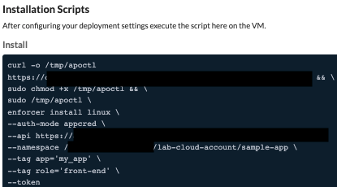

==== Windows Servers and Clients

* Step 1 - Navigate to the group Namespace where you want to deploy the Enforcer and once there, click on the Agent/Deploy page. +

* Step 2 - Select Single Enforcer, Platform Type is Windows and under Registration, select Standard.

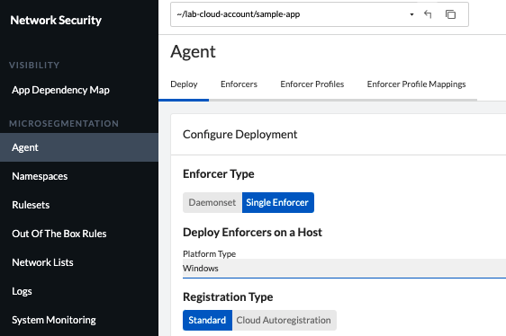

* Step 3 (optional) - If you want to add custom tags to your Enforcer in order to leverage them in rulesets, add them under tags.

* Step 4 - Copy the resulting installation script and use it to install the Enforcer on your workload.

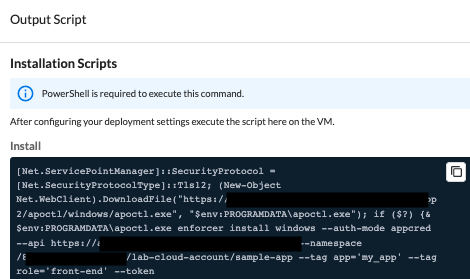

=== Understanding Cloud Auto-Registration
The difference between an Enforcer deployed on-prem and an Enforcer deployed on a public cloud is the registration method. +

On-prem Enforcers uses a short-lived Microsegmentation token, while cloud resources (when using Cloud AutoRegistration) will use a cloud provider signed token, which allows the Enforcer to also retrieve cloud provider metadata.

For Enforcers to be able to use Cloud Auto-Registration, please follow the steps below:

==== AWS
* Step 1 - Obtain your AWS cloud account number

* Step 2 - On Prisma Cloud, navigate to the  Namespace where you want to deploy the Enforcer and once there, click on the Authorizations tab, click on the "+" button and select "Create a Cloud Registration policy".

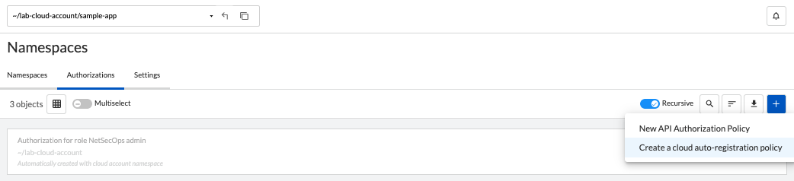

* Step 3 - Under Auto-registration, selects AWS as the cloud provider and under _Claims_, add the string _account=<your AWS account id>_ and finish creating the Auto-Registration policy.

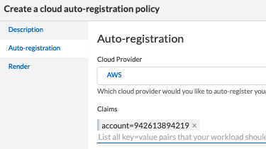

==== Azure
* Step 1 - Obtain your Azure subscription ID or Tenant ID

* Step 2 - On Prisma Cloud, navigate to the  Namespace where you want to deploy the Enforcer and once there, click on the Authorizations tab, click on the "+" button and select "Create a Cloud Registration policy".

* Step 3 - Under Auto-registration, selects Azure as the cloud provider and under _Claims_, add the string _subscriptions=<your Azure subscription>_ or _tenantid=<your Azure tenant id>_ and finish creating the Auto-Registration policy.

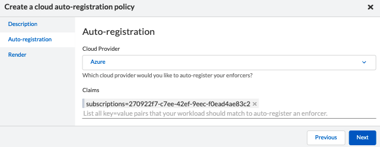

==== GCP
* Step 1 - Obtain your GCP project ID

* Step 2 - On Prisma Cloud, navigate to the  Namespace where you want to deploy the Enforcer and once there, click on the Authorizations tab, click on the "+" button and select "Create a Cloud Registration policy".

* Step 3 - Under Auto-registration, selects GCP as the cloud provider and under _Claims_, add the string _projectid=<your GCP project ID>_ and finish creating the Auto-Registration policy.

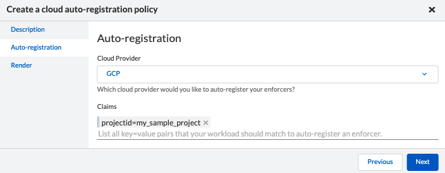

[NOTE]
Cloud Auto Registration is available on AWS, Azure and GCP. For other public cloud providers, use the Standard installation method.

==== Permissions required by Enforcers on public cloud environments.
In order to retrieve CSP and custom metadata from the CSP metadata server, make sure you have the following permissions assigned to your instances:

|===
s|Cloud Provider s|Permission
|AWS
|IAM role attached to the instance, requires the "ec2:DescribeTags" permission

|Azure
|Host VM Identity requires the "Reader Role" permission

|GCP
|Service Account attached to the instance requires "Read Only" permission to Compute Service
|===

=== Installing Enforcers on Public cloud instances
Enforcers can be installed on public cloud instances running in any cloud provider. +

The steps below cover the Enforcer installation in such environments. +

==== Linux

* Step 1 - Navigate to the group Namespace where you want to deploy the Enforcer (make sure the Cloud AutoRegistration policy already exists) and once there, click on the Agent/Deploy page. +

* Step 2 - Select Single Enforcer, Platform Type is Linux and under Registration, select Cloud AutoRegistration.

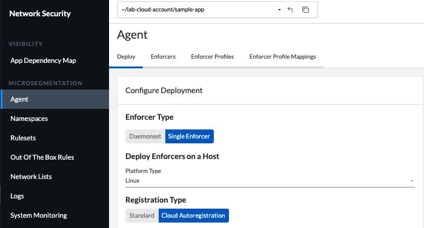

* Step 3 - Copy the resulting installation script and use it to install the Enforcer on your workload.

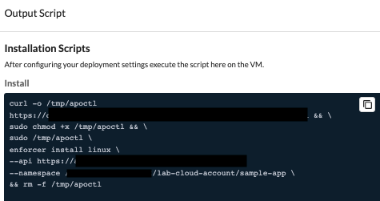

==== Windows

* Step 1 - Navigate to the group Namespace where you want to deploy the Enforcer (make sure the Cloud AutoRegistration policy already exists) and once there, click on the Agent/Deploy page. +

* Step 2 - Select Single Enforcer, Platform Type is Windows and under Registration, select Cloud AutoRegistration.

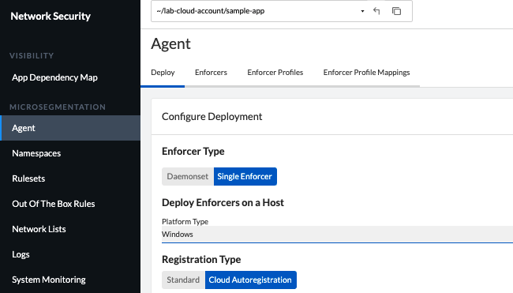

* Step 3 - Copy the resulting installation script and use it to install the Enforcer on your workload.

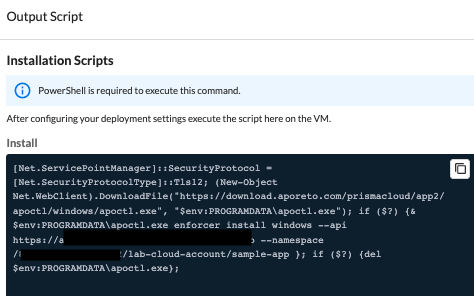

==== Kubernetes
Microsegmentation provides a close integration with Kubernetes and OpenShift to make it easy to control and monitor clusters composed of Linux hosts. +

You can use either of the following methods to deploy the enforcer DaemonSet. +

apoctl, yaml or helm charts

===== AKS

* Step 1 - Navigate to the group Namespace where you want to deploy the Enforcer and once there, click on the Agent/Deploy page. +

* Step 2 - Select Daemonset and under ClusterType, select AKS. Select the CLI Tool Version (the Host OS where the deployment will be executed) and your preferred Installation Mode.

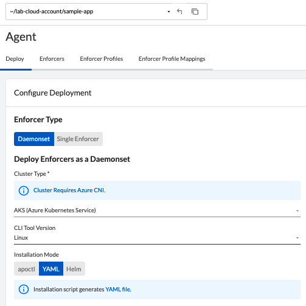

* Step 3 - Copy the resulting installation script and use it to install the Enforcer on your AKS cluster.

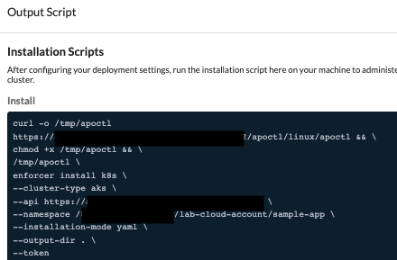

* Step 4 [yaml only] - The resulting script will generate two files. +
- enforcerd-<version>.yaml - Enforcer deployment file
- namespace-secret-<version>.yaml - Enforcer credential. +

Install the namespace-secret file first, then move to deploy the Enforcer, by running the command _kubectl apply -f <yaml file name>_

After the installation is done, you can visualize the Enforcer pods by running the command _kubectl get pods -n aporeto_

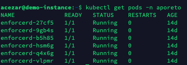

[NOTE]
Make sure the AKS cluster is running the Azure CNI

===== EKS
===== GKE
===== Openshift
===== Tanzu Kubernetes Grid
===== Standard Kubernetes
=== Using Enforcer tags
=== Install the api-server (k8s CRD operator)
==== Enabling the API Server during installation
=== Advanced Options
==== Host Mode
==== Using a non-transparent proxy to connect to the console
==== Enable ipv6
==== Token expiration
==== Install without activation
==== Output script
==== IP Constraint

