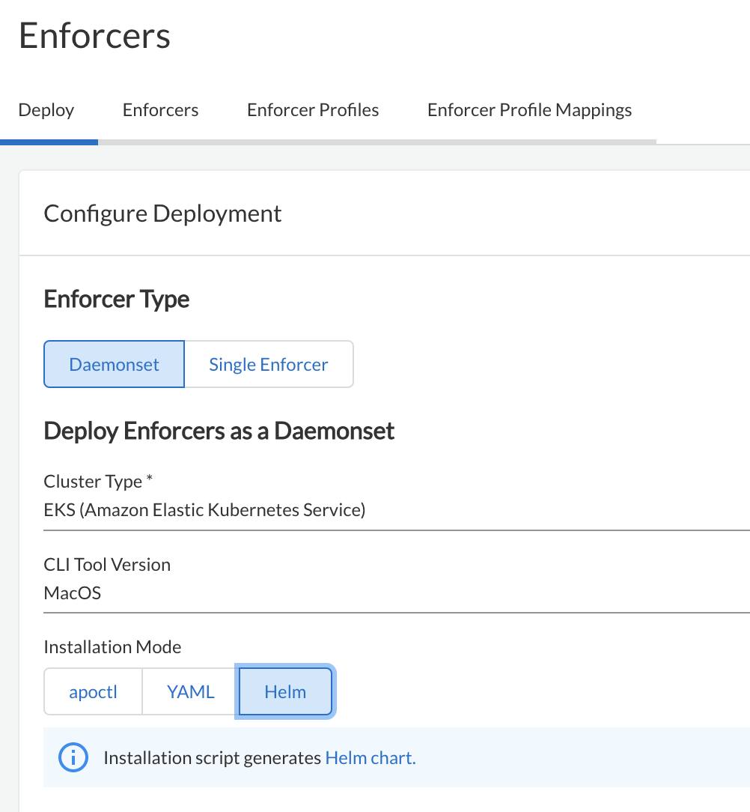
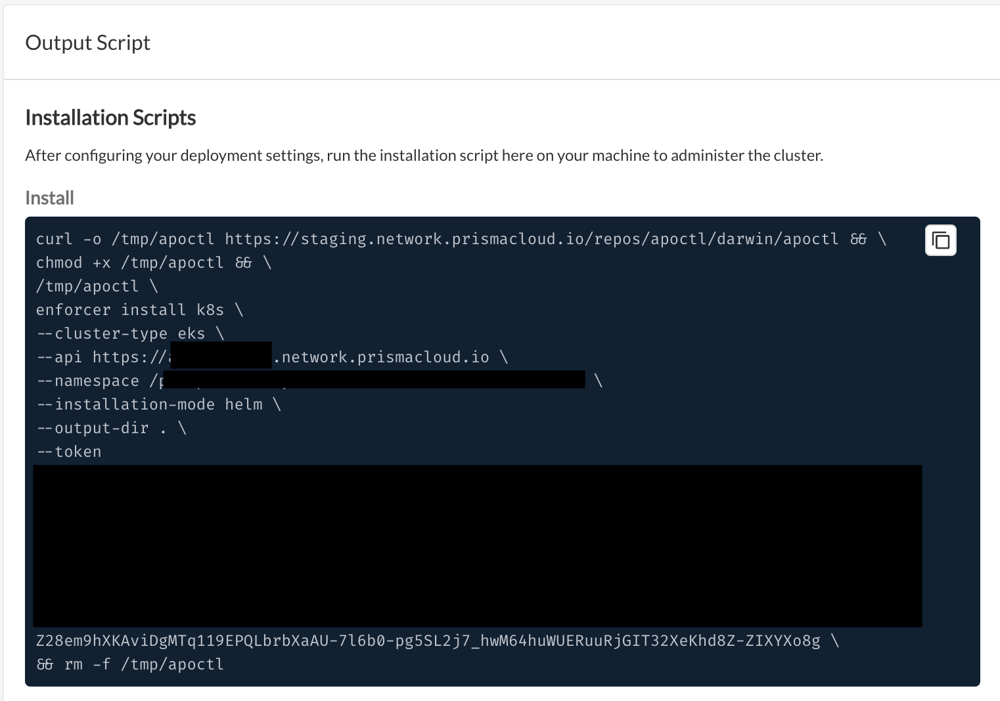
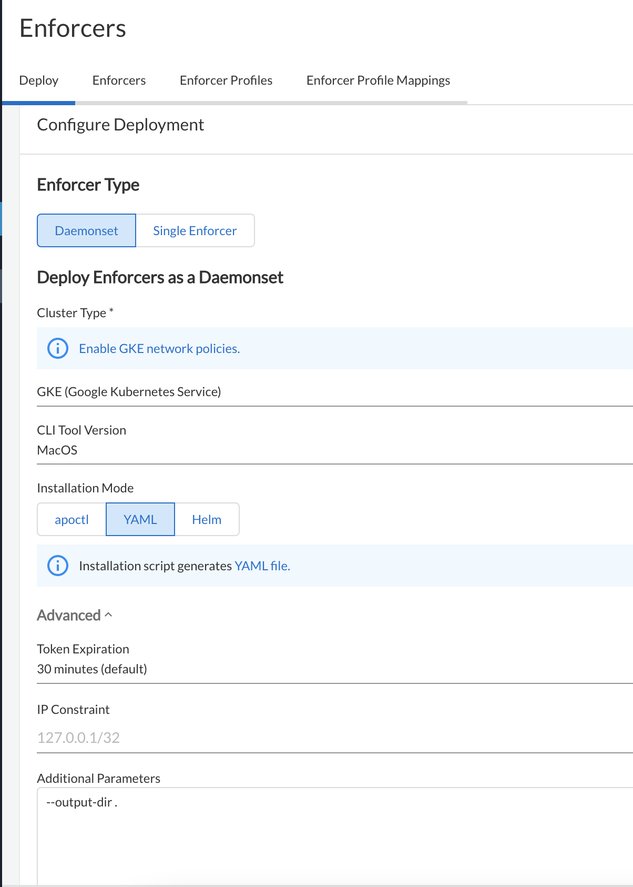
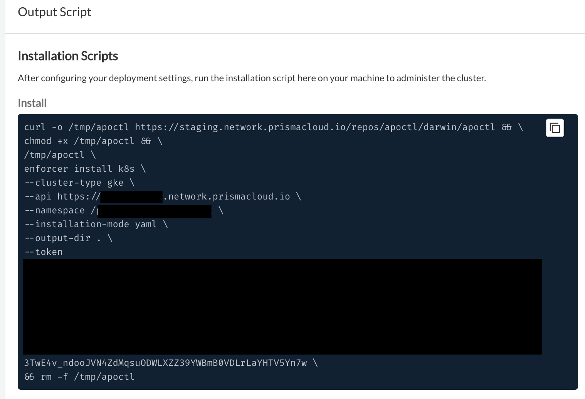
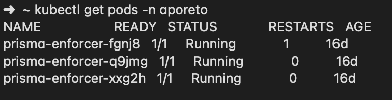
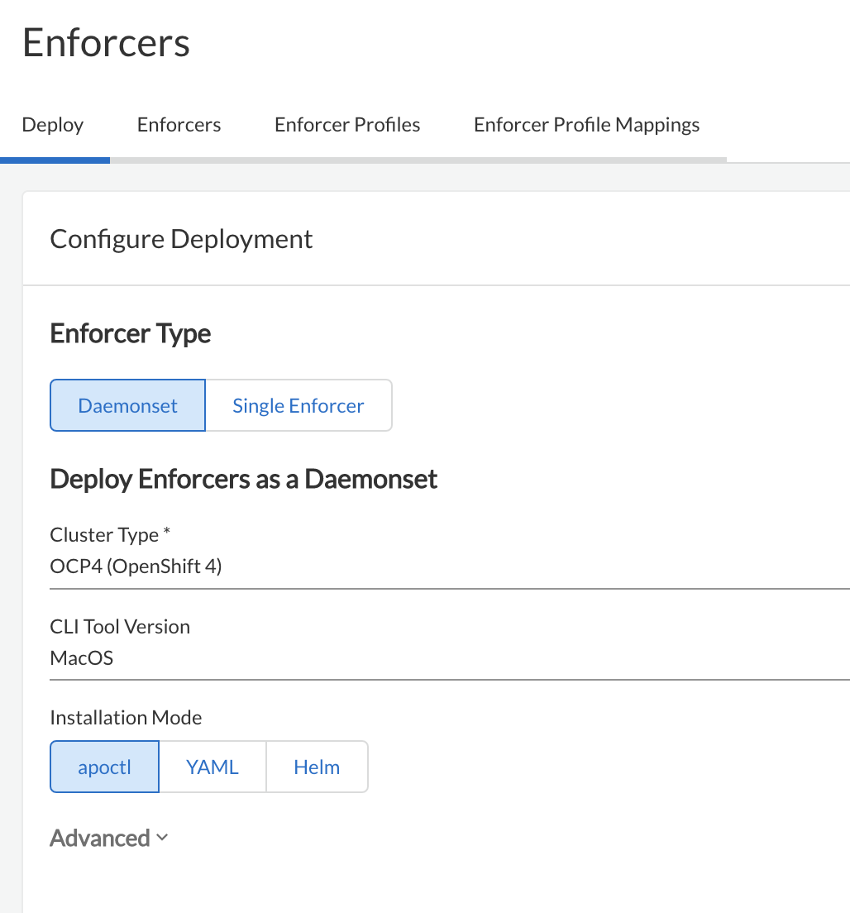
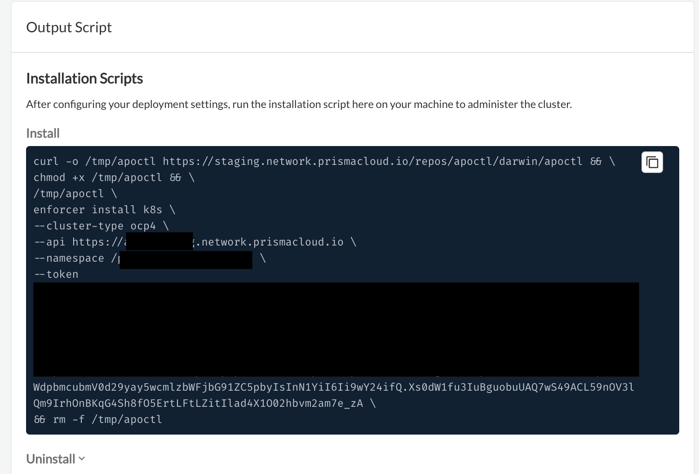
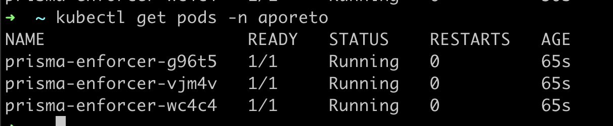

= Install Enforcers
Alexandre Cezar <acezar@paloaltonetworks.com> 1.0, April 8, 2022:
:toc:
:toc-title:
:toclevels: 4
:icons: font

== System Requirements
System requirements are documented https://github.com/alexandre-cezar/cns-docs/blob/main/System%20Requirements.adoc[here]

== Installing Enforcers

=== Standard Hosts and VMs (on-prem)
Enforcers can be installed on bare metal servers and virtual machines running on on-prem or private clouds. +

The steps below cover the Enforcer installation in such environments. +

==== Linux

* Step 1 - Navigate to the group Namespace where you want to deploy the Enforcer and once there, click on the Agent/Deploy page. +

* Step 2 - Select Single Enforcer, Platform Type is Linux and under Registration, select Standard.

* Step 3 (optional) - If you want to add custom tags to your Enforcer in order to leverage them in rulesets, add them under tags.

image::images/install_enforcer-2.png[width=250,align="center"]

* Step 4 - Copy the resulting installation script and use it to install the Enforcer on your workload.

==== Windows Servers and Clients

* Step 1 - Navigate to the group Namespace where you want to deploy the Enforcer and once there, click on the Agent/Deploy page. +

* Step 2 - Select Single Enforcer, Platform Type is Windows and under Registration, select Standard.

image::images/install_enforcer-4.png[width=500,align="center"]

* Step 3 (optional) - If you want to add custom tags to your Enforcer in order to leverage them in rulesets, add them under tags.

image::images/install_enforcer-2.png[width=250,align="center"]

* Step 4 - Copy the resulting installation script and use it to install the Enforcer on your workload.

=== Understanding Cloud Auto-Registration
The difference between an Enforcer deployed on-prem and an Enforcer deployed on a public cloud is the registration method. +

On-prem Enforcers uses a short-lived Microsegmentation token, while cloud resources (when using Cloud AutoRegistration) will use a cloud provider signed token, which allows the Enforcer to also retrieve cloud provider metadata.

For Enforcers to be able to use Cloud Auto-Registration, please follow the steps below:

==== Create Auto-Registration for AWS accounts
* Step 1 - Obtain your AWS cloud account number

* Step 2 - On Prisma Cloud, navigate to the  Namespace where you want to deploy the Enforcer and once there, click on the Authorizations tab, click on the "+" button and select "Create a Cloud Registration policy".

image::images/cloud-registration-1.png[width=550,align="center"]

* Step 3 - Under Auto-registration, selects AWS as the cloud provider and under _Claims_, add the string _account=<your AWS account id>_ and finish creating the Auto-Registration policy.

image::images/cloud-registration-2.png[width=350,align="center"]

==== Create Auto-Registration for Azure subscriptions
* Step 1 - Obtain your Azure subscription ID or Tenant ID

* Step 2 - On Prisma Cloud, navigate to the  Namespace where you want to deploy the Enforcer and once there, click on the Authorizations tab, click on the "+" button and select "Create a Cloud Registration policy".

image::images/cloud-registration-1.png[width=550,align="center"]

* Step 3 - Under Auto-registration, selects Azure as the cloud provider and under _Claims_, add the string _subscriptions=<your Azure subscription>_ or _tenantid=<your Azure tenant id>_ and finish creating the Auto-Registration policy.

==== Create Auto-Registration for GCP projects
* Step 1 - Obtain your GCP project ID

* Step 2 - On Prisma Cloud, navigate to the  Namespace where you want to deploy the Enforcer and once there, click on the Authorizations tab, click on the "+" button and select "Create a Cloud Registration policy".

image::images/cloud-registration-1.png[width=550,align="center"]

* Step 3 - Under Auto-registration, selects GCP as the cloud provider and under _Claims_, add the string _projectid=<your GCP project ID>_ and finish creating the Auto-Registration policy.

[NOTE]
Cloud Auto Registration is available on AWS, Azure and GCP. For other public cloud providers, use the Standard installation method.

==== Permissions required by Enforcers on public cloud environments.
In order to retrieve CSP and custom metadata from the CSP metadata server, make sure you have the following permissions assigned to your instances:

|===
s|Cloud Provider s|Permission
|AWS
|IAM role attached to the instance, requires the "ec2:DescribeTags" permission

|Azure
|Host VM Identity requires the "Reader Role" permission

|GCP
|Service Account attached to the instance requires "Read Only" permission to Compute Service
|===

=== Installing Enforcers on Public cloud instances
Enforcers can be installed on public cloud instances running in any cloud provider. +

The steps below cover the Enforcer installation in such environments. +

==== Linux

* Step 1 - Navigate to the group Namespace where you want to deploy the Enforcer (make sure the Cloud AutoRegistration policy already exists) and once there, click on the Agent/Deploy page. +

* Step 2 - Select Single Enforcer, Platform Type is Linux and under Registration, select Cloud AutoRegistration.

* Step 3 - Copy the resulting installation script and use it to install the Enforcer on your workload.

==== Windows

* Step 1 - Navigate to the group Namespace where you want to deploy the Enforcer (make sure the Cloud AutoRegistration policy already exists) and once there, click on the Agent/Deploy page. +

* Step 2 - Select Single Enforcer, Platform Type is Windows and under Registration, select Cloud AutoRegistration.

image::images/install_enforcer-9.png[width=500,align="center"]

* Step 3 - Copy the resulting installation script and use it to install the Enforcer on your workload.

==== Kubernetes
Microsegmentation provides a close integration with Kubernetes and OpenShift to make it easy to control and monitor clusters composed of Linux hosts. +

You can use either of the following methods to deploy the enforcer DaemonSet. +

apoctl, yaml or helm charts

===== Install Enforcers on AKS clusters
* Step 1 - Navigate to the group Namespace where you want to deploy the Enforcer and once there, click on the Agent/Deploy page. +

* Step 2 - Select Daemonset and under ClusterType, select AKS. Select the CLI Tool Version (the Host OS where the deployment will be executed) and your preferred Installation Mode.

image::images/enforcer-aks-1.png[width=400,align="center"]

* Step 3 - Copy the resulting installation script and use it to install the Enforcer on your AKS cluster.

* Step 4 [yaml only] - The resulting script will generate two files. +
- enforcerd-<version>.yaml - Enforcer deployment file
- namespace-secret-<version>.yaml - Enforcer credential. +

Install the namespace-secret file first, then move to deploy the Enforcer, by running the command _kubectl apply -f <yaml file name>_

After the installation is done, you can visualize the Enforcer pods by running the command _kubectl get pods -n aporeto_

[WARNING]
Make sure the AKS cluster is running the Azure CNI

===== Install Enforcers on EKS clusters
* Step 1 - Navigate to the group Namespace where you want to deploy the Enforcer and once there, click on the Agent/Deploy page. +

* Step 2 - Select Daemonset and under ClusterType, select EKS. Select the CLI Tool Version (the Host OS where the deployment will be executed) and your preferred Installation Mode.

* Step 3 - Copy the resulting installation script and use it to install the Enforcer on your EKS cluster.

* Step 4 [helm only] - The resulting script will generate a scipt and a folder. +
- namespace-secret-<version>.yaml - Enforcer credential
- prisma-enforcer - Enforcer helm chart for the deployment. +

Install the namespace-secret file first, then move to deploy the Enforcer, by running the commands _kubectl apply -f <namespace-secret-<version>.yaml>_ _helm install prisma-enforcer -n aporeto <helm chart path>_

After the installation is done, you can visualize the Enforcer pods by running the command _kubectl get pods -n aporeto_

===== Install Enforcers on GKE clusters
* Step 1 - Navigate to the group Namespace where you want to deploy the Enforcer and once there, click on the Agent/Deploy page. +

* Step 2 - Select Daemonset and under ClusterType, select GKE. Select the CLI Tool Version (the Host OS where the deployment will be executed) and your preferred Installation Mode.

* Step 3 - Copy the resulting installation script and use it to install the Enforcer on your GKE cluster.

* Step 4 [yaml only] - The resulting script will generate two files. +
- enforcerd-<version>.yaml - Enforcer deployment file
- namespace-secret-<version>.yaml - Enforcer credential. +

Install the namespace-secret file first, then move to deploy the Enforcer, by running the command _kubectl apply -f <yaml file name>_

After the installation is done, you can visualize the Enforcer pods by running the command _kubectl get pods -n aporeto_

[WARNING]
Make sure that intra-node-visibility is disabled for the cluster.
Make sure that your cluster has CNI enabled.

===== Install Enforcers on Openshift clusters
* Step 1 - Navigate to the group Namespace where you want to deploy the Enforcer and once there, click on the Agent/Deploy page. +

* Step 2 - Select Daemonset and under ClusterType, select OCP4. Select the CLI Tool Version (the Host OS where the deployment will be executed) and your preferred Installation Mode.

* Step 3 - Copy the resulting installation script and use it to install the Enforcer on your OCP4 cluster.

After the installation is done, you can visualize the Enforcer pods by running the command _kubectl get pods -n aporeto_

===== Install Enforcers on Tanzu Kubernetes Grid
===== Install Enforcers on Standard Kubernetes

=== Using Enforcer tags
Enforcer tags are used when you want to create tags for the Enforcer itself. They are resourceful on environments where security administrators have no permissions to create/modify existing workload tags. +
In such cases, administrators can use Enforcer tags as a way to use custom tags on rulesets.
Add them under the tags section during an Enforcer installation.

image::images/install_enforcer-2.png[width=250,align="center"]

=== Install the api-server (k8s CRD operator)
To install the api-server, add the `--install-aggregated-apiserver` flag as an argument during a K8s Enforcer installation.

For additional information on how use the api-server to manage microsegmentation objects in K8s, please read this https://github.com/alexandre-cezar/cns-docs/blob/main/api-server.adoc[document].

=== Advanced Options
There are several aspects of an Enforcer configuration that are controlled by using advanced flags during an Enforcer install.
They're described below +

==== Host Mode
When Host mode is enabled, the Enforcer protects your Kubernetes pods, containers and nodes.

[IMPORTANT]
You can only change the protection mode when installing the Enforcer. To change the protection mode from container to host mode, you need to reinstall the Enforcer.

To enable host mode, you must use the `--raw-flags --enable-host-mode` advanced configuration option when installing the Enforcer. +
Alternatively, you can enable host mode directly in the Prisma Cloud administrative console.

For additional information on how use the api-server to manage microsegmentation objects in K8s, please check this https://github.com/alexandre-cezar/cns-docs/blob/main/Host-Mode.adoc[page].

==== Enable non-transparent proxy support
Enforcers require access to Prisma Cloud in order to send telemetry data and receive updates and in some environments this can only be achieved through a non-transparent proxy.

Enforcers support adding a proxy endpoint during install, in order to support such use cases.

[NOTE]
TLS terminating proxies are not supported.

During the Enforcer installation, expand the Advanced option and add the proxy information, as follows:

* Proxy Address — IP address or fully qualified domain name (FQDN) of the proxy server, alongside the protocol and port information: example http://proxy.example.com:8080

* Proxy Credential— User and Password credentials for proxies that require authentication (optional)

* Proxy Server CA — When the proxy server requires a private CA certificate to be used during connection (optional). Upload the proxy certificate in .pem file format.

==== Enable ipv6
By default,Enforcers ignore IPv6 traffic. +
If you have IPv6 in your environment and wish to monitor and control these connections, use the `--raw-flags --enable-ipv6` flag during installation.

==== Token expiration
You can control for how long you want the Microsegmentation token to be valid during an Enforcer install. The default is _30 minutes_, but if you want the value to be lower, you can adjust it for _10 minutes_ or if you need the token to be higher, you can adjust it for _1 hour_

==== Install without activation (Host only)
==== Output script (Host only)
==== IP Constraint
==== Cloud Probes timeout
The Enforcer can determine if it is running in a cloud environment, such as AWS, GCP, or Azure. Use the `--cloud-probe-timeout` to configure the amount of time to wait for these internal probes to complete during installation. Default is two seconds.

