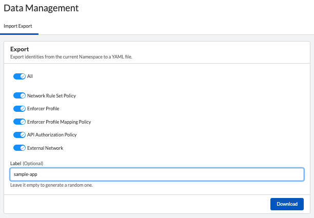
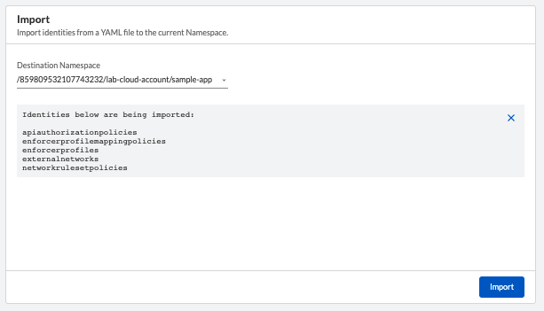
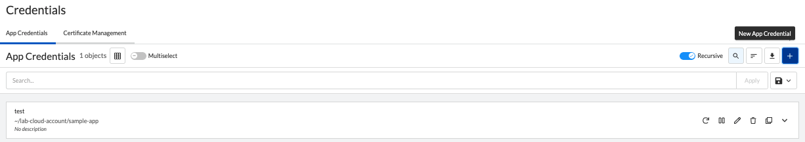
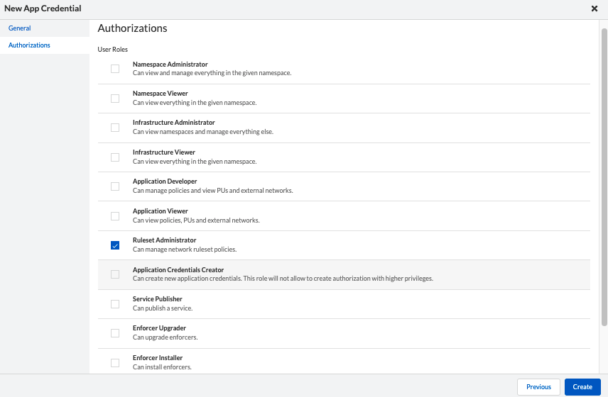
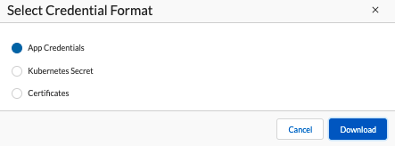
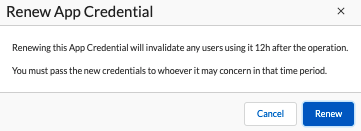
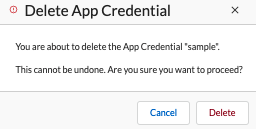
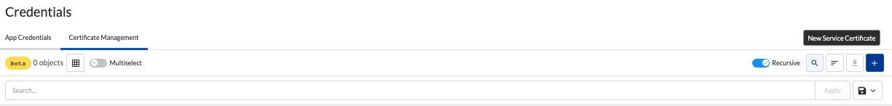
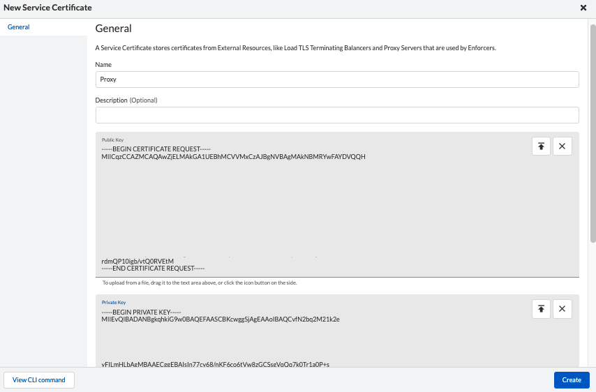

= Management Tasks
Alexandre Cezar <acezar@paloaltonetworks.com> 1.0, May 4, 2022:
:toc:
:toc-title:
:icons: font

Common operational tasks, besides rulesets, external networks and namespaces evolve around 3 additional topics:

* Upgrade Enforcers

* Import/Export the configuration

* Manage certificates and App credentials

Let's look into each topic in more details.

== Upgrading Enforcers
You can upgrade Enforcers in two ways:

* Using the Microsegmentation Console

* Using apoctl

=== Upgrade Enforcers using the Microsegmentation Console

Navigate to Agent/Enforcers and verify the Enforcer version by expanding its details

image::images/upgrade-enforcer-1.png[width=500,align="center"]

[TIP]
You can identify if a new Enforcer version is available when the upgrade button appears for your Enforcers.

You can select a single or multiple Enforcer by enabling the _multiselect_ option

==== Single Enforcer upgrade

image::images/upgrade-enforcer-2.png[width=500,align="center"]

==== Multiple Enforcers upgrade

image::images/upgrade-enforcer-3.png[width=500,align="center"]

The UI will list the selected Enforcer(s) versions and the version you want to upgrade to (latest or a custom version) +

image::images/upgrade-enforcer-4.png[width=350,align="center"]

Once the upgrade process begun, Enforcers will briefly disconnect and its status will transition from "disconnected migration running" back to "connected"

image::images/upgrade-enforcer-6.png[width=250,align="center"]

You can check again at the Enforcer version to confirm that it is now in the desired version.

image::images/upgrade-enforcer-5.png[width=300,align="center"]

=== Upgrade Enforcers using apoctl
To upgrade an Enforcer using apoctl, run the command
`apoctl enforcer switch-to --target-version <version> -n <namespace> --confirm` to upgrade all Enforcers on that namespace. You can also point to a specific Enforcer ID if you want to upgrade just a single Enforcer.

== Importing/Exporting configurations
Importing and Exporting configuration is a common task if you implement microsegmentation using "policy as code" concepts.

=== Exporting Configurations
Select the namespace of interest, navigate to Manage/Data Management, select the objects you want to export, assign a label to the file and click on _Download_

=== Importing Configurations
Navigate to Manage/Data Management, choose the namespace where you want to import the objects (if on a parent), select the file you want to import,  _Import_

=== Exporting/Importing configurations using apoctl
You can use `apoctl` to manage your configurations.

You can export a configuration using the command `apoctl api export --label "<label>" -n <namespace> -f <filename>`

You can import a configuration using the command `apoctl api import -f <filename> -n <namespace>`

For additional options, please check the `apoctl` documentation.

== Managing Certificates and App Credentials
You can manage external certificates and credentials using the Prisma Cloud console.

=== Create an App Credential
Navigate to Manage/Credentials and select the App Credentials tab

* Step 1 -> Click on the _+_ sign to create a new App Credential

* Step 2 -> Name it and define the permissions you want to assign to the credential

* Step 3 -> Save it in the desired format.

[TIP]
If you're using the app credential to use it with `apoctl`, save it as an App Credential

For more details about roles and permissions, please read this https://github.com/alexandre-cezar/cns-docs/blob/main/Roles%20and%20Permissions.adoc[page]

=== Renew an App Credential
You can use renew your app credentials. To do this, click on the _Renew_ icon

A warning message will be displayed stating that the certificate will be renewed and the old certificate will stop working 12h after this operation is done.

Once renewed, a new certificate is provided, and it needs to be distributed to its proper users/services

=== Delete an App Credential
To delete an App Credential, simply click on the delete button.

=== Import an external TLS Certificate
For some tasks that involved external resources that use SSL certificates such as: +

* Rulesets that traverses TLS enabled Load Balancers)
* TLS enabled syslog collectors
* TLS enabled proxies

You need to import the device certificate into Prisma Cloud console.

In order to do this, navigate to Manage/Certificates and select the Certificate Management tab

* Step 1 -> Click on the _New Service Certificate_ icon

* Step 2 -> Import the public and private keys into the console and click on Create

