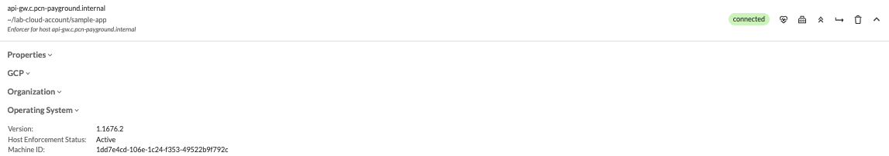
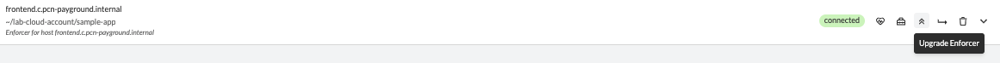
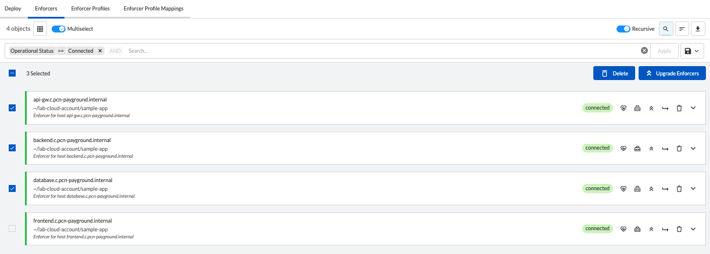
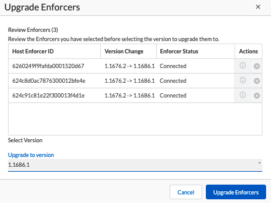
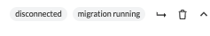
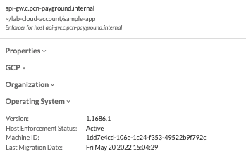

= Management Tasks
Alexandre Cezar <acezar@paloaltonetworks.com> 1.0, May 4, 2022:
:toc:
:toc-title:
:icons: font

Common operational tasks, besides rulesets, external networks and namespaces evolve around 3 additional topics:

* Upgrade Enforcers

* Import/Export the configuration

* Manage certificates

Let's look into each topic in more details.

== Upgrading Enforcers
You can upgrade Enforcers in two ways:

* Using the Microsegmentation Console

* Using apoctl

=== Upgrade Enforcers using the Microsegmentation Console

Navigate to Agent/Enforcers and verify the Enforcer version by expanding its details

[TIP]
You can identify if a new Enforcer version is available when the upgrade button appears for your Enforcers.

You can select a single or multiple Enforcer by enabling the _multiselect_ option

==== Single Enforcer upgrade

==== Multiple Enforcers upgrade

The UI will list the selected Enforcer(s) versions and the version you want to upgrade to (latest or a custom version) +

Once the upgrade process begun, Enforcers will briefly disconnect and its status will transition from "disconnected migration running" back to "connected"

You can check again at the Enforcer version to confirm that it is now in the desired version.

=== Upgrade Enforcers using apoctl
To upgrade an Enforcer using apoctl, run the command
`apoctl enforcer switch-to --target-version <version> -n <namespace> --confirm` to upgrade all Enforcers on that namespace. You can also point to a specific Enforcer ID if you want to upgrade just a single Enforcer.

== Importing/Exporting the configuration

== Managing Certificates