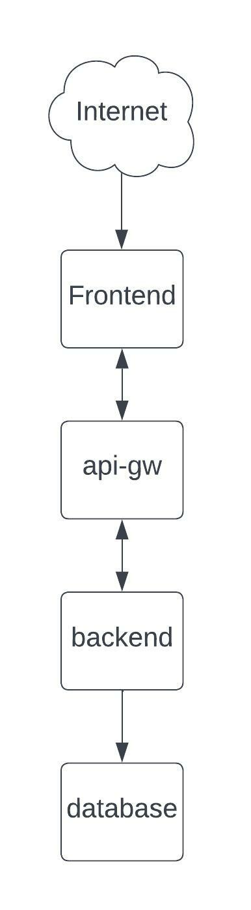
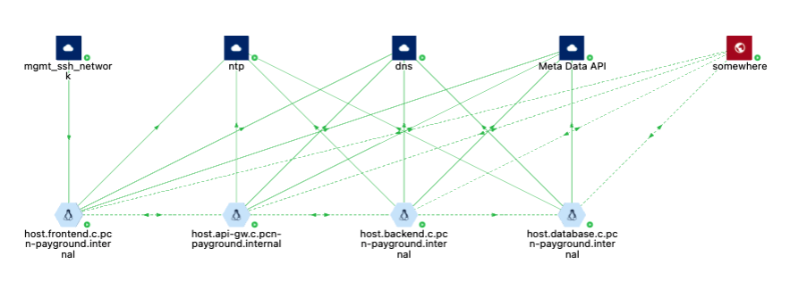
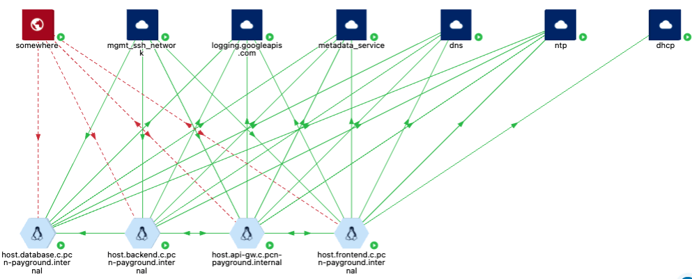

= Monitor Network Traffic
Alexandre Cezar <acezar@paloaltonetworks.com> 1.0, April 5, 2022:

One of the key aspects of microsegmentation is to make sure that all required flows of a given application are being properly allowed by a ruleset. Everything else should be considered as an exception (least privilege model).

With this approach, it becomes easier for security teams to define alarms for guardrail violations and to investigate anomalies.

A practical example is an application that is made of 4 layers (frontend, api-gw, backend and database). +

Let's dig into this application flows for a moment.

* Frontend is an Internet facing workload that requires accepting traffic from public networks;

* Frontend and Backend accepts incoming traffic from the API-GW and also sends traffic to it;

* API-GW accepts incoming traffic from the frontend and backend, and it also sends traffic to these components;

* Database only accepts traffic from the Backend;

By looking at the map, we can now understand what are the application flows and expected behaviors.

Before jumping into the flow analysis, we need to understand that 5 types of flows can exist in the Prisma Cloud Identity Based Microsegmentation solution: +

* Processing Unit to Processing Unit (PU to PU)
* External Network to Processing Unit (Ext Net to PU)
* Processing Unit to External Network (PU to Ext Net)
* Processing Unit to Somewhere
* Somewhere to Processing Unit

====
`_somewhere_` means a resource that is not a Processing Unit or which the IP address/FQDN doesn't match a pre-defined External Network
====

Flows also will have different colors and representations, depending on decision that Enforcers took over it.

- Solid Green - Flow was accepted by an explicit ruleset
- Dashed Green - Flow was accepted by the Implicit Namespace policy (and if you switch the namespace from Allow to Reject, the flow will be rejected)
- Solid Red - Flow was rejected by an explicit ruleset
- Dashed Red - Flow was rejected by the Implicit Namespace policy
- Orange - In a given time range, flows were reported both accepted and rejected (due to a policy change)

Next step is to start creating https://xxx[External networks] and defining rulesets using https://xxx[Out of box rules] or https://xxx[Application Profiling], depending on your security requirements. +

[TIP]
====
You can also use _policy as code_ to automate the policy creation through CI/CD pipelines.
====

After creating the required external networks and rulesets and modifying the Namespace Implicit Default Action to Reject, your application flow should be similar to this:

Now, all required flows for the application to work are being accepted by a microsegmentation ruleset, while all other flows are being rejected by the implicit namespace policy.
