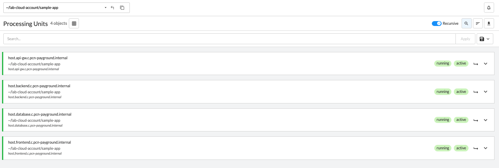
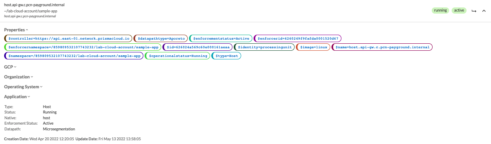
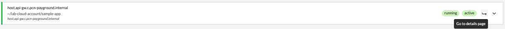
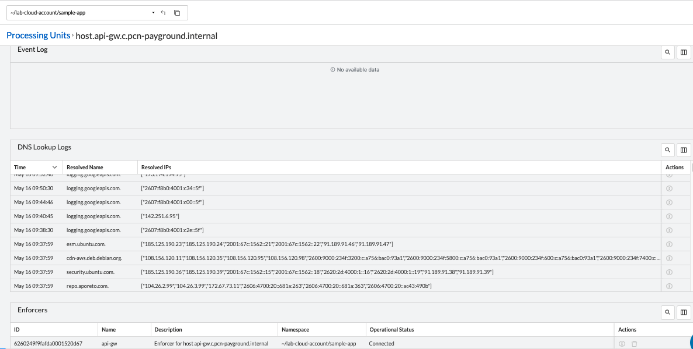
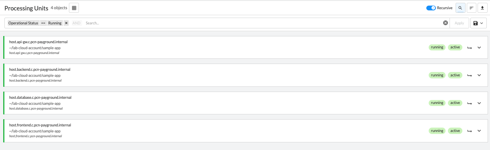
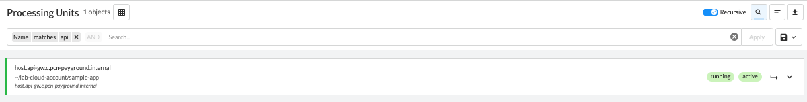
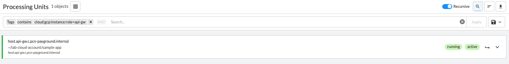

= Monitoring Processing Units
Alexandre Cezar <acezar@paloaltonetworks.com>, May 16, 2022:
:toc:
:toc-title:
:icons: font

You can monitor Processing Units by navigating to a namespace and opening the Processing Units tab.

The page will present several options as we can see below,

To note:

* Search Bar -> Allows users to create queries to search for specific events.

* Recursive -> Enable/Disable visualization of events from child namespaces

* Search -> Enable/Disable the Search toolbar

* Order -> Selects how you want to order by object

* Download as a CSV -> Allows you to download the entire list of objects as a CSV file

* Save button -> Allows you to Save/Apply/Delete queries

== Processing Unit details
You can select and expand on a single Processing unit and look at its status and tags

And you can click on its details icon to observe additional information:

Such as the associate Enforcer protection this Processing Unit and its latest DNS Lookups and Events

== Searching Processing Units
You can quickly create filters to find a specific Processing Unit.

Some commonly used filters:

* Operational Status -> (provides a selection of PUs based on their statuses)

* Name -> (provides a selection of PUs based on their names)

* Tag -> (provides a selection of PUs based on their tags)

== Reporting Processing Units
You can create a filter (optional) to match specific Processing Units and then use the _Download CSV_ file to export the results