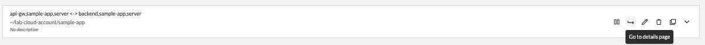
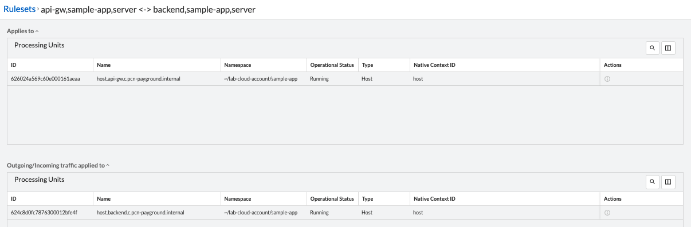

= Monitoring Rulesets
Alexandre Cezar <acezar@paloaltonetworks.com>, May 19, 2022:
:toc:
:toc-title:
:icons: font

You can monitor Rulesets by navigating to a namespace and opening the Rulesets tab.

By clicking on details of a specific ruleset, you can check what are the objects matching that particular ruleset

To note:

* Applies To -> Processing Units that are affected by this ruleset.

* Ongoing/Outgoing -> Processing Units or External Networks that are subjects of the ruleset actions

* External Networks -> External Networks used in this ruleset