= Namespaces
Alexandre Cezar <acezar@paloaltonetworks.com> 1.0, April 13, 2022:

For an introduction about Namespaces, please check this https://github.com/alexandre-cezar/cns-docs/blob/main/Concepts.adoc#microsegmentation-namespaces[page]

== Navigating between Namespaces
There's different ways you can navigate between namespaces, but the common ways are:

=== Namespace Navigation Bar
You can access the namespace navigation bar at any given time or page, and you can use it to search for a specific namespace, move to a parent level, pin a namespace or copy the namespace hierarchy for automation purposes.

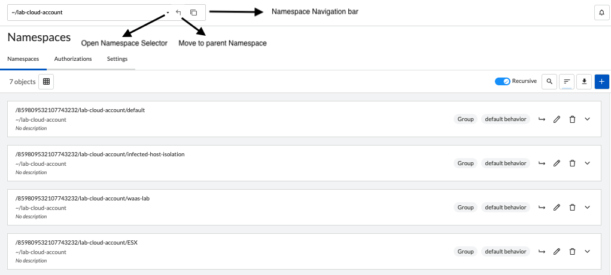

Once you open the Namespace Selector, you can:

* Find a specific cloud account namespace, by clicking on _Cloud Account Namespaces_

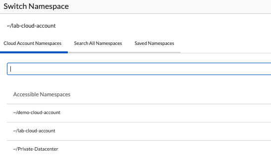

* Search for a specific namespace by clicking on _Search All Namespaaces_

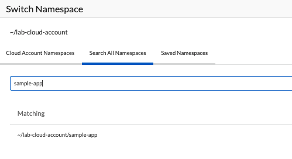

* Pin a specific namespace by clicking on the _pin_ icon

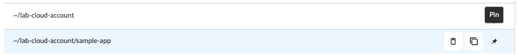

* Easily find all saves namespaces by clicking on _Saved Namespaces_

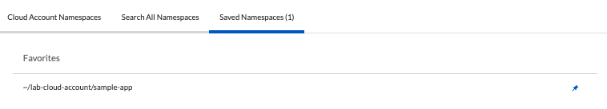

=== Using the Namespace Directory
Selecting the _Namespaces_ section in the Microsegmentation Console, you take you to the Namespaces Directory

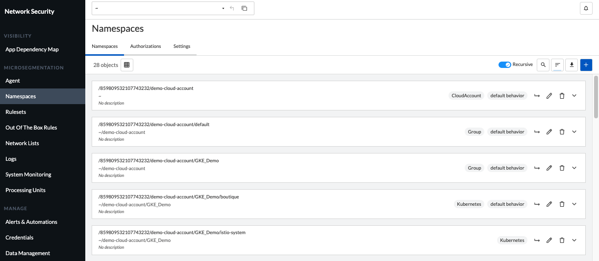

You can use the search bar to find a specific namespace of if you need to find specific namespaces that have some specific setting (like Allow as Default Action)

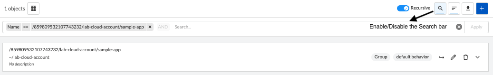

=== Visualizing Namespace Settings
You can expand a Namespace to fully visualize all that Namespace Settings, such as:

* Default Namespace Action

* Organizational tags

* Tag prefixes available in the Namespace

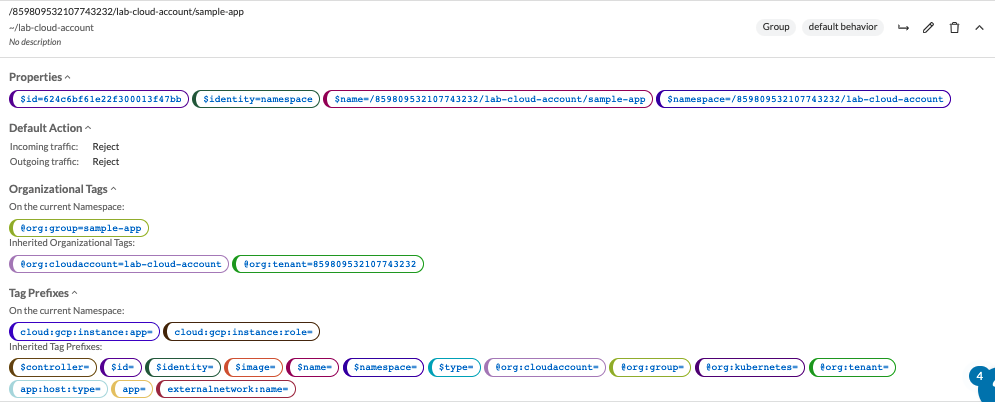

== Namespace Settings
To edit a Namespace configuration, click on the _Settings_ tab of the namespace you're interested on.

To follow settings are available for editing.

=== Enforcer Version
If you want to make sure that new Enforcers on a Namespace, will always be installed on a specific version, you can define this using this option. +

Default is empty (latest)

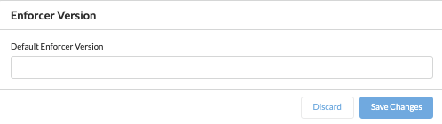

=== Tag Prefixes
Tag prefixes define what tags are associated with Processing Units and can be leveraged to create Rulesets. +
You can add custom tag prefixes to allow usage of custom tags on rulesets.

Tag prefixes are always inherited from parent to child namespaces.

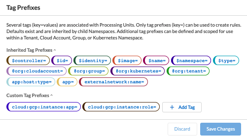

=== Implicit Defaults
Implicit Defaults define what is the default action for a given namespace.

Options are:

* Inherit - Use the action defined on a parent level

* Allow - If no explicit ruleset denies a given flow, it will be allowed.

* Reject - If no explicit ruleset allows a given flow, it will be rejected.

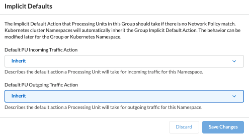

== Authorizations
Authorizations allow users to control how external resources can interact with a namespace in a programmatic matter and how Enforcers will register themselves to the Namespace.

=== API Authorization
An API Authorization implements an ABAC control to restrict actions that external resources can have upon the namespace.

To configure an API Authorization, navigate to Namespaces/Authorization, click on the _+_ sign and select _Create an API Authorization_

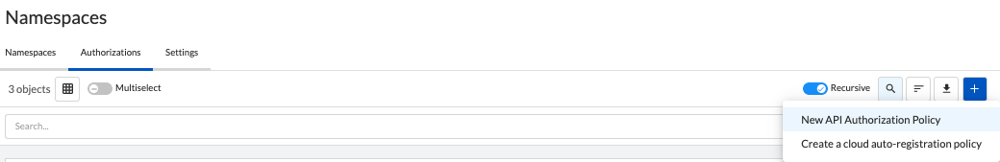

This will open the API Authorization Wizard that will guide you on how to create the API Authorization.

* Step 1 - Add a name and description to the API Authorization and if you don't want to propagate it, enable the _Hide Policy_ button

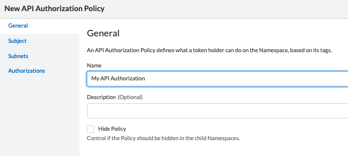

* Step 2 - Under Subject, leave the conditions as-is and define the target Namespaces that you want to match in the scope.

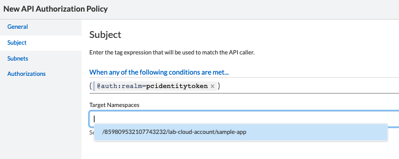

* Step 3 - Under Authorizations, select the permissions you want to add to this Authorization.

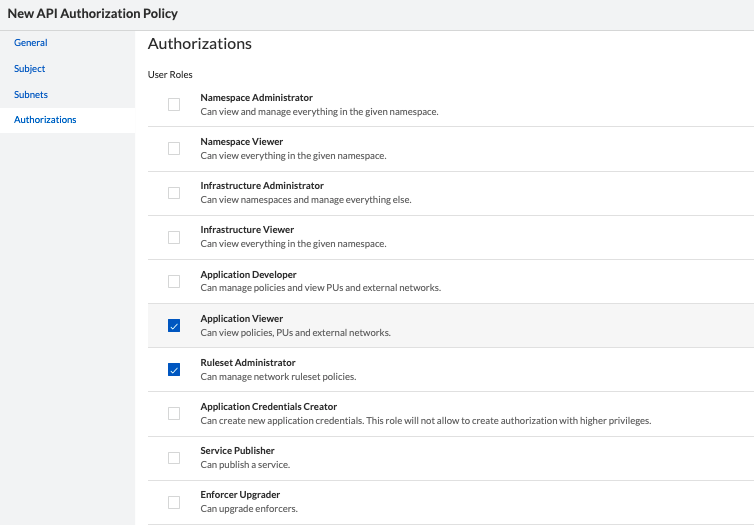

[TIP]
For more information about the User Roles, click https://xxx[here]

=== Cloud Auto-Registration
Cloud AutoRegistration allows Enforcers deployed on public cloud environments (AWS, Azure, GCP) to authenticate themselves to the Microsegmentation console using cloud provider tokens. +

Enforcers also use this token to extract the cloud provider metadata and add it to a Processing Unit.

To configure an API Authorization, navigate to Namespaces/Authorization, click on the _+_ sign and select _Create a cloud auto-registration policy_

image::images/cloud-registration-1.png[width=550,align="center"]

Additional details on how to configure a cloud auto-registration policy are covered on the https://github.com/alexandre-cezar/cns-docs/blob/main/Install%20Enforcers.adoc[_Install Enforcers_] chapter.