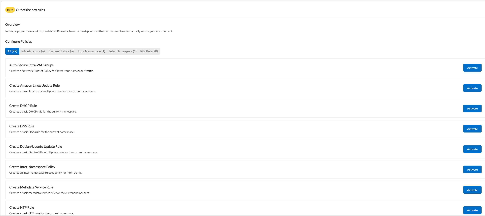
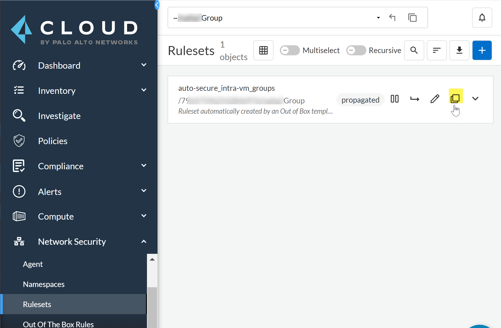
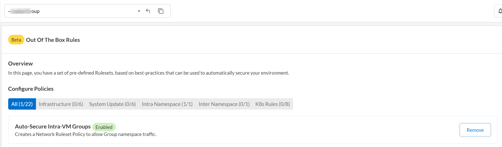

= Out of the Box Rules
Alexandre Cezar <acezar@paloaltonetworks.com> 1.0, April 7, 2022:

Out of the Box rulesets help you get started with default policies that meet your basic microsegmentation needs.

* Step 1 - Select Network Security > Out of The Box Rules.

* Step 2 - Select the ruleset you want to enable under Configure Policies, and click on Activate.

You can review a brief description for the rule.

For example, select the Infrastructure ruleset to view the available rules within that ruleset, select Create DNS Rule and Activate it.

[IMPORTANT]
Intra-namespace policies are only available on specific namespaces. +
Intra-Namespace for VM based applications can be found on group level namespaces while Intra-Namespace for pods is found at k8s level namespaces. +
Inter-namespace policies are only available on specific namespaces. You can find them at the tenant level namespace (in case you want to allow traffic between cloud account level namespaces), at the cloud cloud level (to create rulesets for group level namespaces) and at the group level namespace (for K8s level inter-namespace traffic)

* Step 3 - Provide the information for the additional inputs, if prompted. +

For some rules, you may have to create an External Network. You will be prompted to provide the information such as the DNS server FQDN or IP address(es)). A default value "0.0.0.0" is provided. +

In the case of the intername space ruleset, you must provide the namespaces names and their respective organizational tags (@org:tenant=<name>, @org:cloudaccount=<name>, @org:group=<name> and @org:kubernetes=<name>) +

The rule displays the resulting code snippet and you can copy this rule as code, for integration with your CI/CD pipelines.

* Step 4 - Apply your changes. +
When activated, the rule is in an enabled state. The only available option for an activated ruleset is to Remove it.

**Cloning Out Of The Box Rules**

When you activate an OOB rule, you must use a previously created ruleset template in your policy as code initiative or clone a ruleset in the console and modify it as needed.

* Step 1 - Select Network Security > Rulesets.

* Step 2 - Select the rule to Clone. +
Use the duplicate icon and modify it to meet your requirements.

*Removing Out Of The Box Rules*

If you are removing an OOB, take in account that the traffic previously allowed will be now rejected. It’s important that you account for this ruleset in your automation or that you already have created another equivalent ruleset in the console before you remove it.

* Step 1 - Select Network Security > Out of The Box Rules.
* Step 2 - Select the namespace.
* Step 3 - Select the rule to Remove.

*Automating Out Of The Box Rules*

Out of box rules are stored in a centralized Github repository as yaml file definitions that you can import using your prefered automation method.

* Step 1 - Get the templates from the https://github.com/aporeto-inc/cookbook[repository].

* Step 2 - To install a ruleset, run the following apoctl command:

`#apoctl api import -f <template file> -n /<namespace>#`

