= Planning a Microsegmentation Deployment
Alexandre Cezar <acezar@paloaltonetworks.com> 1.0, April 3, 2022:
:toc:
:toc-title:
:icons: font

Microsegmentation is a technology that requires proper planning before deployment for optimal results.

Following the steps below will ensure a smooth deployment and no impact in existing/new applications enforced.

== Plan and Deploy Phase
Before reading this document, we recommend that you get familiar with the key Identity Based Microsegmentation concepts. You can find them https://github.com/alexandre-cezar/cns-docs/blob/main/Concepts.adoc[here]

=== Initial Requirements
The first consideration is the Prisma Cloud Microsegmentation Console. It serves as both the management interface and the API. CNS administrators will use it to define policies, monitor and perform investigations in the protected environment.

As such, the Enforcers must be able to reach out to the following domains over TLS (TCP port 443) to establish console/api communication: +

*.prismacloud.io +
*.network.prismacloud.io +
*.aporeto.com +
*.gcr.io +

It is important to make sure that the communication between Enforcers and the Console is not intercepted by any inspection technology, such as proxies or next generation firewalls.
Enforcers use mTLS and trying to inspect this traffic will effectively prevent it from being established.

The next consideration is where to deploy the Enforcer. Enforcers monitor the environment and implement the rules you defined in the Console. They must run on every host/orchestrator you want to secure and as such, you need to make sure that the resources you want to protect meet its system requirements. You can find the system requirements here

Also, make sure that network services like DHCP (if used),  NTP and DNS are working in the resources you want to deploy the Enforcers.

=== List your environments

An environment is a logical grouping of hosts, such as a Kubernetes cluster or a set of instances that supports the execution of your app workload. +

Here, the term "environment" is loosely defined because its scope can differ from organization to organization. +

For example, a product group might have its own environment, segmented into dev, test, and prod, a large organization might have separated environments for each product group in a division or it might simply classify everything as prod or non-prod that’s in two large environments shared across the organization. +

It is important to list all the environments where the application workloads will be running and map their orchestrators or operational systems +

=== Use only relevant identities
The Enforcer does a great job in automatically learning all the metadata for the protected resources (like cloud account, service, region, OS, resource name, platform, etc).

The recommended practice is to leverage the automatic attributes created by the Enforcers "@org" tags when writing policies.

These attributes can map your Prisma Cloud Microsegmentation namespaces, platforms, operational systems, images, kubernetes namespaces and are easy to understand from an application owner perspective. "@org" tags are also trusted in the sense that Prisma Cloud manages them directly and Microsegmentation admins are in full control of such tags.

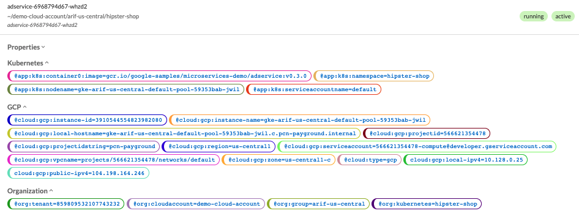

Additionally, if you require more granularity in your policies, use processing unit attributes such as _$name_ or _app:host:fqdn=_ for hosts and _$image_ for containers.

But if you're planning to use custom defined identities, it's important to align what they will be with the teams who manage the cloud resources (eg. DevOps, SRE, Cloud Admins) as application owners need to make sure that these attributes are added to the resources in their pipeline. The best practice is to keep them easy to understand, reflect the application components and to use attributes that make sense from a business or security perspective.

Some examples are: app=payment, role=frontend, environment=prod, pci=yes

[TIP]
Our recommendation, when leveraging tags is to leverage the predefined tags as much as possible and only relying on custom tags if absolutely necessary as this can simplify your environment and reduce friction among different teams.

[IMPORTANT]
====
Enforcers will always store custom tags alongside with their source. On AWS, a custom tag called _app=payment_ , is ingested as _cloud:aws:app=_ , on Azure it is ingested as _cloud:azure:app=_ and so forth.
====

As a reference, you can verify an example of identity attributes retrieved from a resource below:

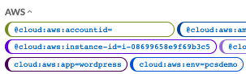

An important aspect of custom attributes is where to define them in the system. +

The recommendation is to create them as higher as possible in the namespace hierarchy. This will allow all rulesets across the child namespaces to be able to leverage these attributes in an uniformed way.

=== Create the Namespace Hierarchy
The relationship between your teams and your environments, alongside with who has authority to set policies, further defines how your namespaces will be organized.

How do you separate the management of your different environments? How much sharing between environments is there? How is the relationship between applications and namespaces?

A best practice is to follow the following pattern:

_Tenant -> Cloud Account -> Group_

In the example below we can see a Namespace hierarchy template and the namespace which are automatically created by Prisma Cloud (blue) and the namespaces created by the CNS Administrators (yellow)

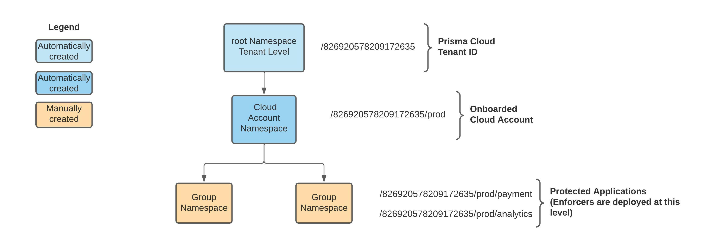

=== Deploy Enforcers
Deploying Enforcers in the right namespace makes it easier for CNS Administrators to make sure they have the proper application visibility and are ingesting the proper resource metadata. We do not recommend that you aggregate all Enforcers in a single namespace and we do not recommend that you deploy Enforcers in the default namespace (root).

Automating the Enforcer deployment is also a great way to ensure that microsegmentation is enforced across the application lifecycle and there are many ways to achieve that. You can add the Enforcer as part of the VM bootstrap process, as a component inside a golden VM image, leverage an automation tool such as Ansible, Chef or Puppet or an IaC technology such as Terraform. You can also use apoctl (a component of Prisma Cloud Identity Based Microsegmentation).

It's important to make sure you are using the right Enforcer version to protect your application and you can take advantage of the mapping you did in the step "Enumerate your environments" to define what is the right Defender version for your resource.

== Monitor Phase

=== Analyze traffic
Once the Enforcers are deployed, the next step is to monitor and analyze traffic and understand what is the relationship between the different components of your applications.

When you create the namespace, the Default action (think of it as the "cleanup rule") is to allow all traffic. We recommend you keep this action at first until the proper microsegmentation policies are in place. This ensures that no service disruption is created when you deploy your Enforcers in new environments.

The Enforcers will start reporting traffic immediately and CNS Administrators can start understanding the traffic flow and to create policies that will protect the applications.

The image below provides an example of a graphical visualization of all the application flows of a certain application. +
Each flow can be further analyzed in order to understand the identities of the components who are part of the flow. +

The best practice is to make sure that you have enough time for the application to execute all of its functions, so you can understand what are the expected behaviors during startup, runtime, batch/scheduled events and shutdown)

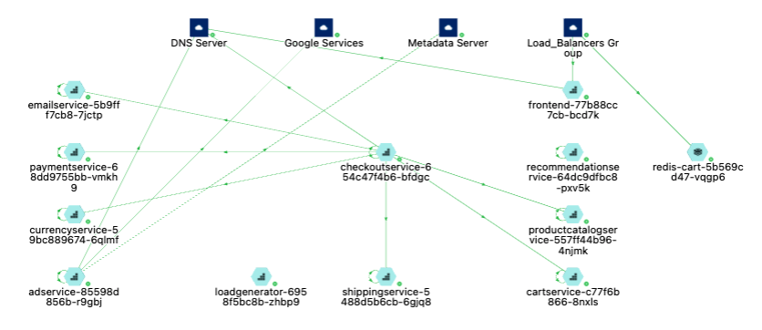

== Policy Design Phase

=== Create Network lists
One of the key aspects of understanding your application behavior is to map what resources can have an Enforcer installed and what resources can not.

The resources that are protected by an Enforcer are called processing units and resources that have a relationship with a processing unit but cannot have an Enforcer installed (eg. external endpoints that are accessing an Internet facing application or a PaaS resource such as AWS RDS, GCP CloudSQL or Azure CosmoDB) are called Network Lists.

We recommend you start by defining the RFC1918 private address block for your Network Lists. +

* 10.0.0.0/8 +
* 172.16.0.0/12 +
* 192.168.0.0/16

If you prefer to refine your lists and add only the exact CIDR for your cloud subnets, please do so, but keep in mind that if additional networks are dynamically added, they will need to be added in the network list, as well.

A good practice is to also add on-prem Data Center subnets, static public IPs of resources where enforcers will be installed, specific network services suchs as external DNS resolvers, DHCP, NTP servers and Load Balancer IPs that front-end your applications, in case they exist.

=== Resolve application dependencies

After obtaining application visibility, we need to translate the application and business requirements into identity based microsegmentation policies.

A best practice is to have a separated environment (staging or dev) where you can deploy your applications and analyze what happens during the entire application lifecycle but if this is not possible, then make sure you can capture the entire application lifecycle in production (startup, runtime and termination) and that you are using a time range that encompasses all these phases during your analysis. This will ensure that all relevant policies are in place and that Enforcers will not block a flow that is required.

When analyzing traffic, Prisma Cloud Identity Based Microsegmentation allows you to inspect a flow and review all the events related to it.

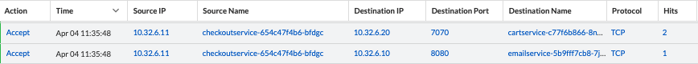

Once all flows are mapped, it's time to create the policies

[TIP]
====
As much as possible, leverage _Out of the Box Rules_ and _Application Profile_ features to speed up the ruleset definition. +
Refer to the product documentation for details.
====

=== Create Identity Based Microsegmentation policies
Rulesets are high-level constructs in Prisma Cloud Microsegmentation that translates security controls into network policies. Policies are automatically pushed to the relevant Enforcers once they're created.

Only Enforcers that exist in the same or a child namespace where the policy exists will receive it, therefore it's crucial that your namespaces accurately reflect your application environment.

We recommend using the organizational tags for policies, such as tenant, cloud-account, group, namespace in both subject and objects inside the policy.

We also recommend to leverage Application Profiling and the Out of Box rules as much as possible.

An important reminder is that policies are not bi-directional in nature (although they are stateful). This means that rules are applied to the objects matched in the “Applies to” field (Subject).

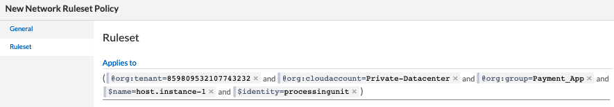

If “Applies to” does not match both the source and destination, you need to create a separate ruleset for each.

As an example, let's assume we have _client A_ that needs to send traffic to _Server B_

Our recommendation is to have two rulesets for this communication to be allowed:

* Ruleset 1 (Allow client to send traffic to the server) +
** Subject +
*** @org namespaces that matches the client namespace and client pu
** Action
*** Outgoing/Allow @org namespaces that matches the server namespace, server pu and protocol/port

* Ruleset 2 (Allow server to accept traffic from the client) +
** Subject +
*** @org namespaces that matches the server namespace and server pu
** Action
*** Incoming/Allow @org namespaces that matches the client namespace, client pu and protocol/port

[ALERT]
====
An External network should not be used in the “Applies to” field. It should only be part of incoming or outgoing rulesets. The reason behind this, is that an external network doesn't have an Enforcer that can be the subject of a policy.

Upon rule creation, it's a good practice to check which processing units are matching the rule in order to make sure you're applying the policy to the correct resources
====

=== Tenant Level Namespace rulesets
Rulesets that will apply to all resources inside an organization are supposed to be created in the Tenant Level Namespace.

Think of it as corporate level policies.

Some examples of policies that would be a great fit for a tenant level namespace:

* Allowing communication between resources in different cloud accounts
* Blocking specific traffic across all resources

A visualization is provided below:

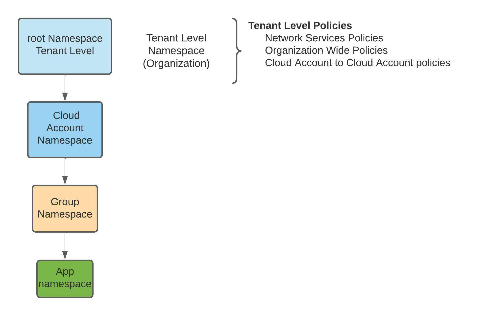

=== Cloud Account Level Namespace rulesets
Rulesets that will enforce controls to resources that exist in a cloud account level are supposed to be created in the cloud account namespace.

Some examples of policies that would be a great fit for a cloud account/datacenter namespace: +

* Allowing communication with Cloud Network Services that would apply for all cloud resources in the cloud account, such as DNS, DHCP and NTP

* Allowing blocking/traffic to specific resources inside the cloud account/Datacenter

A visualization is provided below:

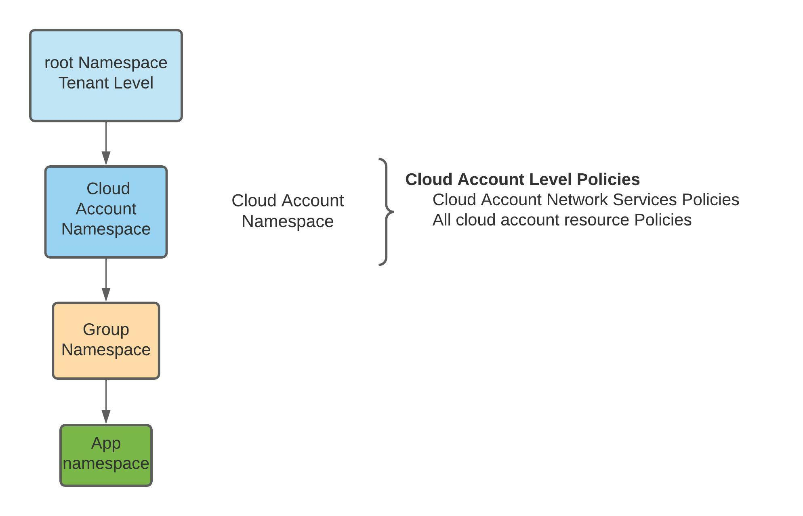

=== Group Level Namespace rulesets
Rulesets that will enforce controls to resources that exist in a K8s namespace or are grouped as an application (VMs) are supposed to be created in the child namespaces.

Some examples of policies that would be a great fit for a child namespace:

* Allowing traffic between resources of the same namespace
* Allowing egress traffic for a resource in the namespace
* Allowing ingress traffic to a resource in the namespace
* Blocking specific traffic that matches a resource in the namespace

A visualization is provided below:

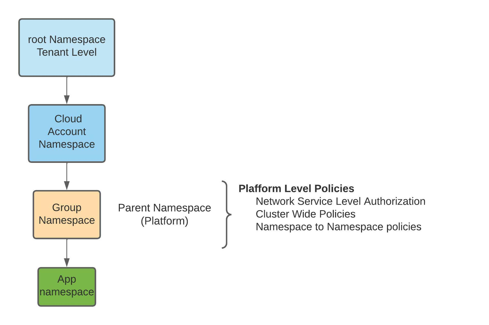

=== Application Level Namespace rulesets
Rulesets that will enforce controls to resources that exist in a K8s namespace are supposed to be created in the namespaces.

Some examples of policies that would be a great fit for it:

* Allowing traffic between resources inside of the namespace
* Allowing egress traffic for a resource in the namespace
* Allowing ingress traffic to a resource in the namespace
* Blocking specific traffic that matches a resource in the namespace

A visualization is provided below:

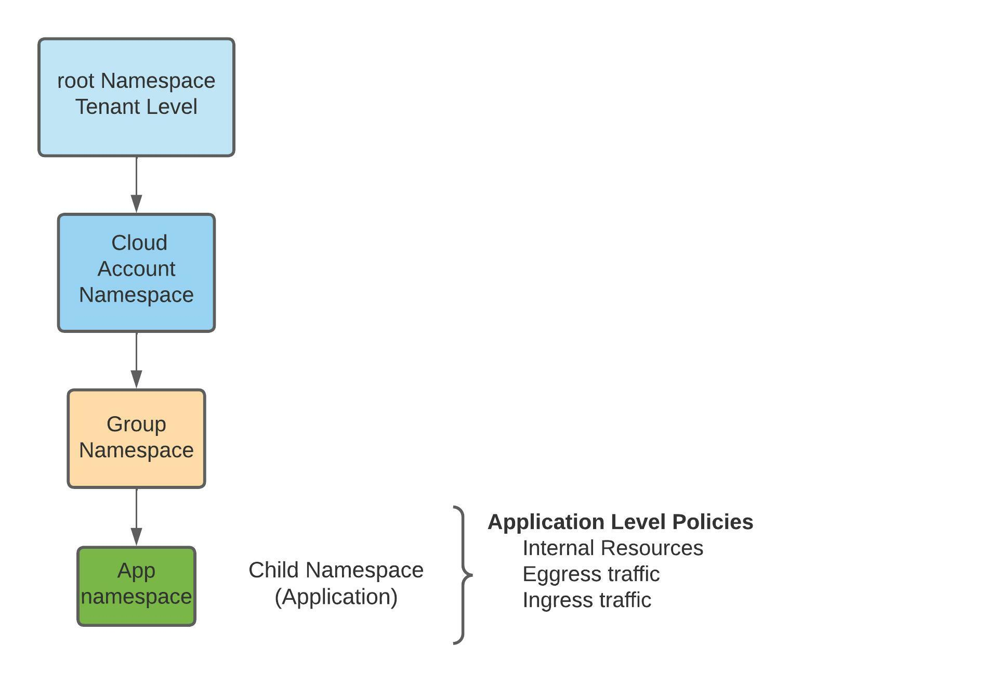

== Enforcement Phase
After AN application in a given namespace was monitored, validation tests were successfully concluded and the proper policies are in place, it's time to enforce microsegmentation.

The best practice is to roll out the enforcement mode by namespace and this can be done by switching the Default Action in the namespace to "Reject". With that, you can ensure that only the desired namespace goes into enforcement mode and all the others that are not ready yet, will remain in "Discovery Mode".

=== Review logs and refine rules
After enabling enforcement mode, it's important to monitor the namespace for a period of time "eg. 24 hours" to ensure that all expected traffic is allowed and everything else is blocked.

We recommend that you investigate any blocked flows at this time that may be logged after turning enforcement on as they may indicate an anomalous behavior or a regular application traffic flow that wasn't identified earlier.

The images below represent a basic idea of a flow analysis, starting with flow observations, traffic analysis and the reasoning behind it (no policy match)

By monitoring the namespace dashboard, CNS administrators can easily identify flows that are being rejected and start a more in-depth analysis.

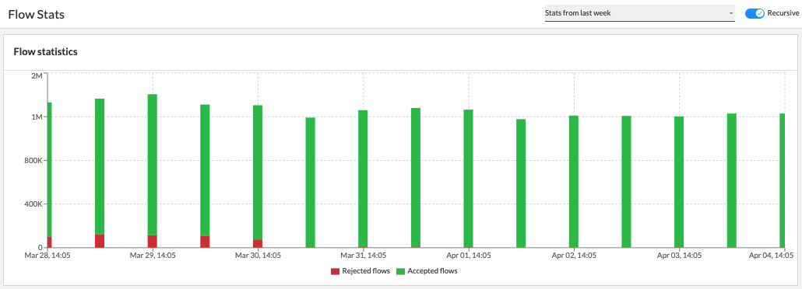

Next step is to inspect the application flows to identify what flows are being rejected and why.

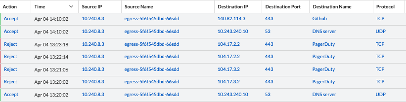

Looking at the matching ruleset, we can verify that no policy is actually matching this flow and therefore it is being caught by the namespace default policy, which is now configured as Reject.

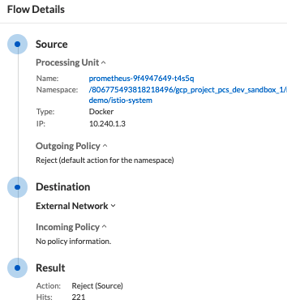

== Operations Phase

=== Configure alerts for guardrail rules

=== Upgrade Enforcers
Enforcers maintain backwards compatibility with the console, but when required, you can upgrade them using the Microsegmentation Console UI, apoctl, Prisma Cloud Identity Based Microsegmentation APIs or you can update them manually.

The best practice is to upgrade them using the graphical interface as Prisma Cloud.

=== Automate policies (policy as code)
The best practice is to align microsegmentation with DevOps teams CI/CD pipelines. In this way, you can create namespaces, objects, rulesets, deploy Enforcers and configure alerts aligned with your application deployment.

If you have new applications or environments that are going to be deployed and you use Application Profiling to define the set of rulesets that you want to enforce, using apoctl or the APIs to automate their deployment is the recommended approach.
