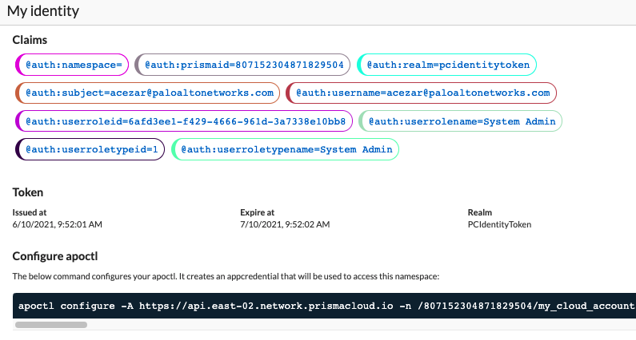
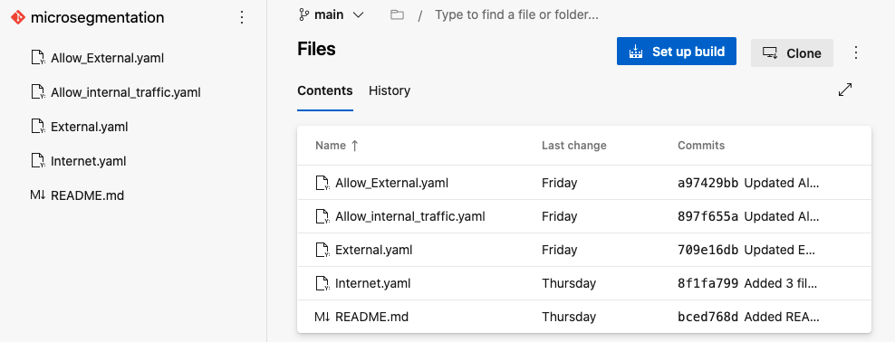
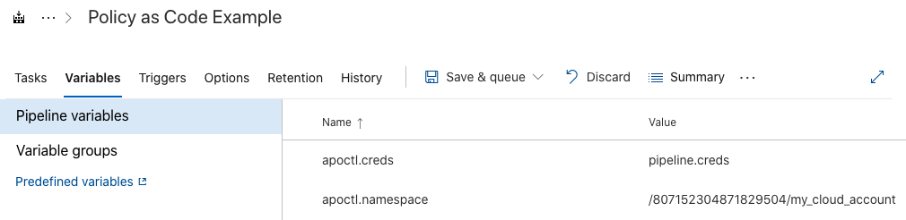
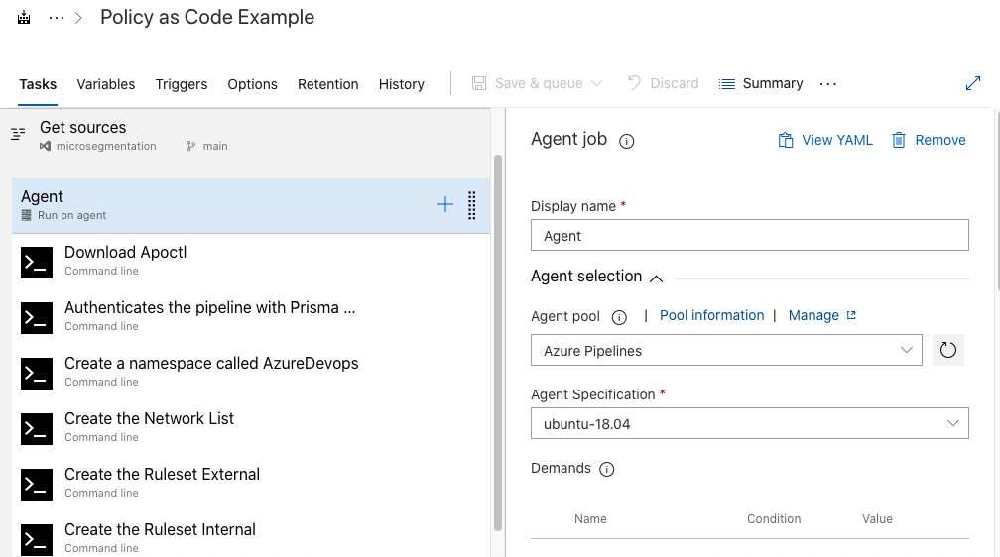
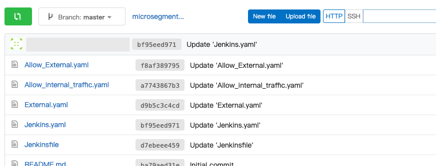
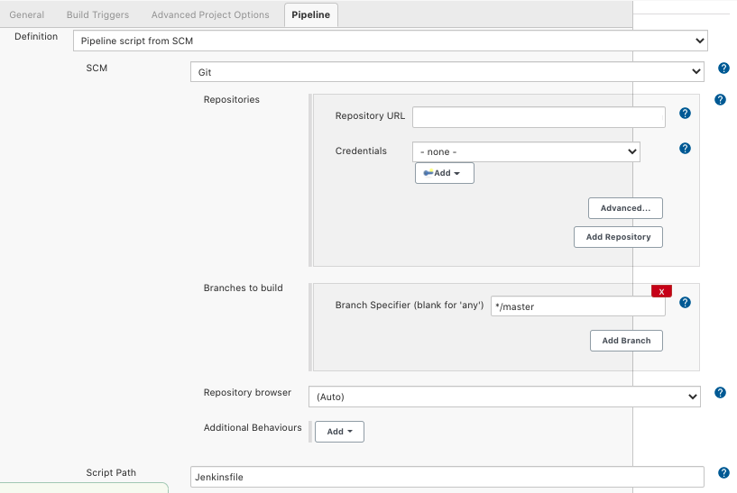

= Microsegmentation as Code
Alexandre Cezar <acezar@paloaltonetworks.com> 1.0, April 26, 2022:
:toc:
:toc-title:
:toclevels: 4
:icons: font

In many DevOps led environments, the CI/CD is the source of truth for all deployments. This ensures immutability and make it easier for application owners and security teams alike to find and fix drift between staging and prod environments.

In such environments, users want to deploy their applications with all rulesets in place in order for applications to be microsegmented at their very deployment.

This chapter covers the steps required to integrate Prisma Cloud Identity based microsegmentation with your CI/CD tool of choice and provides guidance on what the best practices are and working examples.

== Best Practices

=== Store the app credentials securely

A secret store enables applications and users to store and use several types of secret/key data. It's important to ensure the confidentiality of your information.

As app credentials use certificates to authenticate with the console, it becomes important to store them securely and as such, we recommend that you use a secret store to store them.

=== Use Environment Variables

Some variables (like namespaces and the credential itself) must be known to all the jobs that interact with the microsegmentation console. To make it easier, we recommend that you create environment variables that are known to your entire pipeline, otherwise you will need to export them on every job that interacts with the microsegmentation console.

=== Store your configuration as objects

You can use apoctl commands to create and delete objects and while this may be ok but it is not something we recommend at scale.
To create repeatable configurations that can be reused by different DevOps teams is the real goal and as such, we support two types of configuration files (json and yaml).

With these, you can have your templates stored in a central repository and your teams can use them to customize their policies

== Pipeline integration examples

In the example below, we will create a pipeline that creates a new namespace in the Microsegmentation console, creates a Network List (Internet) on this namespace and adds two new rulesets. The first ruleset allows traffic to this network list over specific ports and the second ruleset allows traffic between processing units in this namespace.

You can use the example provided to your specific platform and a starting point to create your own network lists and rulesets.

=== Platform Independent Tasks

* Step1 -> Download apoctl +
Follow the instructions https://github.com/alexandre-cezar/cns-docs/blob/main/apoctl.adoc[here] to download and configure the apoctl client to your platform of choice.

* Step2 -> Generate your app credentials
In your console, navigate to your namespace and click on the key icon, in the bottom left of the page

A pop-up page will appear with the command that will generate the appropriated credential and authorization for us (see below).

Copy this command and execute it on your terminal

[NOTE]
If you want to generate a specific name for your app credential, use the flag --name "< name>" on your command

This will generate a file with a .creds extension inside the .apoctl folder on your home directory.

* Step3 -> Copy this file and store it in your secret store.

=== Platform Specific Tasks

==== Azure Devops
** Step 1 -> Store the configuration files in your repository: +

Create a repository called "microsegmentation" on your repository of choice (we used Azure Git) and store the network list and the ruleset yaml files there.

You will then use this repo as the source of your pipeline.

** Step2 -> Create your pipeline

Login to your Azure DevOps environment and create a new pipeline called _Policy as Code Example_

Add two new environment variables

** apoctl.creds (value is your app cred file)
** apoctl.namespace (value is the namespace where you generated the app credential)

The configuration will be similar to the example below:

[NOTE]
As setting up a secret store and integrating it with Azure DevOps is beyond the scope of this document, we are assuming that your CI tool and your secret store integration is already in place.

** Step3 -> Add the necessary tasks to the pipeline

Our sample pipeline has 5 tasks in total:

*** Download apoctl +
*** Verify if the authentication works +
*** Create a namespace called "Azure DevOps" +
*** Import the Network List +
*** Import the rulesets

An example is provided below:

Let's take a closer look at what our tasks will be executing.

** Task 1 -> Download apoctl
In this task, as the name implies, we're simply using a command line to download apoctl to our host. This will allow us to communicate programmatically with the microsegmentation console

** Task 2 -> Verify if the authentication works
This step isn't really necessary but it's a good check to have in order to make sure that the app credential is in place.

** Task 3 -> Create the Namespace
As we want our objects to exist inside a specific namespace, we need to create it first.
We are not importing the namespace object here but using apoctl commands to create it.

** Task 4 -> Import the Network List
As we want our rulesets to use this network list, we need to import the network list before we import the rulesets.

** Task 5 -> Import the Rulesets
Finally, we need to import the rulesets that will enforce the desired state in our namespace.

In tasks 4 and 5, we're importing the Network List and Rulesets objects. The objects are available as templates in the Appendix.

[NOTE]
You can combine all these tasks into a single one, we just separated them here for a better visualization.

A detailed example of the complete task is provided https://github.com/alexandre-cezar/cns-docs/blob/main/azuredevops.yaml[here] as a reference

==== Jenkins
* Step 1 -> Store the configuration files in your repository +
Create a repository called "microsegmentation" in your repository of choice and store the network list, namespace and rulesets files there.

You will then use this repo as the source of your pipeline.

* Step2 -> Create your pipeline +
Login to your Jenkins environment and create a new pipeline project called "Policy as Code Example"

On your pipeline definition, use the microsegmentation repository as source and the Script Path is going to be your Jenkinsfile

Let's take a closer look at what this pipeline will execute.

** Task 1 -> Download apoctl +
In this task, as the name implies, we're simply using a command line to download apoctl to our host. This will allow us to communicate programmatically with the microsegmentation console

** Task 2 -> Verify if the authentication works +
This step isn't really necessary, but it's a good check to have in order to make sure that the app credential is in place.

** Task 3 -> Import the Namespace +
As we want our objects to exist inside a specific namespace, we need to import the namespace configuration first.

[NOTE]
Unlike the AzureDevOps example where we used apoctl subcommands to create the namespace, here we are importing the configuration file. This is just to explain the different methods that can be used.

** Task 4 -> Import the Network List +
As we want our rulesets to use this network list, we need to import the network list before we import the rulesets.

** Task 5 -> Import the Rulesets
Finally, we need to import the rulesets that will enforce the desired state in our namespace.

The objects used in the examples can be found in the locations below:

** https://github.com/alexandre-cezar/cns-docs/blob/main/external-network-template.yaml[External Network template]
** https://github.com/alexandre-cezar/cns-docs/blob/main/namespace-template.yaml[Namespace template]
** https://github.com/alexandre-cezar/cns-docs/blob/main/outgoing-ruleset-template.yaml[Outgoing ruleset template]
** https://github.com/alexandre-cezar/cns-docs/blob/main/allow-all-internal-template.yaml[Allow-All internal template]

A detailed example of a Jenkinsfile is provided https://github.com/alexandre-cezar/cns-docs/blob/main/jenkins.yaml[here] as a reference
