= Rulesets
Alexandre Cezar <acezar@paloaltonetworks.com> 1.0, April 21, 2022:

For an introduction about Rulesets, please check this https://github.com/alexandre-cezar/cns-docs/blob/main/Concepts.adoc#network-rulesets[page]

== Listing Rulesets
You can list all the rulesets in a given namespace by selecting thee namespace of interest and clicking on Rulesets.

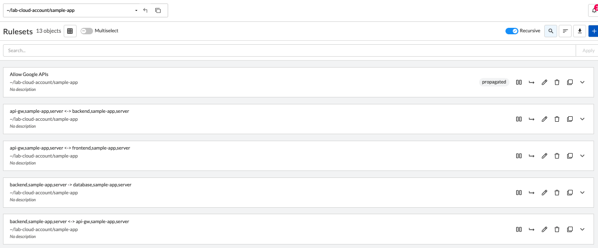

== Looking at a Ruleset details
By selecting a specific ruleset and clicking on the "Expand" icon, you can look at a ruleset details, without having to edit the ruleset.

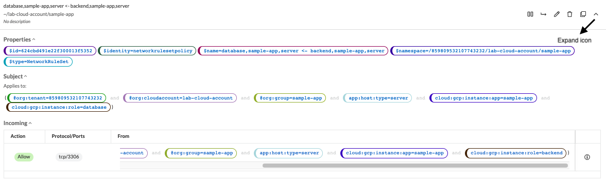

== Editing an existing Ruleset
Select a specific ruleset and click on the "Edit" icon.

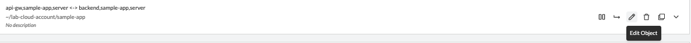

== Creating a new Ruleset
Navigate to the namespace of interest, select Rulesets and click on "+" button

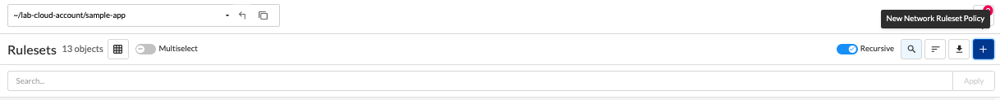

This opens the Ruleset Wizard and after your provide a name to the Ruleset and click next, it will open the Ruleset creation page.

A ruleset always have 3 components:

* Subject: Must match the attributes of a processing unit

* Rule: Controls incoming or outgoing traffic and their respective actions

* Object: Can be an external network or a processing unit

In the example below, we have a Subject that matches all the Processing Units in the selected namespace

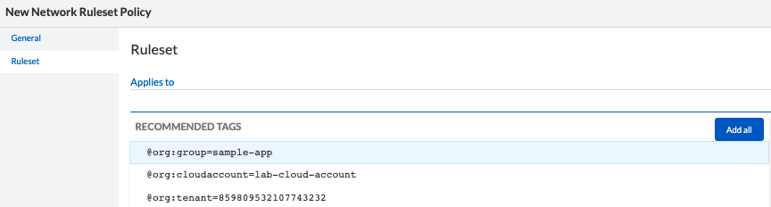

[TIP]
The recommended tags will always match the "@org" tags of the namespace you're in. The best practice is to always click in the "Add All" button to have the proper namespace tags added to your ruleset.

Once added, the subject will match its respective "@org" tags

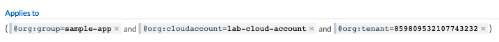

If you want to have a more granular policy, you can match specific attributes of a Processing unit in the Subject. +

=== Exploring ruleset actions
In the example below, we want to create a set of rulesets that allow a client (frontend) to send traffic to a server (api-gw).

In the first ruleset, additionaly to the namespace tags, we also need to match the frontend hostname. In order to make this, we are adding the _instance-name_ tag to the subject, which will result in a specific match.

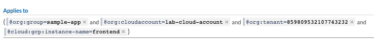

On the Action, we only want this host to send traffic to the api-gw server. In order to do this, we need to create an outgoing rule that matches the api-server PU.

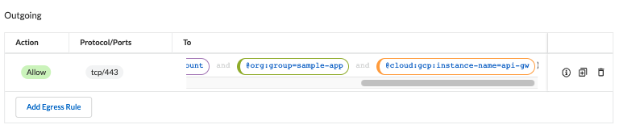

As we can see above, the action is to allow traffic over tcp/443, only if the destination matches the tags of the api-gw PU (both namespace and instance-name)

Next, we need to create a second ruleset to allow the api-gw to accept the request from the client.

In this case, our subject needs to match the tags of the api-gw

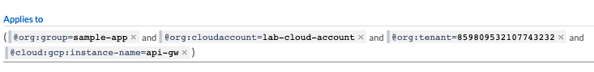

Finally, as we only want the api-gw to accept traffic from the frontend, we need to create an incoming rule that matches the desired client (frontend PU).

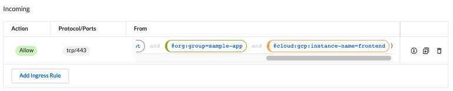

== Other ruleset examples

=== Secure Intra-Namespace communication
In this example, we want to create a ruleset that allows all traffic inside a namespace, regardless of source, destination or port

The ruleset will have the following components:

* *Subject* - Needs to match the "@org" namespace objects
* *Action* - For both Incoming and Outgoing it will be "Allow" and "any" for protocol/port
* *Object* - For both Incoming and Outgoing it needs to match the "@org" namespace objects

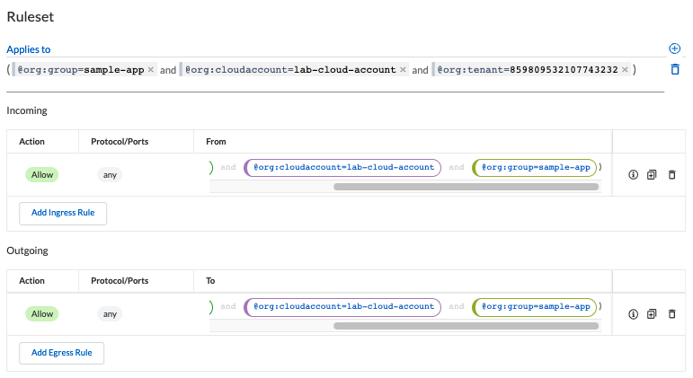

=== Secure Inter-Namespace communication
In this example, we want to create a ruleset that allows all traffic between two namespaces, regardless of source, destination or port

[TIP]
We are using two explicit rulesets here, although it's possible to combine multiple subjects and actions in a single ruleset

The rulesets will have the following components:

*Namespace A Ruleset* +

* *Subject* - Needs to match the "@org" namespace A objects
* *Action* - For both Incoming and Outgoing it will be "Allow" and "any" for protocol/port
* *Object* - For both Incoming and Outgoing it needs to match the "@org" namespace B objects

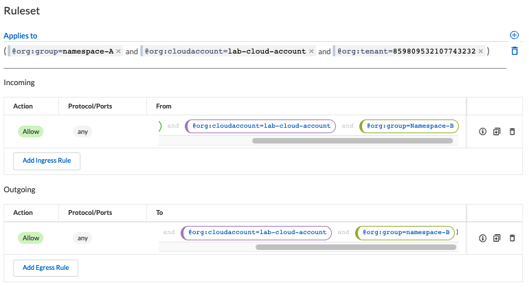

*Namespace B Ruleset* +

* *Subject* - Needs to match the "@org" namespace B objects
* *Action* - For both Incoming and Outgoing it will be "Allow" and "any" for protocol/port
* *Object* - For both Incoming and Outgoing it needs to match the "@org" namespace A objects

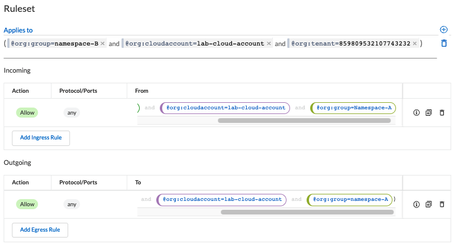

=== Secure Host to Host communication
In this example, we want to create a ruleset that allows specific traffic between two hosts

The rulesets will have the following components:

*Host A Ruleset* +

* *Subject* - Needs to match the "@org" host A objects and host A hostname
* *Action* - For both Incoming and Outgoing it will be "Allow", plus the desired protocol/port +
* *Object* - For both Incoming and Outgoing it needs to match the "@org" host B objects and host B hostname

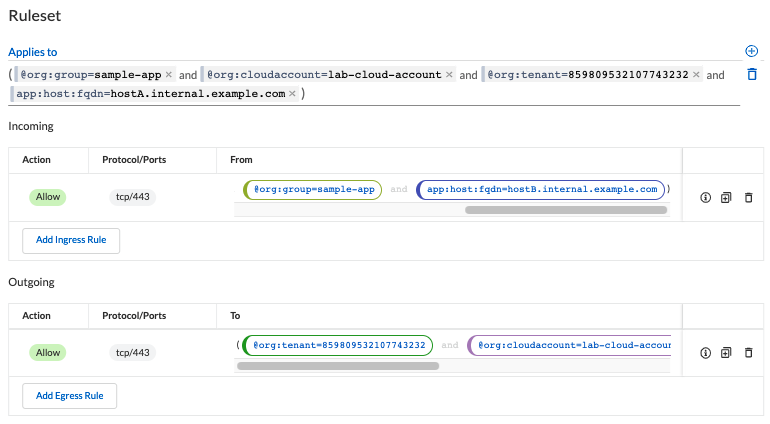

*Host B Ruleset* +

* *Subject* - Needs to match the "@org" host B objects and host B hostname
* *Action* - For both Incoming and Outgoing it will be "Allow" and "any" for protocol/port
* *Object* - For both Incoming and Outgoing it needs to match the "@org" host A objects and host A hostname

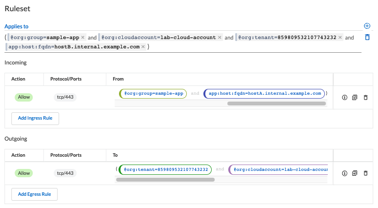

=== Secure pod-to-pod communication
In this example, we want to create a ruleset that allows specific traffic between two set of pods

[TIP]
It's possible to configure a ruleset that controls specific pods, although we don't recommend enforcing a specific pod as they tend to be very short-lived. Use images instead.

The rulesets will have the following components:

*Image A Ruleset* +

* *Subject* - Needs to match the "@org" pod A objects and image tag where pod A is created from
* *Action* - For both Incoming and Outgoing it will be "Allow", plus the desired protocol/port
* *Object* - For both Incoming and Outgoing it needs to match the "@org" pod B objects and image B tag

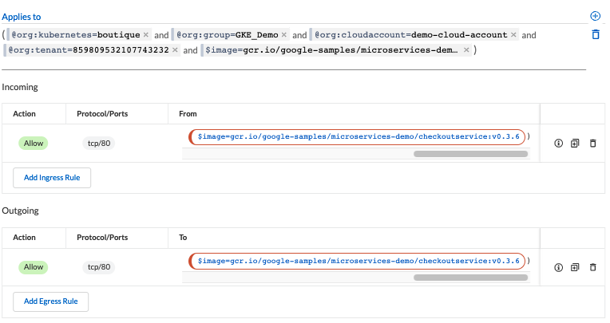

*Image B Ruleset* +

* *Subject* - Needs to match the "@org" pod B objects and the image tag where pod B is created from
* *Action* - For both Incoming and Outgoing it will be "Allow" and "any" for protocol/port+
* *Object* - For both Incoming and Outgoing it needs to match the "@org" pod A objects and image A tag

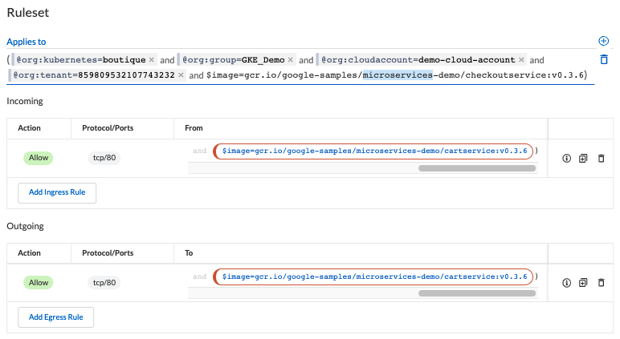

=== Secure egress traffic
In this example, we want to create a ruleset that allows specific traffic between a pod and a PaaS resource, in our example an AWS RDS database

The ruleset will have the following components:

*Egress Ruleset* +

* *Subject* - Needs to match the "@org" pod A objects and image tag where pod A is created from
* *Action* - As we only need egress traffic, we only need to allow outgoing in the desired protocol/port
* *Object* - It needs to match the RDS Database External Network object

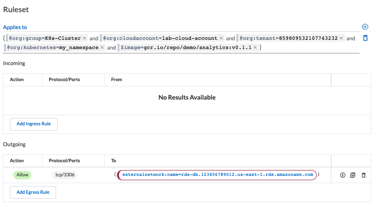

=== Secure ingress traffic
In this example, we want to create a ruleset that allows traffic from the Internet to a front-end application.

The ruleset will have the following components:

*Ingress Ruleset* +

* *Subject* - Needs to match the "@org" host A objects and the frontend hostname

* *Action* - As we only need ingress traffic, we only need to allow incoming in the desired protocol/port
* *Object* - It needs to match the Internet External Network object (in this case 0.0.0.0/0)

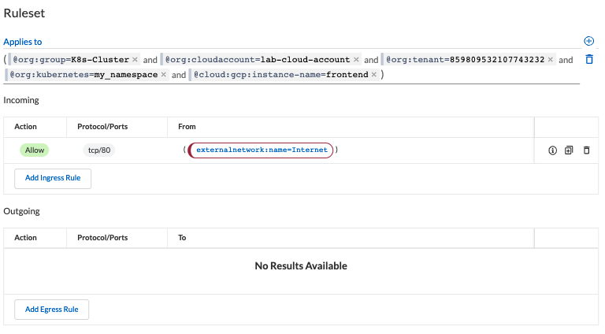

=== Prevent cross-cloud account traffic
In this example, we want to create a ruleset that prevents traffic between prod and dev cloud accounts

The ruleset will have the following components:

*Dev Cloud Account Ruleset* +

* *Subject* - Needs to match the "@org" tags for the dev cloud account

* *Action* - For both Incoming and Outgoing it will be "Reject", with "Any" for the protocol/port
* *Object* - For both Incoming and Outgoing it needs to match the "@org" tags for the prod cloud account

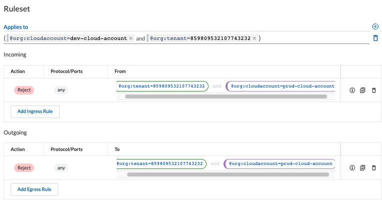

*Prod Cloud Account Ruleset* +

* *Subject* - Needs to match the "@org" tags for the prod cloud account

* *Action* - For both Incoming and Outgoing it will be "Reject", with "Any" for the protocol/port
* *Object* - For both Incoming and Outgoing it needs to match the "@org" tags for the dev cloud account

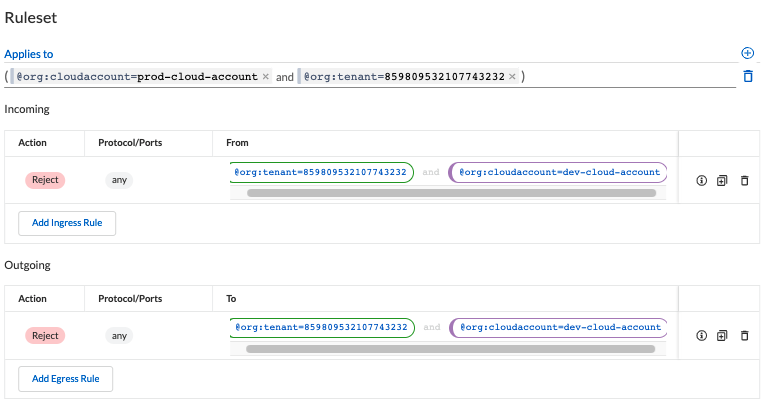

=== Block traffic to an external domain
In this example, we want to create a ruleset that rejects specific traffic from an entire cloud account to a specific domain

The ruleset will have the following components:

*Block Domain Ruleset* +

* *Subject* - Needs to match the "@org" tags of the cloud accoun
* *Action* - As we only need egress traffic, we only need to reject outgoing in "any" protocol/port
* *Object* - It needs to match specific domain External Network object

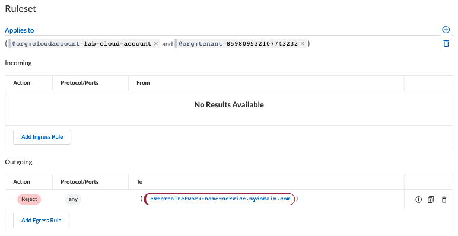

== Creating rulesets using apoctl
To create an External Network using apoctl, you will need to create a yaml file with your ruleset configuration and import it to the namespace of interest, using the command below:

`apoctl api import -f <file name.yaml> -n /859809532107743232/lab-cloud-account/sample-app`

where _/859809532107743232/lab-cloud-account/sample-app_ needs to be replaced with your namespace information.