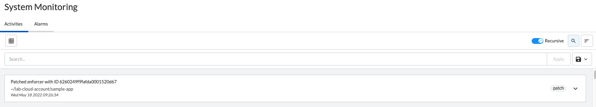
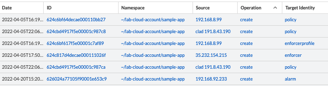
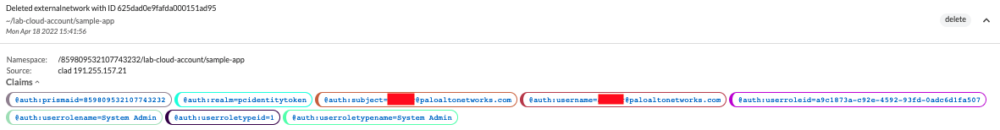
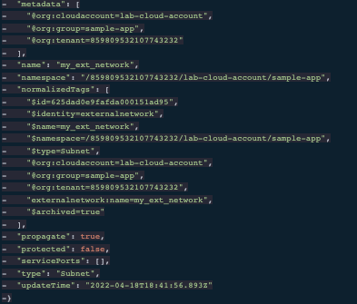
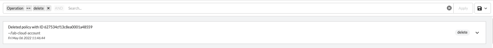
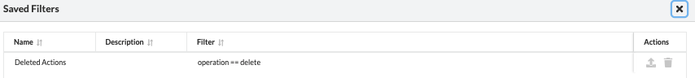

= System Activities
Alexandre Cezar <acezar@paloaltonetworks.com>, May 18, 2022:
:toc:
:toc-title:
:icons: font

You can monitor user activities by navigating to a namespace and opening System Activities tab.

The page will present several options as we can see below:

To note:

* Search Bar -> Allows users to create queries to search for specific events.

* Recursive -> Enable/Disable visualization of events from child namespaces

* Column selector -> Selects the specific log fields you want to visualize

* Order By -> Defines the order where objects will be sorted by

* Save button -> Allows you to Save/Apply/Delete queries

== System Activity details
The data view allows you to investigate and analyze all content in an Enforcer log

Different fields can be selected for visualization, depending on your preference.

The complete list of event log fields is provided below

|===
|Field name | What it means?

| "ID"
| "Unique Acvitiy ID"

| "claims"
| "The user or service identifiers"

| "data"
| "Additional information that may be attached to the activity"

| "date"
| "The date where the activity occurred"

| "diff"
| "The raw message of the executed action"

| "error"
| "If the event is related to an error, additional content may be added"

| "message"
| "Message descriptor of the activity",

| "namespace"
| "Namespace where the activity was generated"

| "operation"
| "Operation descriptor"

| "source"
| "The iP address where the action was executed"

| "targetIdentity"
| "The object type where the action was executed"

|===

You can expand an activity to look at its details, such as the IP address where the activity was executed, username and role of the user/service

You can also look at the activity data, by expanding the Data tab

== Searching Activities
Creating specific search is as simple as clicking on an interesting field, and it will automatically be added to your query. You can continue selecting fields to match the exact traffic you are interested in. +

You can also manually select the fields and add the values directly in the search bar.

[TIP]
If you hold the _shift_ key before selecting a field, it will be added as a _negation_ to your query

== Using Saved Queries
Once you create a query that may be reused in the future, you can save it and reapply it later.

For that, simply click the _Save_ button, provide a name to your Search and the query will be added to your collection

You can visit this anytime in the future to reapply your saved queries or delete them.

[WARNING]
Saved queries are saved locally in your browser. They may appear differently in other devices