= Troubleshooting
Alexandre Cezar <acezar@paloaltonetworks.com>, May 26, 2022:
:toc:
:toc-title:
:icons: font

Several tools are in place to help you identify issues and troubleshoot them. Below are the most common issues and guidance on how to troubleshoot them.

== Installation Issues

=== Enforcers fail to complete installation
Usually, if an Enforcer fails to install, verify the following:

* if all System Requirements are met; +

* if Enforcers can connect to Prisma Cloud and the correct repository to download the images (in the case of a K8s Enforcer)

* if Cloud Autoregistration is being used, check if the policy is correct (you can pinpoint the issue to Cloud Autoregistration by installing the Enforcer using the Standard mode and if it succeeds, the issue is likely related to an error with the Cloud AutoRegistration configuration)

=== Enforcers fail to connect to Prisma Cloud
If the Enforcer install successfully, but fail to register with the Prisma Cloud console, check if your proxy or NGFW is trying to intercept and perform a man-in-the-middle action in the Enforcer -> Console communication. +
This is not supported.

== Microsegmentation Console Troubleshooting Options
The Console offers quick access to the most common troubleshooting tasks.

You can access them under Agents/Enforcers anc clicking on the troubleshooting icon.

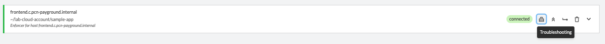

We will discuss each one of the available options below.

== Connectivity issues
When connections are unexpectedly dropped, you can use Prisma Cloud Microsegmentation advanced troubleshooting capabilities to understand what is happening

=== Connection Exceptions
If there's a problem with the identity packet being dropped by an external device (such as a FW or proxy), Enforcer will raise a connection exception log that will provide indicators of this.

For additional details about Connection Exceptions, please read this https://github.com/alexandre-cezar/cns-docs/blob/main/Connection%20Exceptions.adoc[page]

=== Packet Capture
If you need to look further at a flow to understand what's happening, you can use the Microsegmentation console to generate a packet capture.

In order to achieve this, navigate to your Processing Unit of interest or Enforcer and select the Troubleshooting option

* Step 1 -> Select Enforcer you want to run the packet capture (or you can go directly to the Processing Unit) and click on
_Troubleshooting_

* Step 2 -> Select the Network Packet Analysis option

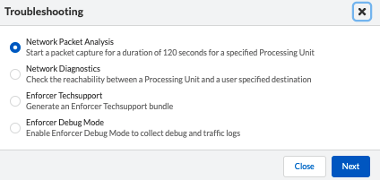

* Step 3 -> Select the Source Processing Unit you want to capture traffic from and click on Start (if multiple PUs are protected by the same Enforcer, a list of PUs will be provided)

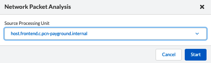

* Step 4 -> The traffic capture will be executed for a few minutes

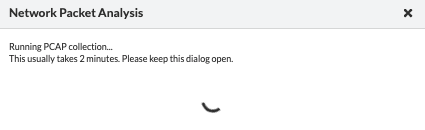

* Step 5 -> After the packet capture is concluded, a download button will appear

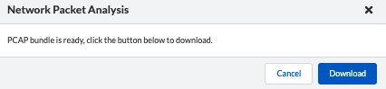

Step 6 -> Unzip the resulting package and open the .pcap file a Packet Analyzer

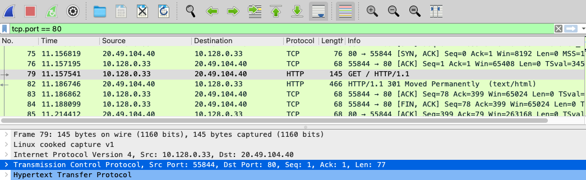

=== Datapath Analysis
When you want to verify if a flow from a given source can reach out to a specific destination, you can use the Network Diagnosis option. This will execute a datapath "OAM ping" that will verify if the Source Processing Unit can reach out to a External Network or another Destination Processing Unit and provide additional flow details, such as latency and policies.

* Step 1 -> Select Enforcer you want to run the packet capture (or you can go directly to the Processing Unit) and click on
_Troubleshooting_

* Step 2 -> Select the Network Diagnostics option

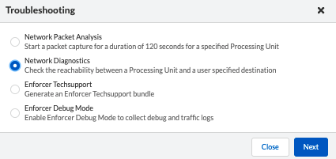

* Step 3 -> Select the Source Processing Unit you want to run the analysis from, the Destination PU or IP/FQDN, the destination Port and click on Start

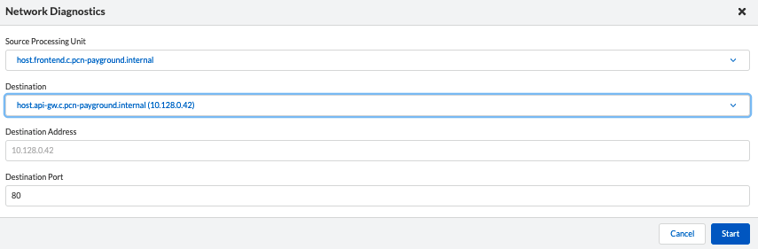

* Step 4 -> From a successful PU to PU analysis, the report will show up as seem in the image below:

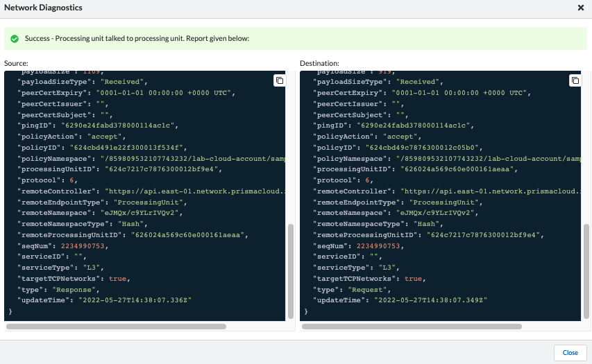

* Step 4 -> From a unsuccessful PU to External Network analysis, the report will show up as seem in the image below:

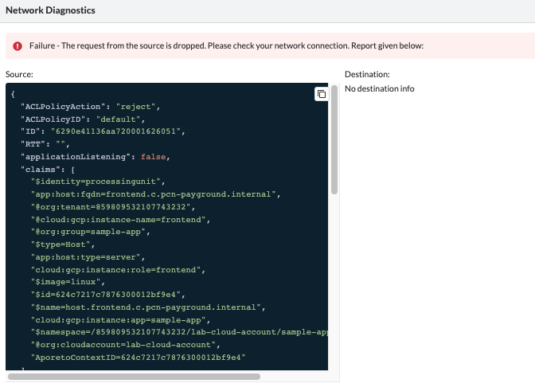

The most important fields in the report are:

* `policyAction` -> Indicates if the flow was accepted or rejected

* `policyID` -> The applied ruleset

* `RTT` -> The flow RTT

* `targetTCPNetworks` - If the target belongs to a Target Managed Network or not.

* `remoteEndpointType` - Indicates if the Destination is recognized as a Processing Unit or External Network

[TIP]
If a datapath analysis is executed against two processing units and both sides are reporting the flow, you will see both source and destination results in the UI. If only source side is displayed, it probably means that either the destination is unreachable or packet is dropped at source.

=== Generate TechSupport
When a support case needs to be opened, it's important that a techsupport file is always attached to it. +
A techsupport is a bundle of metrics, counters and configurations that will help the support team to identify an issue.

* Step 1 -> To generate a techsupport file, select the _Enforcer Techsupport_ option

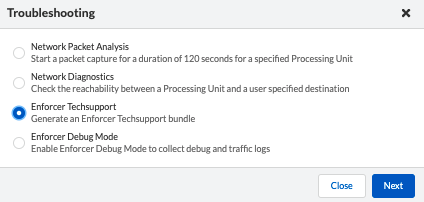

* Step 2 -> Click on Start

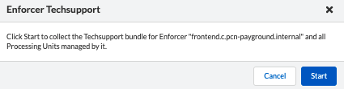

* Step 3 -> The process will run from a few minutes (usually faster) and you will be able to verify its process in the UI. After the techsupport is generated, download it and attach to your support ticket.

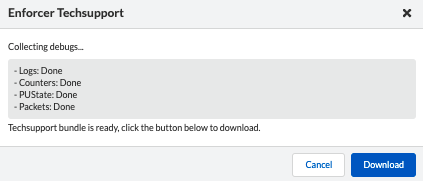

=== Enable Debug Mode
In rare occasions, the support team may request for you to enable Debug Mode in order to gather additional information.

To enable Debug mode, follow these steps:

* Step 1 -> To enable Debug mode, select the _Enforcer Debug Mode_ option

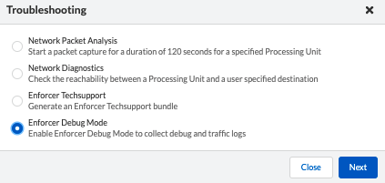

* Step 2 -> Define the time range you want to have Debug enabled

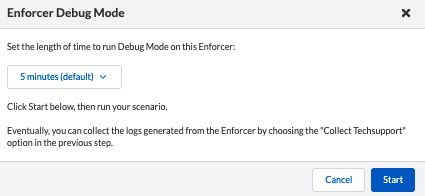

* Step 3 -> The Enforcer will change state to _Debug Mode_"

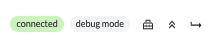

* Step 5 -> Simulate the issue with Debug Mode enabled and generate a TechSupport file.

[IMPORTANT]
The _Start_ troubleshooting button only becomes available when the websocket connection from the user device and the console is established, otherwise the button becomes unavailable.

