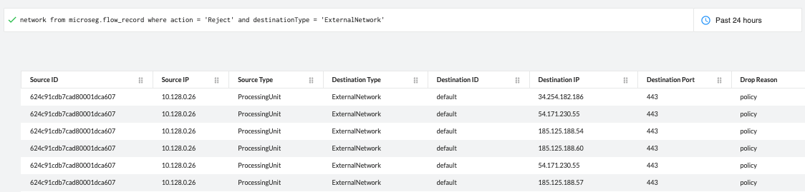
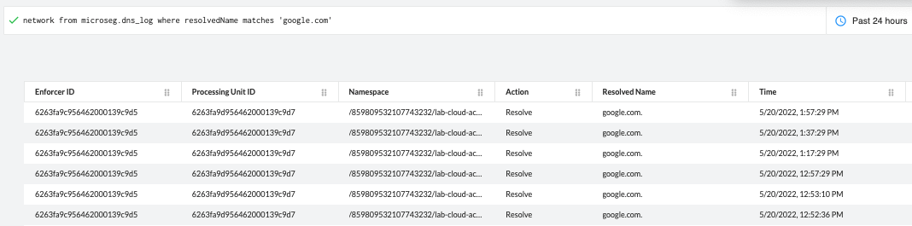

= Using Prisma Cloud RQL
Alexandre Cezar <acezar@paloaltonetworks.com> 1.0, May 20, 2022:

For users that want to leverage the existing Prisma Cloud Investigation capabilities to also analyze microsegmentation flow logs, they can use RQL queries to unify their searches into a single UI or API endpoint, in case of when automation is used.

RQL provides two network query types for Microsegmentation.

`network from microseg.flow_record` and `network from microseg.dns_log`

* _network from microseg.flow_record_ query allows you to query network logs

* _network from microseg.dns_log_ query allows you to query DNS Reports

== Sample Queries
* Find rejected traffic where the destination is an external network

`network from microseg.flow_record where action = 'Reject'and destinationType = 'ExternalNetwork'`

* Find all accepted traffic towards a specific destination IP and port

`network from microseg.flow_record where action = 'Accept' and destinationIP = '173.194.215.95' and destinationPort = 443`

* Find all resolved traffic towards a specific domain

`network from microseg.dns_log where resolvedName matches 'google.com'`