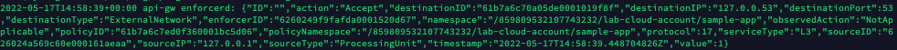

= Using Syslog
Alexandre Cezar <acezar@paloaltonetworks.com> 1.0, April 21, 2022:
:toc:
:toc-title:
:icons: font

You can use the syslog forwarding feature to send Enforcer logs (flow logs, events) to a Syslog Server or a SIEM platform for centralized troubleshooting

For more information about configuring the Syslog Forwarding feature, click https://github.com/alexandre-cezar/cns-docs/blob/main/Syslog.adoc[here]