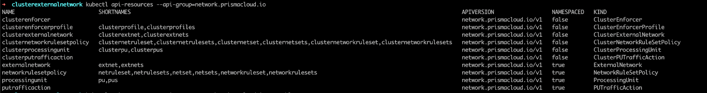

= api-server
Alexandre Cezar <acezar@paloaltonetworks.com> 1.0, April 12, 2022:

Users can access, create, or update micro-segmentation backend objects in the following ways:

- Use the `apoctl` CLI
- Use the micro-segmentation console and the added api-server application.

With Prisma Cloud Microsegmentation api-server capability, users can manage microsegmentation objects using kubectl/helm.

== Supported K8s operators

Operations that can be performed using this k8s hosted aggregated api-server app are limited to as follows:

* Get the list of the enforcers using the command
`kubectl get clusterenforcer`

* Get list of enforcer profiles using the command
`kubectl get clusterenforcerprofile`

* Create an enforcer profile by applying a yaml using the command
`kubectl apply -f clusterenforcerprofile.yaml`

* Update an enforcer profile by re-applying a yaml using the command
`kubectl apply -f clusterenforcerprofile.yaml`

* Delete the enforcer profile by using the command
`kubectl delete clusterenforcerprofile <object-name>`

[NOTE]
Replace <object-name> with the name of your Kubernetes object.

* Get list of the external networks at the cluster namespace (where enforcer is installed) using the command `kubectl get clusterexternalnetwork`

* Create an external network by applying a yaml using the command `kubectl apply -f clusterexternalnetwork.yaml`

* Update an external network by re-applying a yaml using the command -
`kubectl apply -f clusterexternalnetwork.yaml`

* Delete the external network by using the command `kubectl delete clusterexternalnetwork <object-name>`

* Get list of the network ruleset policies at the cluster namespace (where Enforcer is installed) using the command
`kubectl get clusternetworkrulesetpolicy`

* Create a network ruleset policy by applying a yaml using the command
`kubectl apply -f clusternetworkrulesetpolicy.yaml`

* Update an network ruleset policy by re-applying a yaml using the command `kubectl apply -f clusternetworkrulesetpolicy.yaml`

* Delete the  network ruleset policy by using the command `kubectl delete clusternetworkrulesetpolicy <object-name>`

* Get list of the processing unit at the cluster namespace (where Enforcer is installed) using the command `kubectl get clusterprocessingunit`

* Get the PU Traffic Action at the cluster namespace (where Enforcer is installed) using the command `kubectl get clusterputrafficaction`

* Update PU Traffic Action at the cluster namespace by using the command `kubectl edit clusterputrafficaction` and then modify the Incoming and Outgoing values as per your requirement and save the changes.

* Get list of the external networks for a kubernetes namespace using the command `kubectl get clusterexternalnetwork -n <namespace>`

* Create an external network by applying a yaml using the command `kubectl apply -f clusterexternalnetwork.yaml -n <namespace>`

* Update a network ruleset policy by re-applying a yaml using the command `kubectl apply -f networkrulesetpolicy.yaml -n <namespace>`

* Delete the  network ruleset policy by using the command `kubectl delete networkrulesetpolicy <object-name> -n <namespace>`

* Get list of the processing unit at a namespace using the command `kubectl get processingunit -n <namespace>`

* Get the PU Traffic Action at a namespace using the command `kubectl get putrafficaction -n <namespace>`

* Update PU Traffic Action at a namespace by using the command `kubectl edit putrafficaction -n <namespace>` and then modify the Incoming and Outgoing values as per your requirement and save the changes.

== LIMITATIONS OR KNOWN-ISSUES

* You cannot create 2 objects for a given api-resource with the same name. For example: you cannot create 2 external networks with the same name as “external-network-test” using the kubectl CLI as k8s does not allow it. On the other hand, you can add two objects with the same name using the UI.

* You cannot rename an object via kubectl CLI. For example: if you named a network ruleset as “network ruleset 1” you cannot change it to  “network ruleset 2” as K8s does not allow it. Alternatively, you can create a copy of the YAML file, rename it, and apply it to create a new object. +

* When a K8s namespace is deleted, all the objects created in it via kubectl are deleted but the objects created via apoctl or console are not. If you synced the K8s namespaces with your backend, the namespaces remain in the backend even after you delete the K8s namespaces.

* Any protected object has to be updated to unprotected before deletion can occur.

[WARNING]
Backend objects can be lost. After you create a backend object using the console or apoctl CLI, avoid creating a new backend object with the same name using kubectl and the aggregated api-server. When you delete the objects using kubectl, it deletes all the objects with the same name. Use different names for all your backend objects to avoid deleting them inadvertently.

All the api-resources falls under _network.prismacloud.io_ api group.
You can review the available resources with the command `kubectl api-resources --api-group=network.prismacloud.io`

=== EXAMPLE - How to create a new network ruleset using the api-server

Follow these steps to create a network ruleset to allo PU to PU communication from one namespace (frontend app) to another namespace (backend app) over TCP protocol on port 443.

* Step 1 - Apply the _frontend-to-backend-outgoing.yaml_ file on the test-frontend namespace using the command `kubectl apply -f  frontend-to-backend-outgoing.yaml -n test-frontend`

The yaml file used in this example is located https://github.com/alexandre-cezar/cns-docs/blob/main/frontend-to-backend-outgoing.yaml[here]

* Step 2 - Apply the _backend-from-frontend-incoming.yaml_ file on the test-backend namespace using the command `kubectl apply -f  backend-from-frontend-incoming.yaml -n test-backend`

The yaml file used in this example is located https://github.com/alexandre-cezar/cns-docs/blob/main/backend-from-frontend-incoming.yaml[here]

[NOTE]
For the example above, we've assumed that both namespaces were already created on the cluster and synced with the micro-segmentation console and that all the tags used in the network rulesets were already defined in the tag prefixes.

=== YAML file examples

https://github.com/alexandre-cezar/cns-docs/blob/main/clusterenforcerprofile.yaml[clusterenforcerprofile]

https://github.com/alexandre-cezar/cns-docs/blob/main/clusterexternalnetwork.yaml[clusterexternalnetwork]

https://github.com/alexandre-cezar/cns-docs/blob/main/clusternetworkrulesetpolicy.yaml[clusternetworkrulesetpolicy]

https://github.com/alexandre-cezar/cns-docs/blob/main/externalnetwork.yaml[externalnetwork]

https://github.com/alexandre-cezar/cns-docs/blob/main/networkrulesetpolicy.yaml[networkrulesetpolicy]