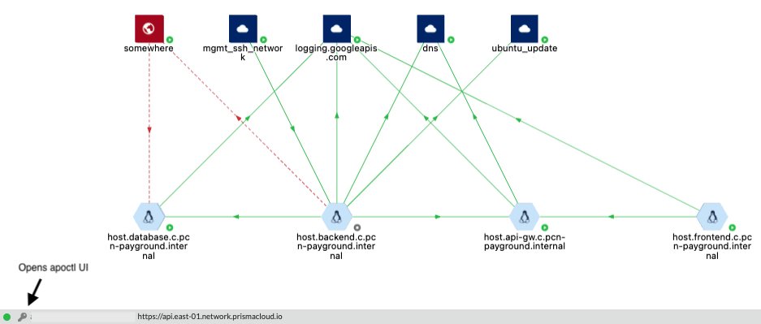
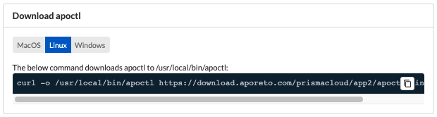
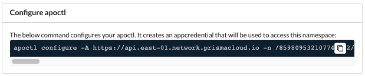

= apoctl
Alexandre Cezar <acezar@paloaltonetworks.com> 1.0, April 28, 2022:
:toc:
:toc-title:
:toclevels: 4
:icons: font

`apoctl` is the official command line tool (CLI) to interact with the
Microsegmentation Console.

== Download apoctl from the console
Apoctl can be downloaded directly from the Microsegmentation console.

On any page in UI, click on the _key_ icon at the bottom of the page to open the apoctl UI

In the apoctl page, select the binary that matches your operational system, copy and paste the command on your system.

MacOS, Linux and Windows OS are supported

== Configure apoctl using the console
For apoctl to work, it requires an app credential permission that will grant specific permissions on your environment.

You can manually create an app credential and attach it to a profile or generate an initial one using the UI that will apply to the namespace where it's being created (and children).

In the apoctl page, under _Configure apoctl_, copy and paste the generated command on the same system where you installed the apoctl binary.

== apoctl basics
`apoctl` provides the following main commands:

* `api` to interact with the Microsegmentation Console API
* `appcred` to manage app credentials
* `auth` to deal with authentication tokens
* `configure` for quick set up
* `enforcer` to obtain enforcer debugging information
* `oam` to debug connectivity issues
* `profiles` to manage multiple profiles
* `protect` to deploy enforcers to hosts
* `reports` to generate compliance reports
* `stats` to retrieve statistical data
* `unprotect` to uninstall enforcers from hosts

Here are the main global flags you can set:

* `--api` or `-A`: defines the URL of the Microsegmentation Console API
* `--namespace` or `-n`: defines the namespace you want to target
* `--token` or `-t`: defines the token to use to authenticate
* `--config`: defines the path to a configuration profile to use
* `--log-level`: defines the level of logging

In general, every flag can be also set from an environment variable.
You can easily guess the environment variable by

* upper casing the flag name
* replace all `-` by `_`
* prefixing it by `APOCTL`

For instance, the variables used to set the above flags are:

    APOCTL_API
    APOCTL_NAMESPACE
    APOCTL_TOKEN
    APOCTL_LOG_LEVEL
    APOCTL_CONFIG

The resolution order is as follows from low to high priority:

1. built-in default value
2. value set in a configuration profile
3. value set the environment variables
4. value set using the flags.

== Autocompletion

`apoctl` supports autocompletion on `bash` and `zsh`.
It will autocomplete commands, API resources, attributes, and more.

To take advantages of this feature, you must add a command in your shell configuration.

For Bash:

    echo "source <(apoctl completion bash)" >> ~/.bashrc

For ZSH:

    echo "source <(apoctl completion zsh)" >> ~/.zshrc

On CentOS, you may need to install the bash-completion package which is not installed by default.

    sudo yum install bash-completion -y

On macOS, you may need to install the bash-completion package which is not installed by default.

* If running Bash 3.2 included with macOS:

    brew install bash-completion

* If running Bash 4.1+:

    brew install bash-completion@2

== Understanding Profiles

`apoctl` supports multiple configuration profiles that can be placed in `~/.apoctl`.

A profile is a simple YAML file setting default values for any flags of `apoctl`.
The most useful one is to set up your default namespace as well as an app credential to use.

All values defined in the profile, can be overridden by an environment variable or by setting the flag when you call `apoctl`.

The default profile is `~/.apoctl/default.yaml`.
If it doesn't exist, `apoctl` will use its built-in default values.

To select a profile, use the flag `--config`, set the environment variable `$APOCTL_CONFIG_NAME`, or use the `apoctl profiles` command.

For instance, you can create `~/.apoctl/my-profile.yaml` and tell `apoctl` to use it by running:

    export APOCTL_CONFIG_NAME=my-profile

Or

    apoctl profile use my-profile

In any case, to verify which profile is used, you can run `apoctl profiles`.

[NOTE]
The value of the variable must omit the extension.

Profile example:

    $ cat ~/.apoctl/default.yaml
    api: https://microsegmentation.acme.com
    namespace: /acme
    creds: ~/.apoctl/default.creds
    output: yaml

== Command list

=== https://github.com/alexandre-cezar/cns-docs/blob/main/apoctl/api.adoc[api]
Allow api manipulation +

=== https://github.com/alexandre-cezar/cns-docs/blob/main/apoctl/appcred.adoc[appcred]
Manage application credentials +

=== https://github.com/alexandre-cezar/cns-docs/blob/main/apoctl/auth.adoc[auth]
Allow authentication +

=== https://github.com/alexandre-cezar/cns-docs/blob/main/apoctl/aws.adoc[aws]
Manages AWS IAM policies and associated Aporeto scope policies +

=== https://github.com/alexandre-cezar/cns-docs/blob/main/apoctl/completion.adoc[completion]
Generate shell completion +

=== https://github.com/alexandre-cezar/cns-docs/blob/main/apoctl/configure.adoc[configure]
Configures your apoctl environment +

=== https://github.com/alexandre-cezar/cns-docs/blob/main/apoctl/enforcer.adoc[enforcer]
Allow enforcer management +

=== help
Help about any command +

=== https://github.com/alexandre-cezar/cns-docs/blob/main/apoctl/metrics.adoc[metrics]
Manages the Metrics APIs +

=== https://github.com/alexandre-cezar/cns-docs/blob/main/apoctl/oam.adoc[oam]
Operations and Maintenance related commands +

=== https://github.com/alexandre-cezar/cns-docs/blob/main/apoctl/profiles.adoc[profiles]
Manages apoctl profiles +

=== https://github.com/alexandre-cezar/cns-docs/blob/main/apoctl/reports.adoc[reports]
Generates supported reports +

=== https://github.com/alexandre-cezar/cns-docs/blob/main/apoctl/reportsquery.adoc[reportsquery]
Allows the querying of reports +

=== https://github.com/alexandre-cezar/cns-docs/blob/main/apoctl/ssh.adoc[ssh]
Allows you to manage SSH certificates and provides helpers to connect to an OpenSSH server

=== https://github.com/alexandre-cezar/cns-docs/blob/main/apoctl/stats.adoc[stats]
Manages Aporeto Statistics APIs +

=== update
Updates apoctl to a specific version

Options: +
-A, --api string -> Server API URL. (default points to the Prisma Cloud region API GW ) +

--api-cacert string -> Path to the CA to use for validating api endpoint. +

--api-skip-verify -> If set, skip api endpoint verification. This is insecure. +

--config string -> config file (default is $HOME/.apoctl/default.yaml) +

--creds string -> Path to an app credential. +

--encoding string -> encoding to use to communicate with the platform. Can be 'msgpack' or 'json' (default "msgpack") +

-h, --help -> help for apoctl +

--log-level string -> Set the log-level between info, debug, trace (default "info") +

--tracking-id string -> ID to trace the request. Use this when asked to help debug the system. +

-v, --version -> Show version.
