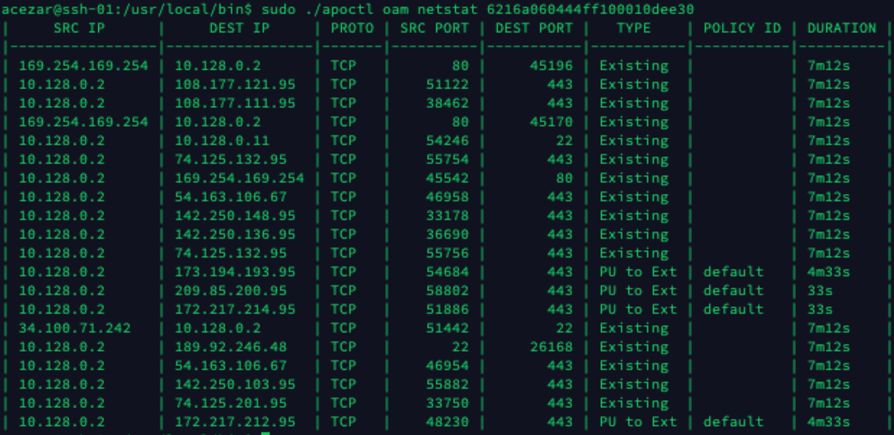

= oam command
Alexandre Cezar <acezar@paloaltonetworks.com> 1.0, May 2, 2022:

The `+oam+` command holds operations, administration, and maintenance tools.

=== `+ping+` subcommand

The `+ping+` subcommand is used to run ping and print the results.

Use the `+ping+` command to troubleshoot network connectivity. The command starts a flow from the specified processing unit to the destination IP and port. A successful ping returns the status code `+0+`, and writes a report to `+stdout+`. An unsuccessful ping returns the status code `+1+`, and writes a report the errors to `+stderr+`. The reports contain information about the source and destination. How the command and reports operate depends on whether the destination is a processing unit.

A destination that is not a processing unit must listen to the specified port for a successful response. The connection is immediately set up and then dropped. The report includes detailed information about the source, but only the IP and port of such a destination.

A destination that is a processing unit has an enforcer that handles the flow, and the destination doesn't have to actively listen to the port. If it is listening on the port the enforcer still consumes the flow. The report includes detailed information about both the source and destination.

Examples:

Consider the situation where there are two processing units and the admin suspects that there may be a network device within the path that is blocking traffic on port 9000. The admin knows that SSH (port 22) is working, so they run the command

 apoctl oam ping 5ee5a29939483e4c01a20d7b 192.168.100.101:22```

The command succeeds, and you run the following command:

 apoctl oam ping 5ee5a29939483e4c01a20d7b 192.168.100.101:9000```

Because the command fails, you now know that the problem is with the network path or with the server that is not responding to connections in the port 9000.

 apoctl oam ping 5ee5a29939483e4c01a20d7b 192.168.100.101:9000
 apoctl oam ping 5ee5a29939483e4c01a20d7b 192.168.100.101:9000 --verbose

The oam ping command format is"
`apotcl oam ping <Source PU ID> <Destination IP>:<Destination Port>`

=== `+netstat+` subcommand

The `+netstat+` subcommand is used to identity what flows are controlled by an Enforcer and which ones are not.

Use the `+netstat+` command to troubleshoot situations where a flow is not being controlled by the Enforcer. This usually happens on Virtual Machines or Bare Metal Servers where the Enforcer is just deployed and existing connections are in place. +

By definition, the Enforcer doesn't take over existing flows to avoid disrupting applications and as existing connections terminates and new ones are established, the Enforcer will eventually control all flows. +

The command displays a list of all flows in the host and under the _Type_ column, it shows the state of the flow. The following values are possible:

* Existing -> Flow that is not being managed by an Enforcer

* PU to PU -> Flow that being managed by the Enforcer and, it is of a PU to PU type

* PU to EXT -> Flow that being managed by the Enforcer and, it is of a PU to External network type

* EXT to PU -> Flow that being managed by the Enforcer and, it is of an External Network to PU type



Examples:

`apoctl oam netstat 5ee5a29939483e4c01a20d7b`

The oam netstat command format is"
`apotcl oam netstat <PU ID>`
